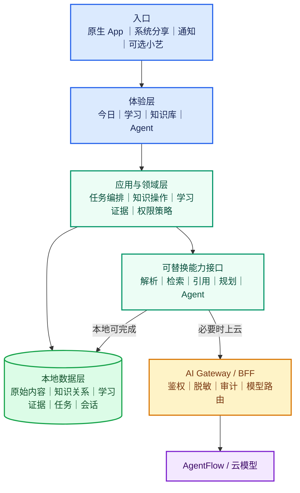

# loci

> 个人知识 Agent：把资料转化为可追溯的知识结构，支持自由探索、单点深入学习与下一步行动。

`loci` 面向持续处理学习资料的大学生，也兼容备考者、职场学习者和自主研究者。它不是网盘、摘要工具或单文档问答：产品要连接“资料摄入 → 结构理解 → 自由探索 → 单点学习 → 学习证据 → 下一步行动”的完整闭环。

产品名统一写作小写 `loci`。界面中的 `Knowledge Agent` 是 Agent 角色名，不是产品名。

## 当前方向

独立 App 是完整产品；小艺、端 A2A、通知与系统分享均为未来可选连接器，不能阻塞核心体验。

全局结构固定为：

> **今日｜学习｜知识库 + 独立 Agent 入口**

| 区域 | 用户要解决的问题 | 核心职责 |
| --- | --- | --- |
| 今日 | 我现在最值得做什么？ | 一项主建议、处理中资料、继续学习与近期成果 |
| 学习 | 我的知识如何形成、连接并变化？ | 知识地图、节点探索、学习状态图层与深入学习 |
| 知识库 | 我保存了哪些资料，如何追溯？ | 知识空间、文件、理解结果、原文阅读和引用定位 |
| Agent | 我现在想问什么？ | 跨资料与知识点问答、可见上下文、引用与转入深入学习 |

Agent 由独立圆形入口唤起，默认以约 75% 高度抽屉打开，不是第四个底部 Tab。自由问答不会自动更新学习状态；只有围绕单一知识点、有目标、有验证、有结束的深入学习任务才能形成学习证据。

当前视觉基线保留“连续知识场”和烟晶材质：一级页面共享浅灰紫环境，正文、资料与学习内容使用稳定实体层；页眉用户区、底部导航、短时筛选、Agent 入口与覆盖层可使用烟晶悬浮材质。烟晶是组件语义和体验层级，不代表三端复用 Web 滤镜代码；各原生端应按平台能力实现，并提供关闭实时模糊后仍可读的降级态。

## 系统架构



## 当前交付阶段

当前集成工作的最小范围、能力边界与验收门槛见 [MVP 范围说明](docs/MVP_SCOPE.md)。本轮只保证“单份资料 → 互动学习书 → 学习与复习 → 当前书内 Agent”的闭环；旧文档中的更大产品愿景不等同于首版承诺。

当前首先交付“代码即高保真原型”，以统一、可重复的《机器学习第三章》模拟数据验证产品结构与首次闭环：

1. P0：今日、学习地图、知识库、Agent 抽屉四张可运行视觉与交互基准页；
2. P1：以模拟数据完成 S01—S10 首次使用闭环；
3. P2：在结构验证后逐步接入真实上传、解析、RAG、学习证据、任务安排与可选系统连接器。

原型阶段不要求接入真实模型、向量数据库或图谱算法；但必须清晰区分模拟结果与真实处理能力。

## 工程现状

| 模块 | 当前技术 | 当前定位 |
| --- | --- | --- |
| `admin/` | React 18、TypeScript、Vite、Tailwind CSS | 当前七个业务页面、Agent 抽屉及烟晶材质的高保真视觉与交互基准；迁移期只接受阻塞性修复。 |
| `entry/` | ArkTS、ArkUI、HarmonyOS | 原生 App 与本地能力的技术骨架；A2A 代码将作为可选连接层隔离。 |
| `server/` | Node.js、Express、TypeScript | 开发期 LLM 代理骨架，不等同于最终的产品后端。 |
| `docs/` | Markdown | 产品、设计、技术参考及历史记录。 |

现有代码中仍有旧方向的页面、注释和协议骨架。它们不代表当前产品需求；重构与保留规则以 PRD 为准。

## 快速开始：运行前端原型

高保真原型优先在 `admin/` 中实现。需要 Node.js 20+。

```bash
cd admin
npm ci
npm run dev
```

开发服务器默认运行在 `http://localhost:5173`。P0/P1 使用本地模拟数据时，不需要启动 `server/` 或配置 LLM API Key。

如需单独验证现有代理骨架：

```bash
cd server
copy .env.example .env
# 在 .env 中填写 LLM_API_KEY
npm ci
npm run dev
```

代理默认端口为 `3456`，健康检查为 `http://localhost:3456/health`。真实资料处理、引用检索与学习者模型的接口契约尚未确定，不应以当前代理路由作为产品 API 定稿。

## 目录

```text
HUAWEI-knowledge-management/
├── admin/                 # React 高保真原型
├── entry/                 # HarmonyOS / ArkUI 原生工程与可选连接层
├── server/                # 开发期 LLM 代理骨架
└── docs/
    ├── PRD.md             # 当前最高产品基线
    ├── architecture/      # 跨平台架构、迁移方案与 ADR
    ├── design-system/     # 用户旅程、信息架构、UI 与视觉规范
    ├── api/               # HarmonyOS API 技术参考
    ├── local/             # 当前实施清单与历史协作记录
    └── archive/           # 已归档的旧技术方案
```

## 文档优先级

文档按关注点设立真源，不使用一份文档覆盖所有决策。当前决策记录见 [ADR-001：文档真源与烟晶材质基线](docs/architecture/ADR-001-文档真源与烟晶材质基线.md)。

| 关注点 | 当前真源 |
| --- | --- |
| 产品定位、范围、功能与验收 | [产品需求文档（PRD）](docs/PRD.md) |
| 产品身份与高层设计原则 | `PRODUCT.md`、`DESIGN.md` |
| 视觉语言与材质边界 | `docs/design-system/视觉设计规范.md` |
| 组件行为、手势、响应式与无障碍 | `docs/design-system/UI与交互规范.md` |
| 用户旅程与页面关系 | `docs/design-system/用户旅程.md`、`docs/design-system/信息架构与页面结构.md` |
| 客户端架构与迁移边界 | `docs/architecture/` 下已确认的 ADR 与迁移方案 |
| 当前具体视觉与交互参考 | 可运行的 `admin/` 及其基准截图 |

同一关注点发生冲突时，按“用户最新确认并记录的 ADR → 当前专项规范 → 当前实现基准 → 历史记录”的顺序处理。实现基准用于验收，不反向覆盖已确认的产品语义或架构边界。`docs/api/` 只提供技术参考；`docs/archive/`、历史 worklog 和旧代码注释只用于追溯。

## 实施原则

- 重要 AI 判断必须有依据、来源与修正入口；
- 明确区分本地保存、云端处理和同步，禁止使用无法兑现的“知识绝不出端”等绝对表述；
- 文件存在不等于用户学习过；深入学习完成也不等于用户绝对掌握；
- 页面共享浅灰紫连续环境和深色编辑排版；正文与普通列表保持稳定实体，烟晶只用于页眉、导航、短时控制、Agent 与必要覆盖层；
- 地图用于知识结构与节点探索，知识库用于文件与正文，二者不互相替代；
- 代码先实现可替换的状态、模拟数据和接口边界，开放决策不写死在页面逻辑中。

## 下一步

按 [跨平台客户端迁移方案](docs/architecture/跨平台客户端迁移方案.md) 先完成文档基线、烟晶组件跨端映射和 ArkUI 工程基线，再交付“今日”Walking Skeleton 与 S03—S06 首个业务垂直切片。当前 React 原型保留为视觉与交互基准；真实能力接入前，应先完成迁移台账、状态矩阵和 PRD 开放决策。
