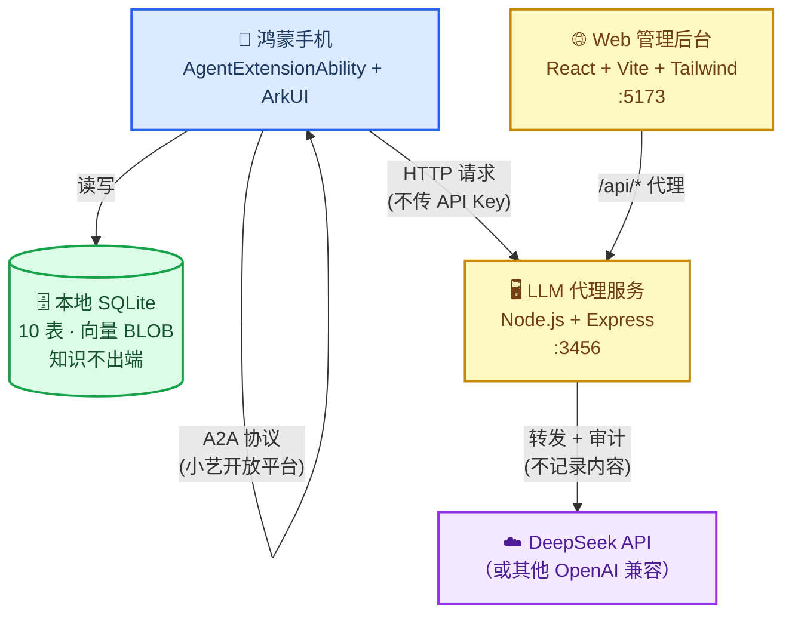

# HarmonyAgent —— 知识学伴

> 鸿蒙高校创新赛 · 赛题2：Agent 创新
> 个人知识管理 Agent —— 摄入、理解、复习三位一体，知识不出端

---

## 这是什么？

**你每天学很多东西，但过几天就忘了。HarmonyAgent 帮你记住。**

它是一个跑在鸿蒙手机上的 AI 学习伙伴。你随时把想记住的东西"喂"给它——一句话、一段笔记、一篇文档——它帮你拆解、整理、归档。需要的时候，直接问它，它会从你的知识库里找到最相关的内容回答你。它还会主动提醒"你该复习这个了"，像一个永远不偷懒的家教。

核心承诺：**你的知识数据全留在手机里，不上传任何云端**。AI 能力通过一个中间代理服务器调用（只转发请求，不保存内容），你的笔记、知识点、学习记录全在手机 SQLite 里。

**仓库地址**: https://github.com/Tangzy0121/HarmonyAgent（Private）

---

## 系统架构

_下图展示了 HarmonyAgent 的三端协作关系——鸿蒙 App 是主角，LLM 代理和 Web 后台是辅助。_



**简单说**：你用手机通过小艺跟 Agent 对话 → Agent 把需要 AI 处理的内容发给电脑上的代理服务 → 代理服务调用云端大模型 → 结果返回手机。你的笔记存在手机 SQLite 里，谁都不给。

---

## 前置条件

在开始之前，确保你的电脑上有这些工具。打开终端（Windows 用 PowerShell 或 Git Bash），逐条验证：

| 你需要什么 | 最低版本 | 怎么确认装好了 | 没装的话去哪下 |
|-----------|---------|---------------|---------------|
| **Node.js** | 20+ | `node --version` | https://nodejs.org/ |
| **Git** | 任意新版 | `git --version` | https://git-scm.com/（Windows 推荐 Git Bash） |
| **DevEco Studio** | 6.1.1+ | 打开 IDE → Help → About | https://developer.huawei.com/consumer/cn/download/ |
| **鸿蒙手机**（真机调试） | — | 需要 AGC 签名 | 模拟器也可以跑，不需要真机 |
| **DeepSeek API Key**（或其他 LLM） | — | 注册即送额度 | https://platform.deepseek.com/ |

> 💡 **没有鸿蒙手机也能开发**：DevEco Studio 自带模拟器。但 Agent 功能依赖小艺开放平台，模拟器上部分能力受限。先把 server + admin 跑起来，鸿蒙端等有设备再说。

---

## 快速开始

### 第 0 步：获取代码

> ⚠️ 仓库是 **Private** 的。先把你的 GitHub 用户名发给仓库 owner，加为 Collaborator 后才能 clone。

```bash
git clone https://github.com/Tangzy0121/HarmonyAgent.git
cd HarmonyAgent
```

clone 下来后，你会看到三个主要目录：`entry/`（鸿蒙 App）、`server/`（LLM 代理）、`admin/`（Web 后台）。

---

### 第 1 步：启动 LLM 代理服务（必须先跑）

这个服务是你电脑上的"中转站"——鸿蒙 App 和 Web 后台都通过它调用 AI。API Key 存在你电脑上，不会泄露到手机。

```bash
cd server

# 1. 创建配置文件（Windows 用 copy，Mac/Linux/Git Bash 用 cp）
copy .env.example .env      # Windows CMD / PowerShell
# cp .env.example .env      # Mac / Linux / Git Bash

# 2. 编辑 .env，把 LLM_API_KEY 改成你的真实 Key
#    用记事本或 VSCode 打开 server/.env
#    把 your-api-key-here 替换为你的 DeepSeek API Key（形如 sk-xxxx）

# 3. 安装依赖（用 npm ci，精确按 lockfile 装，不会出意外）
npm ci

# 4. 启动！
npm run dev
```

**✅ 验证成功**：终端出现这三行就对了——

```
[HarmonyAgent Server] running on http://localhost:3456
[HarmonyAgent Server] provider: deepseek
[HarmonyAgent Server] audit log: enabled (no content)
```

再开一个终端验证：

```bash
curl http://localhost:3456/health
# → {"status":"ok","service":"harmony-agent-server"}
```

---

### 第 2 步：启动 Web 管理后台（队友写前端的地方）

```bash
cd admin

# 安装依赖
npm ci

# 启动开发服务器
npm run dev
```

**✅ 验证成功**：浏览器打开 http://localhost:5173，看到"📚 知识学伴"页面。

> 💡 Web 后台对 `/api/*` 的请求通过 Vite 开发服务器自动转发到 `localhost:3456`。你在页面上调 API，实际是 server 在处理。不需要改任何配置。

---

### 第 3 步：打开鸿蒙工程

用 **DevEco Studio** 打开 `HarmonyAgent/` 根目录（注意是整个项目根目录，不是 `entry/` 子目录）。

IDE 会自动识别这是 HarmonyOS 项目并加载。连接真机或启动模拟器，点击 **Run** 即可。

> ⚠️ **真机调试必看**：`entry/src/main/ets/services/LLMGateway.ets` 中的 `PROXY_URL` 默认是 `http://localhost:3456`。
> 在真机上 `localhost` 指向手机自身，**必须改成你电脑的局域网 IP**（如 `http://192.168.1.100:3456`）。
> 模拟器不需要改，`localhost` 就是电脑。

怎么看电脑 IP？
- Windows：`ipconfig`，找 IPv4 地址
- Mac/Linux：`ifconfig` 或 `ip addr`

---

## 环境变量说明

### server/.env

| 变量 | 默认值 | 说明 |
|------|--------|------|
| `PORT` | `3456` | 代理服务端口 |
| `LLM_PROVIDER` | `deepseek` | LLM 提供商：`openai` / `deepseek` / `custom` |
| `LLM_BASE_URL` | `https://api.deepseek.com/v1` | API 地址（用 custom 时改这里） |
| `LLM_API_KEY` | `your-api-key-here` | **你的 API Key，必填！**（`.env` 在 `.gitignore` 中，不会提交） |
| `LLM_MODEL` | `deepseek-chat` | 默认模型 |
| `AUDIT_LOG_ENABLED` | `true` | 审计日志开关（只记录时间/模型/token数，**不记录内容**） |

### admin/.env（可选）

| 变量 | 默认值 | 说明 |
|------|--------|------|
| `VITE_API_BASE_URL` | — | 本地开发时无需设置（Vite 自动代理到 `:3456`）。部署时指向实际服务地址 |

---

## 项目结构

```
HarmonyAgent/
├── entry/                          # 鸿蒙 App（DevEco Studio 工程）
│   └── src/main/ets/
│       ├── agent/                  # AgentExtensionAbility + A2A 协议
│       │   ├── A2AProtocol.ets     #   JSON-RPC 2.0 消息帧（完成）
│       │   ├── AgentExtAbility.ets #   小艺通信入口（完成）
│       │   └── SkillRouter.ets     #   意图识别 + 技能分发（骨架）
│       ├── entryability/           # 应用主入口
│       │   └── EntryAbility.ets    #   启动时初始化数据库
│       ├── pages/                  # ArkUI 页面（← 你写前端）
│       │   └── Index.ets           #   当前是占位页
│       ├── services/               # LLM 代理客户端
│       │   └── LLMGateway.ets      #   调用 server 的 HTTP 客户端（骨架）
│       └── data/                   # 数据库
│           └── DatabaseHelper.ets  #   SQLite 10 表 DDL（完成）
├── admin/                          # Web 管理后台（← 队友写这里）
│   ├── src/
│   │   ├── App.tsx                 #   当前是占位页（含接手指南）
│   │   ├── main.tsx                #   React 入口
│   │   └── index.css               #   Tailwind CSS
│   ├── package.json                #   React + Vite + Tailwind
│   └── vite.config.ts              #   端口 5173，/api → :3456
├── server/                         # LLM 代理服务（后端）
│   ├── src/
│   │   ├── index.ts                #   Express 服务入口
│   │   └── routes/llm.ts           #   LLM 转发路由（/chat/completions 已实现）
│   ├── .env.example                #   环境变量模板
│   └── package.json                #   Node.js + Express + TypeScript
└── docs/
    ├── 2026-07-18-端A2A技术实施计划.md  # 完整技术方案（建议通读）
    └── api/                        # 鸿蒙 API 参考文档
        ├── agent-extension-ability.md
        ├── relational-store.md
        ├── notification.md
        └── arkui-animation-gesture.md
```

---

## 开发路线 & 分工

| 里程碑 | 内容 | 谁做 | 状态 |
|--------|------|------|------|
| M0 | AGC 签名 + 小艺平台关联 + 样例跑通 | Tangzy | 🔲 |
| M1 | 端A2A 通信 + 基础 Skill 路由 | Tangzy | ✅ 骨架完成 |
| M2 | 摄入笔记 → 分块 → 向量化 | Tangzy | 🔲 |
| M3 | 知识问答 + LLM 集成 | Tangzy | 🔲 |
| M4 | 学习模型 + 主动复习 Chips | Tangzy | 🔲 |
| M5 | Web 管理后台 | **队友** | 🔲 |
| M6 | 联调 + 演示脚本 | 一起 | 🔲 |

**M5 Web 管理后台（队友负责）** 需要做的页面：
- 知识库浏览（笔记列表 + 搜索）
- 笔记管理（查看/编辑/删除）
- 知识点浏览（自动抽取的知识点列表）
- 学习曲线（掌握度可视化图表）

API 全部通过 `/api/*` 调用（Vite 自动代理到 server），不需要关心后端部署。

---

## 常见问题

### Q: clone 之后 `npm ci` 报错？

**不会。** `server/package-lock.json` 和 `admin/package-lock.json` 都已在仓库里，`npm ci` 会按 lockfile 精确安装，和 Tangzy 电脑上装的版本一模一样。

如果确实报错，常见原因：
- Node.js 版本太低 → `node --version` 确认 ≥ 20
- 网络问题（npm registry 连不上）→ 试试 `npm config set registry https://registry.npmmirror.com`

### Q: 真机连不上 `localhost:3456`？

这是意料之中的。手机上的 `localhost` 是手机自己，不是你的电脑。

**解决**：把 `entry/src/main/ets/services/LLMGateway.ets` 里的 `PROXY_URL` 从 `localhost` 改成你电脑的局域网 IP（如 `192.168.1.100`）。还需要确保：
1. 手机和电脑在同一个 WiFi 下
2. 电脑防火墙允许 3456 端口入站

### Q: `npm ci` 和 `npm install` 有什么区别？

`npm ci` 完全按 `package-lock.json` 安装，不修改 lockfile。`npm install` 可能会更新依赖版本。**开发用 `npm ci`，保证所有人环境一致。**

### Q: AGC 签名是什么？现在必须弄吗？

AGC（AppGallery Connect）是华为的应用服务平台。要在真机上跑鸿蒙 App，需要用你的华为开发者账号创建应用、配置签名。这一步现在可以先跳过——**先把 server + admin 跑起来，代码写起来**，签名等 M0 再搞。

### Q: admin 前端怎么调后端 API？

不需要额外配置。`admin/vite.config.ts` 里配了代理：所有 `/api/*` 请求自动转发到 `http://localhost:3456`。

在前端代码里直接写：
```ts
const res = await fetch('/api/chat/completions', { ... })
// Vite 自动转发到 http://localhost:3456/api/chat/completions
```

### Q: 我只写前端，不碰鸿蒙端，需要装 DevEco Studio 吗？

不需要。你只需要 `server/` 和 `admin/` 两个目录。装好 Node.js 20+，跑第 1 步和第 2 步就行。

---

## 技术选型

| 层 | 选型 | 为什么选它 |
|----|------|-----------|
| 接入层 | 小艺开放平台 端A2A V0.6 | 鸿蒙官方 Agent 通信协议，系统级集成（AgentExtensionAbility + AgentUIExtensionAbility） |
| 智能层 | ArkTS 自建 Orchestrator | 轻量意图分发 + Tool Calling，不引入第三方 AI 框架，包体积可控 |
| LLM 代理 | Node.js + Express + TypeScript | 把 API Key 留在服务端，手机端只传请求内容；支持流式 SSE 转发 |
| 数据库 | RelationalStore SQLite | 鸿蒙原生关系型数据库；Float32 BLOB 存向量，暴力余弦相似度检索（10K 以内够用） |
| 学习模型 | SM-2 变体 + 艾宾浩斯衰减 | 规则引擎（非 LLM），可解释、省 token；LLM 仅输出每次复习的等级评分（0-5） |
| Web 后台 | React + Vite + Tailwind CSS | 轻量、快速、队友上手成本低；Vite 代理解决跨域 |
| 隐私 | 全端侧存储 + 无状态代理 | 笔记/知识点/学习记录不出手机；云端 LLM 经代理转发，服务端不留内容 |

---

## 队友上手 Checklist

clone 完仓库后，按顺序做这 5 件事，每件做完打个勾：

- [ ] `node --version` ≥ 20 ✅
- [ ] `cd server && npm ci && npm run dev` → 看到 `running on http://localhost:3456` ✅
- [ ] `curl http://localhost:3456/health` → `{"status":"ok"}` ✅
- [ ] `cd admin && npm ci && npm run dev` → 浏览器打开 `localhost:5173` 看到页面 ✅
- [ ] 通读 `docs/2026-07-18-端A2A技术实施计划.md`（30 分钟，了解全貌）✅

全部打勾后，来认领 M5 的任务！
