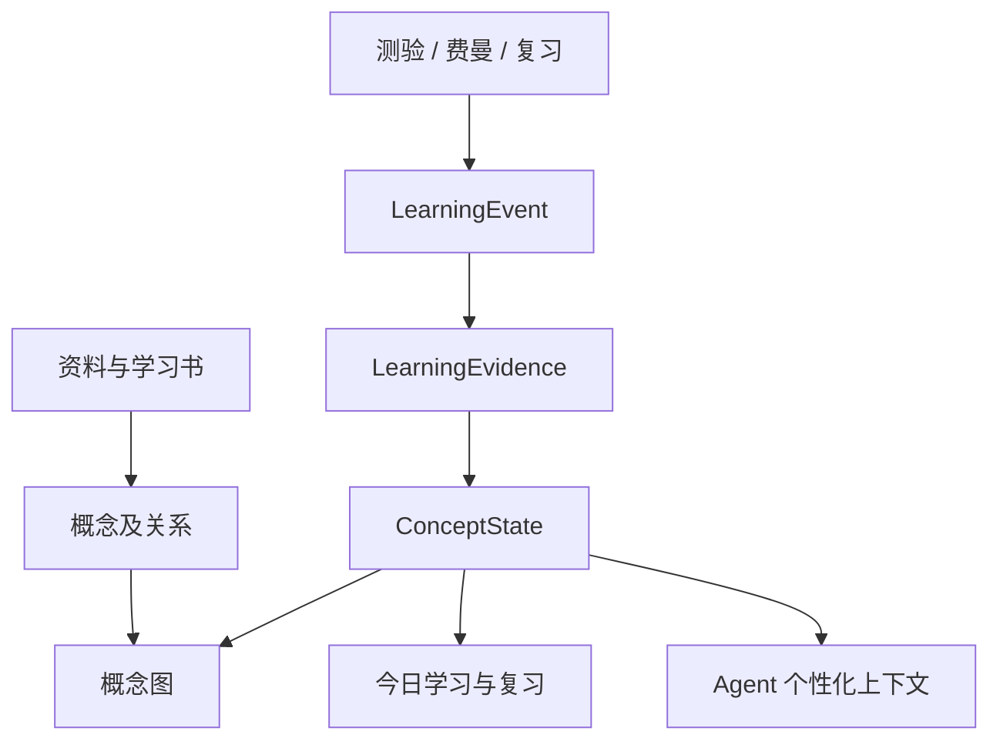
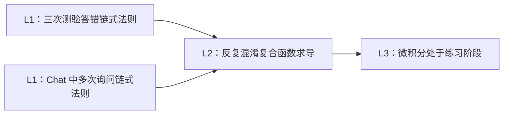
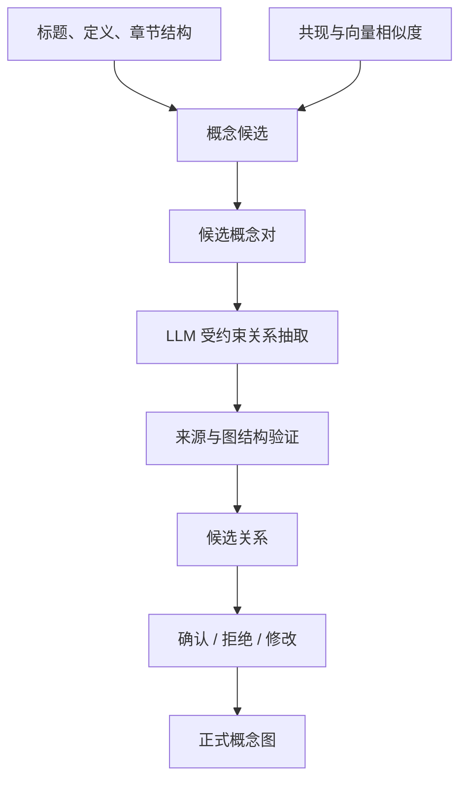
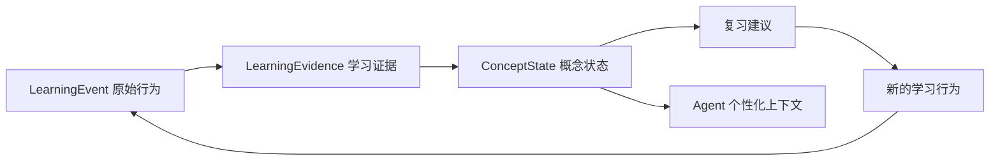

# HarmonyAgent 产品设想与开发路线

> 版本：产品基线 v1.1
>
> 日期：2026-08-24
>
> 状态：十三项核心产品决定已确认
>
> 参考项目：[DeepTutor](https://github.com/HKUDS/DeepTutor)
>
> 当前代码基线：[HarmonyAgent PR #7](https://github.com/Tangzy0121/HarmonyAgent/pull/7)，已合并为 `c734b30`
>
> 详细规范入口：[docs/product/README.md](product/README.md)

## 1. 一句话定位

`loci`（工程代号 HarmonyAgent）不是简单的“上传 PDF 后与 AI 聊天”，也不是照搬整个 DeepTutor，而是一个以 HarmonyOS 为首个真实客户端的个人学习 Agent：

> 以连续学习项目组织体验，以学习书承载学习，以持续 Chat 提供协助，并通过可追溯的知识模型和学习者模型决定“下一步应该怎样学”。

短期从“一份资料形成完整学习闭环”切入，长期发展为跨资料、跨课程、跨设备的个人学习操作系统。

## 2. 我们当前形成的共识

### 2.1 产品原则

1. 愿景可以大，但首版必须只有一条能真正跑通的主流程。
2. 不以页面数量衡量功能，先定义后端事实、事件、状态和推导规则。
3. 模型输出不能直接成为事实；引用、掌握度和学习记忆都必须可追溯。
4. 普通聊天不能直接改变掌握度，只有测验、费曼解释和复习等明确行为可以形成学习证据。
5. Memory 首先是后端能力，不为了展示而设置一级页面。
6. 知识地图不能只有“看起来相关”的连线，关系必须有类型、解释和来源。
7. 首版不同时扩展搜索、MCP、多 Agent、动画、社区和账户体系。

### 2.2 首版用户入口

首版应用外壳只保留两个一级内容入口和一个持续助手入口：

- **今日**：只回答“现在最值得做什么”，突出一条主推荐和最多两条备选；
- **学习库**：查找和管理进行中、已完成及已归档的学习项目；
- **Chat**：任意页面可唤起、作用域始终可见的学习助手，不作为内容 Tab。

学习书由今日推荐或学习库进入，是全屏学习工作区，不是一级导航。Memory 首版只做后端能力；概念图放在学习书内部。

## 3. 首版完整用户流程

1. 用户创建学习项目并选择一份 PDF、Markdown 或 DOCX；
2. 后端解析成可定位的页、章节或段落，并保存原文来源；
3. 用户填写学习目标、当前水平和希望的学习深度；
4. Agent 生成学习书提案、章节目录、每章目标和预计时间；
5. 用户在独立确认页审阅、编辑并确认学习方案；
6. 系统优先生成第一章，后续章节在后台继续生成；
7. 用户在单一学习书工作区阅读讲解、示例、结论和原文引用，并可随时向章节 Agent 提问；
8. 用户完成小测或费曼解释；
9. 后端保存原始行为，形成学习证据，更新概念状态；
10. 今日学习根据概念状态和复习时间给出下一步；
11. 书内概念图展示知识依赖、用户掌握状态及其判断依据。

## 4. 首版必须实现的功能

### 4.1 资料与沉浸式阅读

- PDF、Markdown、DOCX 上传、解析、来源查看和安全删除；
- 使用统一 `DocumentUnit` 表示 PDF 页、文档章节或文本段落；
- 所有生成内容通过 `SourceAnchor` 返回原文；
- 阅读原文时支持选中文本并调用解释、对比和提问；
- Agent 回答中的引用可以跳回原文位置；
- 明确区分“资料依据”和“Agent 补充”。

首版不做 OCR、网页、音视频和多资料合并。

### 4.2 Chat

- 普通多轮对话；
- 流式输出、停止生成、重新生成；
- 会话保存、恢复和删除；
- 上下文范围选择：学习概况、当前项目、当前书、当前章节、当前概念、选中文本；
- 学习模式支持解释、举例、对比、总结、出题、费曼检查和定位原文；
- 学习模式回答必须带可验证引用；
- 会话按学习项目组织；切换章节时提示继续旧会话或创建新会话，不静默混淆上下文；
- 保存笔记、创建复习题等写操作必须由用户确认；普通 Chat 不得直接修改正文、概念关系和掌握状态。

首版不做网页搜索、任意代码执行、MCP、Skills 和多 Agent 协作。

### 4.3 互动学习书

- 根据资料、学习目标和当前水平生成提案；
- 用户可修改章节标题、目标、顺序和删除章节；
- 确认后优先生成第一章，其他章节渐进生成；
- 生成任务具有 `pending / generating / ready / failed / paused` 状态；
- 支持失败重试、断点继续和防止同一章节重复生成；
- 首版内容块只保留：讲解、示例、公式或结论、引用、小测、费曼解释；
- 保存阅读进度、书签、测验结果和章节会话；
- 支持重新打开并继续学习；
- 目录是导航层，正文和概念图是内容模式，Chat 与来源阅读器是覆盖层；
- 小测和费曼嵌入章节，不建立平行的讲解、验证和普通章节完成页面。

### 4.4 测验、费曼与学习证据

- 每章定义 2～4 个明确学习目标；
- 记忆与步骤型目标主要通过题目验证；
- 概念与设计型目标主要通过费曼解释验证；
- 每次作答和解释先产生不可变 `LearningEvent`；
- 后端根据事件形成 `LearningEvidence`；
- 一个概念的掌握状态由多条证据综合决定，而不是答对一道题立即掌握；
- 错误答案、遗漏点和复习结果可以改变概念状态；
- 自由聊天只能提供线索，不能直接修改掌握度。

### 4.5 今日学习与复习

- 今日突出一条主推荐，最多提供两条弱化备选；
- 推荐说明动作、原因、所属项目和预计时间；
- 推荐在到期复习、继续章节、下一章、恢复项目和新建项目之间确定性排序；
- 首版使用简单、可解释的间隔复习规则；
- 复习作为学习书内部的 3—5 个概念短任务；
- 文件解析和章节生成状态通过独立 `ProjectNotice` 横幅或角标提示，不替代今日推荐。

## 5. 后端核心模型

| 模型 | 作用 |
| --- | --- |
| `LearningProject` | 聚合学习目标、来源、学习书与生命周期的用户对象 |
| `Document` / `DocumentUnit` | 保存资料及可定位内容单元 |
| `SourceAnchor` | 连接生成内容、回答、概念关系和原文 |
| `Book` / `Chapter` / `Block` | 学习书结构和生成状态 |
| `Conversation` / `Message` | Chat 会话、消息和上下文范围 |
| `Citation` | 回答使用的真实原文依据 |
| `LearningObjective` | 章节希望用户最终具备的能力 |
| `LearningEvent` | 不可变的原始学习行为 |
| `LearningEvidence` | 对学习事件的可解释评价 |
| `Concept` | 规范化知识点及别名、描述、来源 |
| `ConceptRelation` | 有类型、有证据的概念关系 |
| `ConceptState` | 某用户对某概念的学习状态 |
| `ReviewItem` | 到期复习任务和调度信息 |
| `TodayRecommendation` | 可解释的主推荐和备选行动 |
| `ProjectNotice` | 解析、生成、失败和恢复等项目状态提示 |

核心数据流：



## 6. 先区分 DeepTutor 的两张图

DeepTutor 实际上存在两套目的完全不同的图：

1. **MemoryGraph**：展示系统如何从原始行为形成长期记忆；
2. **Book ConceptGraph**：展示学习书中的概念、章节和前置关系。

MemoryGraph 解决“系统为什么这样理解用户”，ConceptGraph 解决“知识应该如何组织”。HarmonyAgent 不能把两者混成一张只有节点和连线的图。

### 6.1 DeepTutor MemoryGraph：记忆形成的溯源图

DeepTutor 的 MemoryGraph 不是知识点语义图，而是三层记忆之间的引用图：

| 层级 | 内容 | 来源或形成方式 |
| --- | --- | --- |
| L1 | 原始对象与行为 | Chat、Quiz、Book、Notebook 等真实记录 |
| L2 | 单一场景的归纳 | 从一组同类 L1 记录中提炼出的事实 |
| L3 | 跨场景用户画像 | 从多个 L2 文档形成学习偏好、近期关注和知识范围 |

例如：



这里的边不是“相似度”，而是引用关系：

- L2 事实必须引用具体 L1 对象；
- L3 判断必须引用 L2 归纳；
- 用户可以沿引用逐级回到原始记录；
- L2→L1 的精确引用是强边；
- L3 只能确定某个场景、无法定位具体 L2 条目时使用软边。

这套关系可以在 [DeepTutor MemoryGraph 数据层](https://github.com/HKUDS/DeepTutor/blob/main/web/lib/memory-graph.ts) 中看到。

DeepTutor 的 Memory 页面实际上是一个管理工作台，而不是普通学习首页。用户可以：

- 查看系统记住了什么；
- 沿引用返回原始记录；
- 手工编辑或删除错误记忆；
- 重新执行 Update、Audit、Dedup 和 Merge；
- 控制长期记忆如何形成。

可参考 [DeepTutor Memory Workbench](https://github.com/HKUDS/DeepTutor/blob/main/web/components/memory/MemoryWorkbench.tsx)。因此它真正的用户价值是：

> 让长期个性化记忆透明、可追溯、可纠正，而不是单纯展示一张漂亮的图。

### 6.2 DeepTutor Book ConceptGraph：知识与章节依赖图

DeepTutor 在生成学习书目录时，让模型同时输出：

- 概念节点；
- 概念关系；
- 每章覆盖的概念；
- 章节前置条件；
- 章节学习目标。

原始图只允许三类关系：

- `depends_on`；
- `extends`；
- `related`。

每条边带有 `rationale`，解释关系成立的理由。对应结构见 [DeepTutor Book 类型](https://github.com/HKUDS/DeepTutor/blob/main/web/lib/book-types.ts)。

生成过程也不是一次随意调用，而是：

1. Draft：同时生成概念图和章节目录；
2. Critique：检查覆盖、排序和环；
3. Revise：根据问题修订；
4. 确定性后处理。

后处理包括：

- 删除 `depends_on` 中的环；
- 根据依赖关系拓扑排序章节；
- 将未覆盖概念分配到最相关章节；
- 合并重复关系。

实现见 [DeepTutor SpineSynthesizer](https://github.com/HKUDS/DeepTutor/blob/main/deeptutor/book/agents/spine_synthesizer.py)。

但 DeepTutor 的最终用户界面也有缩水：它会把细粒度概念图转换成章节级思维导图，一个节点对应一个章节，主要保留 `depends_on` 和显式章节前置关系。`extends`、`related` 以及概念级细节基本不进入最终章节图。

所以 DeepTutor 的图主要回答：

> 章节应该按照什么顺序学习？

它还没有充分回答：

> 为什么“链式法则”和“反向传播”相连？关系依据在原文哪里？这条关系有多可靠？

它的边虽然有 `rationale`，但没有独立的边级原文引用和置信度。这正是 HarmonyAgent 可以改进的地方。

## 7. HarmonyAgent 的学习概念图

### 7.1 为什么不能只复制 Obsidian

Obsidian 的边主要来自笔记之间的显式内部链接，节点距离和聚类由图布局产生。它擅长展示：

- 哪些笔记互相链接；
- 哪些节点连接较多；
- 哪些笔记形成聚类；
- 当前节点的一跳、两跳邻居。

但它不能自然说明：

- A 是否是 B 的前置知识；
- A 与 B 是否构成对比；
- A 是否是 B 的应用；
- 为什么存在这条边；
- 这条关系来自资料的哪里。

如果 HarmonyAgent 只做“节点距离 + 相关程度”，最终仍然只是一个好看的 Obsidian 式图，而不是教学系统。

### 7.2 产品定义

HarmonyAgent 不使用泛泛的“知识地图”定义，而是：

> 有类型、有依据，并叠加用户学习状态的学习概念图。

它由两层组成：

1. **书籍概念图**：描述知识本身的结构；
2. **学习者状态投影**：描述用户和这些知识之间的关系。

### 7.3 第一层：书籍概念图

```ts
interface Concept {
  id: string
  bookId: string
  name: string
  aliases: string[]
  description: string
  chapterIds: string[]
  sourceAnchors: SourceAnchor[]
}

interface ConceptRelation {
  id: string
  sourceConceptId: string
  targetConceptId: string

  type:
    | 'depends_on'
    | 'part_of'
    | 'causes'
    | 'contrasts_with'
    | 'applies_to'
    | 'extends'

  rationale: string
  evidenceAnchors: SourceAnchor[]
  confidence: number

  method:
    | 'document_structure'
    | 'explicit_reference'
    | 'llm_extraction'
    | 'embedding_candidate'
    | 'user_confirmed'

  status: 'candidate' | 'confirmed' | 'rejected'
}
```

这里最重要的不是单独一个 `confidence`，而是：

- **关系类型**：不是一律称为“相关”；
- **关系解释**：能够用自然语言说明为什么；
- **原文证据**：能够回到资料；
- **生成方式**：知道是结构规则、模型抽取还是用户确认；
- **确认状态**：模型候选不能自动成为最终事实。

例如：

> 链式法则 → 反向传播
>
> 类型：前置知识
>
> 理由：反向传播通过链式法则逐层计算复合函数梯度。
>
> 依据：第 23 页、第 27 页。
>
> 置信度：0.92。

用户不仅可以点击概念节点，也应该可以点击边查看关系解释和证据。

### 7.4 第二层：学习者状态投影

```ts
interface ConceptState {
  conceptId: string
  status: 'unverified' | 'learning' | 'mastered' | 'review_due'
  evidenceIds: string[]
  misconceptionIds: string[]
  lastEvidenceAt: string
  nextReviewAt: string | null
}
```

同一张图叠加：

- 未验证；
- 学习中；
- 已掌握；
- 有误解；
- 待复习。

这样图才能回答：

- 下一步应该学习哪个概念；
- 系统为什么推荐它；
- 它依赖哪些前置知识；
- 用户因为哪次测验或解释被判断为未掌握；
- 这条知识关系来自资料的哪里。

### 7.5 关系生成不能完全交给大模型

后端采用“候选生成 → 受约束抽取 → 确定性验证 → 人工纠正”的流水线：



#### 第一步：概念抽取

从以下内容生成概念候选：

- 标题和小标题；
- 加粗术语；
- 定义句；
- 章节学习目标；
- 高频专业名词；
- Agent 生成的核心概念。

#### 第二步：候选配对

Embedding 只用于找出可能相关的概念对，例如每个概念取 Top 5。它不能直接决定关系成立，也不能决定关系类型。

#### 第三步：受约束关系抽取

向模型提供概念 A、概念 B 和相关原文，要求输出固定 JSON：

```json
{
  "related": true,
  "type": "prerequisite",
  "direction": "A_TO_B",
  "rationale": "反向传播依赖链式法则逐层计算梯度",
  "evidence": ["source_12", "source_19"],
  "confidence": 0.86
}
```

#### 第四步：确定性验证

后端必须检查：

- 引用来源是否真实存在；
- 两端是否都是有效概念；
- 是否出现自环和重复边；
- 前置关系是否形成环；
- `rationale` 是否为空；
- 低置信度关系是否应该隐藏或等待确认。

#### 第五步：人工纠正

用户可以在关系详情中修改受控关系类型、标记关系不成立或补充纠正说明。系统保留原始生成结果和纠正记录；用户确认的关系优先级最高，再生成不得静默覆盖。

### 7.6 图界面必须支持的用户任务

- 默认查看当前章节，并可切换到整本学习书；
- 查看概念的前置和后续；
- 点击边查看“为什么相关”和原文证据；
- 查看从当前水平到目标概念的学习路径；
- 查看节点的掌握状态、误解、最近证据和复习时间；
- 从节点进入学习、向 Agent 提问或开始复习；
- 对错误关系进行确认、拒绝或修改。

首版不做自由拖拽、任意画线和复杂画布编辑。手机端以当前概念为中心显示一层关系，并提供等价关系列表。

## 8. Memory 的后端定位与界面边界

### 8.1 首版为什么不做一级 Memory 页面

如果用户进入 Memory 后只能“看看系统记住了什么”和“看看一张图”，这个功能没有形成任务闭环，不应成为首版一级入口。

首版首先实现后端记忆能力：

- 保存原始学习行为；
- 从行为形成学习证据；
- 从证据更新概念掌握状态；
- 用掌握状态生成复习建议；
- Agent 回答时读取相关状态；
- 所有推断可以回溯到原始行为。

真正的后端链路是：



### 8.2 首版如何让用户感知 Memory

Memory 不需要独立首页，但需要出现在真正有用的位置：

- 今日学习显示“为什么推荐”；
- 概念状态可以返回具体测验、费曼和复习证据；
- Agent 显示本轮使用了哪些学习状态；
- 用户可以纠正“我并没有掌握这个概念”；
- 用户可以删除不应该进入长期记忆的记录。

### 8.3 长期学习档案

当后端记忆稳定后，再增加“学习档案”工作台：

- 查看系统对自己的判断；
- 查看判断来自哪些原始行为；
- 修改或删除错误记忆；
- 区分近期状态和长期偏好；
- 控制哪些记忆允许 Agent 使用。

因此，Memory 首先是基础设施和审计能力，之后才是产品页面。

## 9. 长期产品方向

HarmonyAgent 长期维护三类模型：

1. **内容模型**：资料中有什么；
2. **知识模型**：这些内容如何组织；
3. **学习者模型**：用户学到了什么、为什么这样判断。

所有功能服务六个阶段：获取知识、理解知识、组织知识、练习验证、记忆复习、迁移创造。

### 阶段 1：单书学习闭环

- 单资料导入；
- 学习书；
- 带引用 Chat；
- 测验和费曼；
- 学习证据；
- 概念图；
- 简单复习；
- HarmonyOS 核心页面。

### 阶段 2：个人知识空间

- 多资料学习空间；
- 跨书概念归并；
- 原文高亮和笔记；
- 更完整的间隔复习；
- 学习计划；
- 跨设备同步；
- 可纠正的长期学习记忆。

### 阶段 3：个人学习操作系统

- 多学习目标管理；
- 自适应教学策略；
- 项目式和迁移型任务；
- 长期学习者建模；
- 端云协同和离线学习；
- HarmonyOS 服务卡片、分享入口、通知和多设备接续。

### 阶段 4：学习平台与生态

- 教师课程与模板；
- 教学技能插件；
- 学习书分享；
- 班级整体薄弱点分析；
- 开放 Agent/API；
- 账户、权限和隐私体系。

## 10. 与 DeepTutor 的关系和差异

值得借鉴：

- Chat、阅读和学习能力共用统一 Agent Loop；
- Book 的提案、目录、概念图、渐进生成、暂停和恢复；
- 原文与 Chat 并排的沉浸式阅读；
- 依据目标类型选择测验或解释验证；
- Memory 的分层、引用链和可纠正性。

暂不照搬：

- Deep Research、Web Search；
- Math Animator、视频和图片生成；
- MCP、Skills、Partners 和多 Agent；
- Notebook、独立题库和社区；
- 多用户管理及复杂模型供应商配置。

我们的主要差异：

- 更聚焦“有证据的学习闭环”；
- 概念关系具有类型、解释和边级原文证据；
- 学习者状态与概念图直接结合；
- 利用 HarmonyOS 做分享入口、跨设备接续、服务卡片和端云协同。

## 11. 开工顺序与 PR 拆分

当前按完整纵向切片推进，不从重画页面或建设大而全组件库开始：

1. 文档、ADR 与共享合同；
2. 学习项目聚合与创建状态机；
3. 首章生成与单一学习书工作区；
4. 有明确作用域的 Chat；
5. 学习事件、证据、概念状态与复习；
6. 有证据的书内概念图；
7. 今日推荐、项目通知与学习库收口；
8. HarmonyOS 真实端到端与发布门禁。

具体里程碑、PR 拆分和验收门槛见 [开发路线与验收标准](product/06-开发路线与验收标准.md)。客户端与服务端可以并行，但必须先共享同一套 API Schema、事件合同和错误码。

## 12. 当前工程基线（2026-08-24）

PR #7 已合并进 `master`，合并提交为 `c734b30`。它完成了原型整理、管理端和服务端 CI、构建修复、真实表面 fixture 收口、限定范围 Agent，以及首版前测流程分叉移除。

当前 Book 已存在提案、确认、章节流式生成和本地保存的实验链路，但整体仍属于 `Prototype`。自动测试中的上游大模型主要使用 Mock；构建和测试通过不能证明真实文件、真实模型和 HarmonyOS 客户端的完整闭环可用。

下一阶段仍需完成：

- 新产品口径下的领域模型和 API 冻结；
- DevEco Studio 构建与 HarmonyOS 实机或模拟器联调；
- PDF、Markdown、DOCX 的真实端到端验收；
- 账户权限、正式数据库、对象存储、部署和监控；
- 有边级证据和用户纠正的概念图；
- Web 原型与 HarmonyOS 通过同一 `server/` 读取和写入业务状态。

## 13. 已确认的产品决定

1. 主结构为“今日＋学习库＋持续 Chat”；概念图属于学习书内部。
2. 用户感知连续学习项目，后端仍分离 `Document`、`Book` 等事实对象。
3. 手机阅读器正文优先，来源按需打开，不使用默认拥挤分栏。
4. 概念图首版用于查看、溯源和受控纠错，不做自由画布编辑。
5. `TodayRecommendation` 与 `ProjectNotice` 分离；今日不被文件状态替代。
6. 学习库只列学习项目，原始来源降为次要元数据。
7. 创建采用“选择来源＋学习设置＋方案确认”，后台解析和首章优先生成。
8. 学习书采用单一全屏工作区，不设平行的讲解、验证和普通完成页面。
9. 概念图默认当前章节，支持整本书范围和关系详情纠错。
10. 掌握状态由可追溯正式证据驱动；阅读和普通 Chat 不改变掌握度。
11. Chat 作用域始终可见，会话按项目组织，写操作需要确认。
12. 今日只有一条主推荐和最多两条备选，项目通知独立显示。
13. 学习库按进行中、已完成、已归档组织，每张卡片只突出一个下一步动作。

这些决定已经写入 [ADR-002](architecture/ADR-002-统一产品口径与单一学习项目闭环.md) 和 [现行产品文档](product/README.md)，不再作为开放问题。
