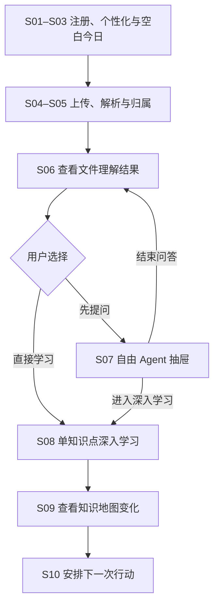
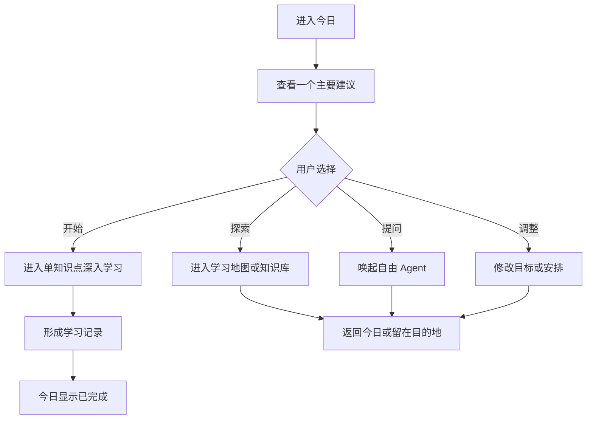

# 用户旅程

**版本：** V1.0

**状态：** 历史设计基线；产品流程已被 `docs/product/02-用户流程与状态模型.md` 取代

> [!WARNING]
> 本文保留旧 S01—S10 和视觉探索供追溯。现行主流程是连续学习项目、单一学习书工作区和书内概念图，新增实现请使用 [`docs/product/`](../product/README.md)。

## 1. 文档目的

本文档用于明确知识管理 Agent 独立 App 的核心用户旅程，并作为信息架构、交互原型、产品需求和比赛演示脚本的共同依据。

当前产品定位为：

> 一个以个人知识库和学习者模型为基础，持续帮助用户摄入、理解、学习、复习和连接知识的个人知识 Agent。

独立 App 是完整产品。小艺、系统分享、桌面组件和通知仅作为可选连接器，用于缩短导入、查询、提醒和继续学习的路径；任何核心能力都不能依赖系统智能体才能完成。

---

## 2. 核心体验目标

新用户第一次使用时，应在一条连续旅程中理解产品的四项核心价值：

1. Agent 能读懂用户自己的学习资料，而不只是保存文件；
2. Agent 能把资料转化为可学习的知识结构，而不只是生成摘要；
3. Agent 能根据内容和用户状态提出下一步学习建议，而不只是等待提问；
4. 用户的资料、自由问答和单点学习会分别沉淀为资料资产、知识关系与可解释的学习记录。

首次价值时刻不是“文件上传成功”，而是：

> 用户看到 Agent 已将自己的资料转化为可追溯的知识结构，围绕一个知识点完成短学习，并在知识地图中看到本次变化，最后自主安排下一次行动。

---

## 3. 旅程设计原则

### 3.1 一项任务，而不是一次产品导览

首次旅程虽然经过“今日、知识库、自由 Agent、深入学习和知识地图”等载体，但用户感受到的应始终是同一项任务：

> 让 Agent 认识并帮助我学习第一份资料。

不应为了介绍功能而强制用户依次参观页面。

### 3.2 先展示价值，再要求用户理解产品结构

首次使用时尽量避免要求用户理解“文件类目、知识节点、知识空间、学习者模型”等内部概念。界面优先使用用户语言：

- “这份材料属于哪里？”而不是“选择文件类目”；
- “我从资料中发现了这些核心内容”而不是“知识抽取完成”；
- “为什么推荐复习它？”而不是只显示一个不透明的掌握度分数。

### 3.3 Agent 主动，但用户拥有最终控制权

Agent 可以提出分类、知识关系、学习路径和复习建议，但应同时提供判断依据，并允许用户确认、修改或拒绝。

### 3.4 首次体验轻量，画像逐步建立

注册阶段只收集会立刻影响体验的信息。更细的偏好和学习习惯应根据后续行为逐步推断，并在重要判断前向用户确认。

### 3.5 地图表达知识结构，不替产品判断用户是否学过

仅有一份文件时，也应形成一张由真实资料构成的小型个人知识地图。地图默认用轮廓、节点形态、位置、连接和标签表达知识类别与关系；学习状态只作为用户主动开启的个人图层。当前视觉基线以烟灰节点为主体，桃色和冷紫只辅助当前学习与待复习状态。官方模板可以辅助展示完整形态，但不能伪装成用户已经拥有或掌握的知识。

### 3.6 页面与能力各自收敛

- 今日负责给出一个可解释、可调整的行动焦点；
- 学习地图负责展示知识 outline 与关系；
- 约 30% 节点信息面板负责知识点概要、邻近节点、学习入口和资料跳转；
- 列表型知识库负责资料管理、筛选和正文阅读；
- 自由 Agent 负责跨知识点、跨主题、跨全库问答；
- 深入学习只围绕单一知识点形成有目标的学习闭环。

---

## 4. 核心用户与首次场景

### 4.1 目标用户

以需要持续处理学习资料的大学生为主要原型用户，同时兼容备考者与职场学习者。

### 4.2 示例场景

用户刚获得一份《机器学习》第三章课件，希望快速知道课件讲了什么、应该从哪里开始学习，以及其中是否存在自己欠缺的前置知识。

### 4.3 用户初始状态

- 尚未建立个人知识库；
- 今日没有学习任务；
- 学习者模型缺少有效行为数据；
- 对产品能力和内部结构不熟悉；
- 愿意上传资料，但未必知道应该向 Agent 提什么问题。

---

## 5. 首次使用主旅程总览

这条旅程形成的完整闭环是：

> 资料进入 → Agent 理解 → 用户自由探索或直接学习 → 单点学习形成证据 → 地图揭示变化 → 用户安排下一次行动。

S07 自由提问不是首次旅程的强制步骤。真实用户可以从 S06 直接进入 S08；比赛演示可以经过 S07，以展示全库问答与深入学习之间的转换。

---

## 6. 分阶段用户旅程

### 阶段一：创建账号

**用户目标**

快速进入产品，确认自己的学习数据能够被持续保存。

**用户行为**

1. 打开 App；
2. 查看简短的价值说明；
3. 选择手机号、邮箱或第三方账号完成注册；
4. 阅读并确认必要的数据与隐私说明。

**界面与系统行为**

- 首屏用一句话说明产品价值，不使用大段功能介绍；
- 注册流程尽量短；
- 清楚区分本地保存、云端处理和同步能力；
- 注册成功后直接进入轻量个性化，不要求先浏览功能教程。

**关键文案示例**

> 让每一份资料，最终成为你真正掌握的知识。

**数据沉淀**

- 账号基础信息；
- 隐私授权状态；
- 同步与云端生成偏好。

**体验风险**

- 注册前解释过多，延迟用户看到价值；
- 使用“知识不出端”等绝对表述，却实际需要上传最小上下文至云端生成。

---

### 阶段二：轻量个性化

**用户目标**

让 Agent 初步了解自己的学习背景，同时尽快开始体验。

**建议收集的信息**

1. 当前身份：大学生、备考者、职场学习者或其他；
2. 最近在学习什么；
3. 当前主要目标：课程预习、考试复习、长期积累或项目研究；
4. 希望 Agent 当前更偏向：解释、整理或训练。

**交互原则**

- 控制在 3—4 个轻量问题内；
- 每个问题都可以跳过；
- 不在此时询问详细学习时段、所有课程、认知风格等难以准确自述的信息；
- 说明这些信息将怎样影响后续推荐。

**Agent 行为**

- 创建初始用户画像；
- 生成初始内容呈现偏好；
- 暂不对掌握度作出强判断。

**数据沉淀**

- 用户明确声明的背景与目标；
- 信息来源标记为“用户自述”，与后续行为推断区分。

---

### 阶段三：进入“今日”空白状态

**用户目标**

理解现在可以做什么，并完成第一个有价值的动作。

**页面状态**

今日页面尚无复习计划、未完成任务和历史资料，但不能只显示空白。页面应呈现一个明确的新手任务。

**推荐结构**

- 标题：让 Agent 认识你的第一份知识；
- 说明：上传课件、笔记或教材，生成属于你的知识结构；
- 主 CTA：上传第一份资料；
- 次入口：暂时没有资料？体验示例知识空间。

**系统行为**

- 主 CTA 启动连续的资料导入任务流；
- 不必先把用户带到完整知识库首页；
- 用户选择体验示例时，明确标注其为独立示例，不写入个人学习状态。

**关键体验要求**

用户需要明确知道：上传不是为了云盘式保存，而是为了让 Agent 开始理解和帮助学习。

---

### 阶段四：上传第一份资料

**用户目标**

以尽可能低的成本把手中的资料交给 Agent。

**用户行为**

1. 点击“上传第一份资料”；
2. 从设备文件、相册扫描或系统分享中选择资料；
3. 查看文件上传和解析状态。

**系统行为**

- 校验文件格式、大小和可读性；
- 显示真实处理阶段，例如上传、解析和生成理解结果；
- 处理时间较长时允许用户离开，并在完成后通知；
- 失败时保留文件与已完成进度，提供清晰的重试原因。

**信任与隐私要求**

- 在发生云端处理前说明会发送哪些内容；
- 仅发送完成任务所需的最小上下文；
- 用户可以选择不生成、仅本地保存或删除文件。

**数据沉淀**

- 原始文件；
- 文件来源与上传时间；
- 解析状态与错误信息；
- 用户对云端生成的授权记录。

---

### 阶段五：Agent 建议资料归属

**用户目标**

知道这份材料被放在哪里，同时不必手动完成复杂分类。

**Agent 行为**

Agent 根据文件标题、内容、用户画像和已有空间判断：

- 资料主题与课程；
- 可能所属的知识空间；
- 是否应创建一个新空间；
- 与已有资料是否重复或相关。

**界面呈现示例**

> 检测到这是一份《机器学习》课程课件  
> 建议放入：机器学习基础

操作：`确认`、`更换知识空间`。

如果用户还没有知识空间，系统直接建议创建，并预填名称。首次流程中不要求填写完整描述、标签和封面。

**设计要求**

- 自动建议，不自动决定；
- 展示简短判断依据；
- 用户修改后，Agent 记住这次选择，但不能将一次修改直接推断为永久规则。

**数据沉淀**

- 文件与知识空间的归属关系；
- Agent 建议和置信信息；
- 用户最终确认结果；
- 用户修正行为。

---

### 阶段六：呈现文件理解结果

**用户目标**

快速知道资料讲了什么、重点在哪里，以及下一步可以做什么。

**Agent 行为**

处理完成后，Agent 主动展示对文件的初步理解，而不是把用户丢进空白对话框。

**首屏结果建议包含**

- 一句话内容概述；
- 3—5 个主题或章节；
- 若干核心概念；
- 识别到的前置知识；
- 一个有依据的优先学习建议；
- 每项内容对应的原文出处。

**界面示例**

> 我从这份课件中识别出 4 个主题和 13 个核心概念。  
> 建议先理解“监督学习与无监督学习的区别”，因为它是后续两章的共同基础。

**主要操作**

- 开始深入学习；
- 向自由 Agent 提问；
- 在知识地图中查看。

“开始深入学习”应明确落到一个推荐知识点；“向自由 Agent 提问”以当前文件作为可移除的弱上下文；“在知识地图中查看”聚焦这份资料新增的知识斑块，而不是把文件本身作为地图节点。

**首次价值时刻**

用户确认 Agent 并非只完成了上传和摘要，而是已经形成了对资料结构、重点和学习顺序的理解。

**数据沉淀**

- 文件结构；
- 概念、公式、例题等知识单元；
- 概念关系与出处；
- Agent 的初始学习路径建议。

---

### 阶段七：唤起自由 Agent 完成首次提问（可选）

**用户目标**

结合当前资料和个人全库进行查询、比较、解释或联想，而不进入固定学习流程。

**进入方式**

用户点击底部导航右侧的独立圆形对话入口。当前页面保持原位，自由 Agent 抽屉从底部上拉，默认覆盖约 75% 页面；用户可以继续上拉至全屏，也可以下拉关闭并回到原页面。

从 S06 唤起时，当前文件以可移除的弱上下文标签呈现。Agent 始终具备跨知识点、跨主题和跨知识空间能力，当前文件只影响优先检索范围，不把对话锁死在该资料中。

**Agent 开场方式**

不要只展示空白输入框。抽屉可以提供 2—3 个结合当前资料生成的建议问题，例如：

- 这份材料与我已有的哪些知识有关？
- 哪些资料也讲过监督学习？
- 比较监督学习和无监督学习的适用场景。

同时保留自由输入框、上下文标签、引用来源和历史会话入口。

**能力边界**

- 自由 Agent 可以跨知识点、跨资料、跨知识空间回答；
- 适合即时问答、比较、联想、查找资料和知识探索；
- 默认只记录对话与引用，不因为几次问答就把节点标记为“已学习”；
- 不在自由对话中强行加入自评、验证题或阶段化学习流程；
- 用户连续围绕单一知识点追问时，可以轻量建议“进入深入学习”。

用户接受建议后，当前对话中的问题、关键解释与引用资料被带入 S08，作为学习起点；用户拒绝时继续自由问答，不反复催促。

**数据沉淀**

- 自由 Agent 会话及可见上下文；
- 用户问题、追问和引用来源；
- 用户主动保存的结果；
- 可用于推荐但不能单独证明掌握程度的兴趣信号。

---

### 阶段八：完成单知识点深入学习

**用户目标**

围绕一个明确知识点完成短而完整的学习，并知道本次学习形成了什么记录。

**进入方式**

用户可以从 S06 的推荐知识点直接进入，也可以从自由 Agent、知识地图节点信息面板或今日建议进入。首次旅程中，S07 不是 S08 的必经步骤。

**页面与会话边界**

- 一次会话只锁定一个核心知识点；
- 相关概念可以作为解释材料，但不扩张为跨全库自由问答；
- 页面显示当前知识点、学习目标、预计时长、参考资料和退出入口；
- 学习过程有明确阶段和结束状态，而不是无限对话。

**推荐学习结构**

1. 说明本次目标与已有上下文；
2. 用解释、例子或类比建立初步理解；
3. 通过回忆、自述或一道极短验证题检查理解；
4. 针对误区补充反馈；
5. 由用户确认结束、继续或标记待复习。

**系统边界**

- 一次回答错误不能直接等同于“不会”或“未学习”；
- 完成会话形成的是产品内的学习证据，不是对用户全部真实掌握程度的绝对判断；
- 用户可以手动补录软件外的学习状态，也可以清除或修正状态；
- 如果用户提出明显跨知识点的问题，系统先做简短回应，再提供“转到自由 Agent 继续探索”，但不因轻微发散强制跳转。

**完成反馈与去向**

完成后展示简短摘要：学了什么、使用了哪些资料、形成了什么证据、是否需要复习。首次旅程默认进入 S09 查看地图变化；从其他入口进入时，应能返回原地图位置、原今日任务或原自由对话。

**数据沉淀**

- 单知识点学习目标与过程；
- 用户自述、验证结果和修正记录；
- 引用资料；
- 可解释的学习状态证据与复习建议。

---

### 阶段九：查看个人知识地图变化

**用户目标**

看见首份资料如何进入长期知识网络，以及刚才的学习如何附着到对应节点。

**触发时机**

知识结构在文件解析完成后已经生成。S09 不是“学习结束后才生成地图”，而是在首次学习后揭示并聚焦本次变化：

> 你的知识版图新增了 12 个节点和 4 条联系；刚才的学习记录已附着到“监督学习”节点。

**地图职责与呈现**

- 地图展示知识节点、主题簇、类别分区和节点关系；
- 原始文件不是主要地图节点，只作为知识节点的来源；
- 地图保留完整知识网络，但不要求所有节点始终挤在当前屏幕内；
- 用户平移或缩放视角时，节点可以自然越过屏幕边缘并消失；
- 新增或刚学习的节点通过短期光晕、脉冲和关系线高亮表达，不占用长期颜色语义。

**默认视觉语义**

| 视觉元素 | 表达内容 |
|---|---|
| 节点轮廓、描边形态与文字标签 | 知识类别 |
| 节点位置 | 知识之间的关联与聚集 |
| 节点大小 | 结构重要性或当前焦点 |
| 连线 | 知识关系 |
| 青色临时标记或光晕 | 本次新增、引用或关系变化 |
| 学习状态图层 | 无学习记录、绿色已掌握、橙色待复习；同时显示文字或形态 |

地图默认展示“知识版图”，表达“我拥有哪些知识领域，它们如何连接”。学习状态由用户主动切换查看；系统只能声称“无学习记录”，不能把所有新节点自动判定为“未学习”。

**节点信息面板**

用户点击节点后：

1. 节点进入焦点区，一阶关系高亮；
2. 约 30% 高度的节点信息面板从底部浮现；
3. 后方保留大部分地图，以维持空间连续性；
4. 面板展示知识点概要、所属主题路径、邻近节点、深入学习入口和相关资料跳转；
5. 用户可以关闭面板或点击露出的地图返回；需要自由问答时从面板进入 Agent 抽屉。

点击邻近节点时，面板内容切换，后方地图同步移动焦点。点击“查看相关资料”后进入列表型知识库，并自动带入当前节点筛选条件；完整课件、文章正文和笔记全文不在地图或节点信息面板中阅读。

**数据沉淀**

- 知识节点、类别、主题簇与关系；
- 节点与来源文件的映射；
- 本次学习记录与节点的关联；
- 用户对分类、关系和学习状态的修正。

---

### 阶段十：回到“今日”安排下一次行动

**用户目标**

确认今天已经产生的成果，并自主决定何时继续，而不是被立即推入下一轮学习。

**首次闭环反馈**

S10 顶部短暂展示成果确认：

> 第一份知识已经建立  
> 《机器学习第三章》形成了 12 个知识节点；你刚才对“监督学习”的学习记录已保存。

可以配一张局部地图缩略图，点击后返回 S09。该反馈不是长期固定模块，日常回访时缩减为“最近变化”中的一条记录。

**唯一主建议**

页面只突出一个有依据的下一步建议：

> 下一步建议  
> 用 5 分钟理解“监督学习与无监督学习”  
> 它是后续两个主题共同依赖的基础概念。

首次闭环中的按钮层级固定为：

- 主按钮：安排到明天；
- 次按钮：今天继续；
- 辅助入口：为什么推荐、调整时间、换一个建议、今天不安排。

**安排后的结束状态**

点击“安排到明天”后，主卡转为确认状态：

> 已安排到明天  
> 用 5 分钟理解“监督学习与无监督学习”

页面不再自动补充新任务，让用户明确获得“今天已经完成”的结束感。用户如果选择“今天继续”，再进入新的 S08 深入学习会话。

**最终状态变化**

- 今日从空白状态转为已完成并已安排下一次；
- 列表型知识库中出现第一个知识空间和文件；
- 自由 Agent 可能拥有首个会话，但这不是完成首次旅程的必要条件；
- 学习地图出现真实个人知识节点和关系；
- 一个节点获得首批可解释的产品内学习证据；
- 下一次行动由用户确认，而非系统强制追加。

---

## 7. 官方模板与示例知识空间

官方模板可以解决新用户个人资料不足、难以想象完整知识地图的问题，但必须与个人数据明确分离。

### 7.1 上传前：交互式示例

在今日空白页或知识地图空白页提供独立示例：

> 示例：机器学习入门知识地图  
> 看看资料如何成长为可学习的知识网络。

要求：

- 明确标注“示例”；
- 默认不写入个人知识库和学习记录；
- 用户操作示例时，可展示类别分区、节点关系、节点信息面板、资料跳转和建议任务的完整形态；
- 结束后仍将用户引导回“上传自己的第一份资料”。

### 7.2 上传后：可选知识框架

当系统识别出资料所属领域后，可以询问：

> 是否参考“机器学习入门框架”，补充当前资料尚未覆盖的知识方向？

模板在此阶段作为参照框架，而不是用户已经掌握的内容。

地图中，官方框架节点必须通过虚实、描边或标签与个人资料形成的节点明确区分。知识类别继续使用轮廓、位置和标签语义；用户是否有学习记录仍由可选学习状态图层表达，不能让“来源类型”和“学习状态”争夺同一视觉编码。

### 7.3 模板使用边界

- 不用模板填充虚假的个人掌握状态；
- 不因模板存在而自动扩写大量题目和节点；
- 用户确认后，模板节点才可进入个人计划；
- 模板关系与用户资料冲突时，优先展示冲突并允许用户处理，而不是静默覆盖。
- 对外分享知识地图时，默认隐藏学习状态、文件名称、笔记内容和具体来源，只展示知识类别、规模与连接；“近期学习轨迹”应作为另一种主动选择的分享模板。

---

## 8. 回访用户的日常主旅程

完成首次旅程后，用户日常进入 App 时不再从“上传资料”开始，而是进入“今日”。

日常旅程应支持三种用户状态：

1. **目标明确**：用户直接进入深入学习、搜索资料、打开知识空间或唤起自由 Agent；
2. **目标模糊**：今日页给出一个有依据、可完成的主建议；
3. **只想整理**：用户可以导入、分类、编辑资料，不被强迫立刻学习。

“今日”的主建议不只包括学习任务，也可以是继续上次、复习回顾、确认资料归属、处理解析异常或查看新建立的知识联系。主建议完成后显示“今天已经完成计划”，不自动补充新任务。

底部导航采用“目的地胶囊 + 全局对话入口”：

> 今日｜学习｜知识库　　对话

前三项是固定目的地；右侧独立圆形按钮用于在任意页面唤起自由 Agent 抽屉。

---

## 9. 可选系统入口

小艺不是独立主旅程，而是下列任务的可选快捷入口：

- 将当前文件交给知识 Agent；
- 快速查询个人知识库；
- 查看今日任务；
- 继续最近一次学习；
- 接收 Agent 发出的复习提醒；
- 跳转到 App 中对应的文件、自由 Agent 会话、深入学习记录或知识节点。

原则是：

> 核心能力不依赖系统智能体，系统智能体只缩短操作路径。

小艺负责获取系统上下文、路由任务和呈现轻量结果；具体学习意图、材料理解、学习策略和学习者模型仍由产品自己的 Agent 负责。

---

## 10. 异常与替代分支

### 10.1 用户没有可上传资料

- 提供示例知识空间；
- 允许粘贴一段文本或输入一个学习主题；
- 体验结束后继续引导用户导入真实资料。

### 10.2 文件无法解析

- 明确说明格式、损坏、扫描质量或权限问题；
- 支持重新上传、OCR、转换格式或仅保存原文件；
- 不丢失已完成的上传进度。

### 10.3 Agent 分类错误

- 用户可以更换知识空间或创建新空间；
- 展示当前建议依据；
- 将用户修正记录为反馈，但不直接形成永久自动规则。

### 10.4 Agent 生成内容错误

- 每个知识点、答案和关系可追溯至原文；
- 用户可以修改、删除或标记错误；
- 高风险或证据不足的内容标注“不确定”；
- 用户修正后更新相关知识节点和后续建议。

### 10.5 处理时间过长

- 用户可以离开处理页；
- 今日页与知识库展示处理状态；
- 完成后通过 App 内通知或系统通知触达；
- 先返回已经完成的结构，再逐步补充生成内容。

### 10.6 用户拒绝推荐

- 提供“今天不安排”“换一个建议”“不再推荐”“调整目标”等不同强度选项；
- 询问拒绝原因应保持可跳过；
- 不将一次拒绝解释为用户永久失去兴趣。

---

## 11. 完整首次旅程所需页面与关键状态

以下清单用于后续完整首次旅程，不属于当前四张视觉基准页的交付范围。需要完整呈现 S01—S10 时，至少覆盖以下页面或状态：

| 模块 | 关键页面或状态 |
|---|---|
| 注册 | 欢迎页、注册页、隐私与同步选择 |
| 个性化 | 身份、学习主题、目标、Agent 偏好 |
| 今日 | S03 新用户空白状态、处理状态、S10 首次成果反馈、安排到明天与完成状态 |
| 上传任务流 | 文件选择、上传中、解析中、失败与重试 |
| 资料归属 | Agent 分类建议、新建知识空间、修改归属 |
| 文件理解 | 内容概述、主题、核心概念、前置知识、出处和下一步操作 |
| 自由 Agent | S07 约 75% 抽屉、可移除弱上下文、推荐问题、全库自由提问、引用与全屏状态 |
| 深入学习 | S08 单知识点目标、解释、回忆或验证、反馈、完成摘要与转换出口 |
| 学习地图 | S09 首份资料形成的知识斑块、类别语义、地图变化、学习状态图层与关系修正 |
| 节点信息面板 | 默认约 30%、知识点概要、主题路径、邻近节点、学习入口与资料跳转 |
| 知识库 | 列表型知识空间与文件、节点筛选结果、资料正文与原文定位 |
| 示例空间 | 官方示例地图、明确的示例标识、退出与上传真实资料入口 |

各模块之间应通过任务状态连续衔接，而不是每次进入都重新选择文件或重复描述上下文。

---

## 12. 比赛演示主线

比赛原型应重点展示“导入前后用户发生了什么变化”，而不是长时间展示切块、向量化和入库等后台步骤。

建议演示顺序：

1. 新用户进入今日空白页，上传一份机器学习课件；
2. Agent 识别课程并建议创建“机器学习基础”知识空间；
3. Agent 展示课件结构、核心概念和前置知识；
4. 用户从独立对话入口唤起自由 Agent，结合当前资料与全库提出一个跨知识问题；
5. 当对话聚焦到单一概念时，用户主动进入深入学习；
6. 用户围绕该知识点完成一次简短解释、回忆或验证；
7. 学习地图聚焦本次新增知识斑块，用短期光晕展示新节点与联系，并在节点信息面板中查看概要和来源；
8. 用户回到今日，确认本次成果并点击“安排到明天”；
9. 页面显示“已安排到明天”，不再追加新任务；
10. 可选用十几秒展示小艺如何把系统中的文件快速交给同一个 Agent。

演示的核心表达是：

> Agent 不只是整理一份新课件，而是把资料转化为可追溯的知识结构，支持用户自由探索与单点深入学习，并把下一步行动交还给用户决定。

---

## 13. 旅程验证指标

### 首次体验指标

- 注册完成率；
- 个性化信息完成或跳过率；
- 首份资料上传成功率；
- 从上传到看到理解结果的耗时；
- 用户从 S06 直接进入深入学习与先进入自由 Agent 的路径比例；
- 自由 Agent 用户接受“进入深入学习”建议的比例；
- 单知识点深入学习的开始率与完成率；
- 用户查看个人知识地图的比例；
- 用户打开节点信息面板及跳转相关资料的比例；
- 首次旅程完成后选择“安排到明天”“今天继续”或“不安排”的比例。

### 价值与信任指标

- 用户是否能准确说出产品与普通网盘、摘要工具或文档问答的区别；
- Agent 分类建议被接受或修正的比例；
- 用户查看出处和推荐依据的频率；
- 用户修改知识点、关系和学习状态的频率；
- 用户是否能区分“无学习记录”与“未学习”；
- 自由问答被误认为会自动更新掌握状态的比例；
- 首次使用后 7 日内再次进入深入学习或自由 Agent 的比例。

### 需要重点观察的问题

- 用户是否觉得自己在被带着参观多个页面；
- 用户是否理解“今日、学习、知识库”和独立对话入口的职责差异；
- 用户是否理解地图负责 outline、节点信息面板负责概要与导航、知识库负责资料正文；
- 用户是否理解自由 Agent 与单知识点深入学习的区别；
- 文件处理等待是否过长；
- 首次建议问题是否足够自然；
- 小地图能否让用户感受到个人化，而不是像普通思维导图；
- 节点越过视野边缘后自然消失是否符合连续画布预期；
- Agent 的约 75% 抽屉、全屏吸附和拖拽阻力是否自然；节点信息面板是否不遮断地图探索；
- 地图默认用结构形态表达知识类别、学习状态作为可选图层是否清晰；
- “安排到明天”是否形成明确而不过度催促的结束感。

---

## 14. 待进一步决策

1. 注册是否必须在上传前完成，还是允许游客先体验示例与本地上传；
2. 首次个性化问题的最终数量与表述；
3. 支持的首批文件格式与单文件大小；
4. 文件解析过程中可以提前返回哪些渐进式结果；
5. 深入学习采用纯对话、卡片还是“解释 + 回忆 + 验证”的混合形态；
6. 学习者模型第一版采用哪些证据，以及如何向用户解释；
7. 官方模板的来源、审核方式和视觉区分规范；
8. 知识空间、文件类目和课程之间是否需要进一步统一概念；
9. 今日主建议在学习、复习、资料整理和知识探索之间如何排序；
10. 自由 Agent 转入深入学习的触发阈值和提示频率；
11. 地图一级类别的默认数量、自动分类策略、结构形态映射与用户编辑方式；
12. 学习状态图层第一版的证据规则与手动补录机制；
13. 节点信息面板在不同屏幕尺寸下的约 30% 高度和滚动冲突处理；
14. 云端模型处理与端侧存储的具体技术和隐私边界。
