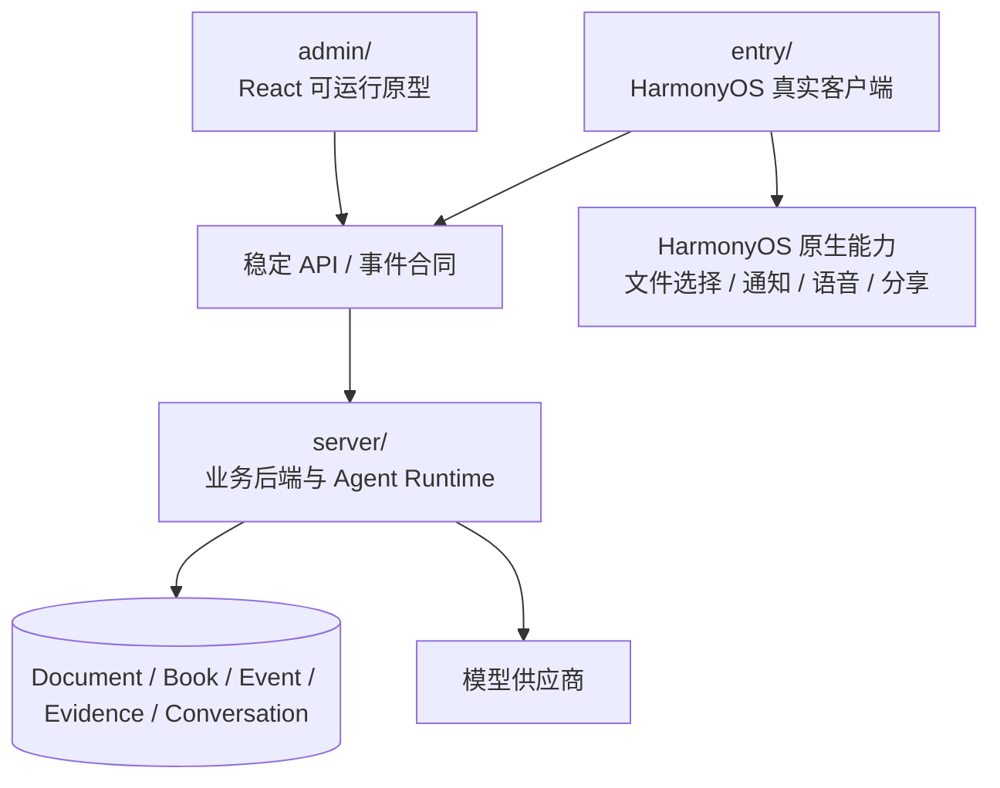

# 跨端架构与实现边界

> 状态：已确认方向
>
> 更新日期：2026-08-24

## 1. 结论

`server/` 是 `admin/` 原型与 `entry/` HarmonyOS 客户端共用的唯一业务后端和事实来源。

两端可以拥有页面状态、缓存和设备能力，但不能各自维护独立的学习项目、证据、概念状态或推荐真相。

## 2. 模块职责

### 2.1 `server/`

负责：

- 来源上传、解析、版本和定位；
- 学习项目聚合；
- 方案与章节生成任务；
- Agent Runtime、工具权限、会话与引用；
- 学习事件接收、证据签发和状态投影；
- 概念与关系、纠正和图投影；
- 复习调度、今日推荐和项目通知；
- 权限、幂等、审计、错误码和业务一致性。

当前实现仍是实验性本地服务，不代表生产存储、账户和部署已经完成。

### 2.2 `admin/`

负责：

- 快速表达和验证产品流程；
- 验证真实 API 合同、流式事件、空状态和错误状态；
- 作为桌面/Web 交互参考和开发管理入口；
- 提供可自动化的领域和页面测试。

不得：

- 只在前端内存中实现另一套正式业务规则；
- 在真实产品表面使用 fixture 冒充服务端数据；
- 先修改 Web 私有 DTO，再要求 HarmonyOS 追随；
- 把浏览器专属材质或手势当作跨端实现。

### 2.3 `entry/`

负责：

- HarmonyOS 原生导航、生命周期、安全区和返回语义；
- 调用同一服务端合同并投影用户状态；
- 文件选择、通知、语音、分享和其他系统能力；
- 设备缓存、未提交草稿和断网恢复；
- ArkUI 原生组件、无障碍和性能降级。

不得：

- 在本地重新计算最终掌握状态；
- 使用 fixture 作为真实页面的默认数据源；
- 将 Web DOM、CSS 或 Hook 逐行移植到 ArkUI；
- 因本地缓存与服务端冲突而静默覆盖服务端事实。

## 3. 共享什么，不共享什么

| 内容 | 共享方式 | 是否共享实现 |
| --- | --- | --- |
| API DTO 和枚举 | OpenAPI / JSON Schema / 版本化事件合同 | 是 |
| 状态机和推荐规则 | 规范、服务端实现、跨端测试向量 | 客户端不复制最终规则 |
| 设计 Token | 平台中立 Token，生成 ArkTS/TS 资源 | 是 |
| 页面职责和路由语义 | 本产品文档与验收场景 | 是 |
| 组件代码 | React 与 ArkUI 分别实现 | 否 |
| 手势和导航 | 共享行为要求，各平台原生实现 | 否 |
| 本地数据库 | Repository 语义一致 | 否 |
| Fixture | 共享合同测试数据 | 只用于开发和测试 |

## 4. API 设计要求

- 客户端围绕学习项目读取聚合视图，不拼接多个内部资源猜测状态。
- 长任务返回任务 ID、阶段、进度语义、可取消性和可重试性。
- 流式 Agent 和章节生成使用版本化事件，不让客户端解析自然语言判断状态。
- 错误返回稳定错误码、用户可读摘要、是否可重试和已保留内容。
- 所有写入支持幂等键；移动端重试不能产生重复事件。
- 分页、时间和 ID 语义在两端一致。
- 合同升级遵循向后兼容或显式版本迁移，不以页面发布时间代替 API 版本。

## 5. 客户端本地状态边界

可以只保存在本地：

- 未发送的 Chat 草稿；
- 未提交的测验或费曼草稿；
- 当前滚动位置和展开状态；
- 短期响应缓存；
- 系统通知调度句柄；
- 原生权限和设备能力状态。

必须由服务端保存：

- 项目、来源和学习书；
- 方案与章节生成状态；
- 正式 Chat 会话和已发送消息；
- 学习事件、证据和概念状态；
- 概念关系和用户纠正；
- 今日推荐与项目通知的业务状态。

## 6. 缓存与离线

- 客户端缓存必须记录服务端版本和更新时间。
- 离线时可以阅读已缓存章节和编辑草稿，但正式提交进入待同步队列。
- 待同步学习事件携带幂等键；同步成功后以服务端回执为准。
- 冲突时展示可解释恢复，不静默覆盖用户长文本。
- 来源未缓存时，引用仍显示元数据并说明需要联网打开。

首版不把完整离线学习列为 `Verified` 前置条件，但合同不得阻断后续实现。

## 7. Agent 与模型边界

- 客户端只选择作用域和提交用户意图，不自行拼装完整系统提示词。
- `server/` 解析作用域、检索来源、执行工具权限和过滤写操作。
- 模型提供草稿、解释和评价候选；确定性代码负责权限、合同验证、幂等和状态投影。
- 模型调用失败不损坏既有项目；流式中断保留已接收内容并允许重试。
- 供应商密钥只存在服务端。

## 8. HarmonyOS 专属能力

HarmonyOS 可以增强核心流程，但不能变成另一套产品：

- 文件选择器进入统一新建项目流程；
- 系统分享创建来源选择草稿；
- 通知深链进入具体项目、章节或复习任务；
- 语音识别只生成可编辑草稿，用户确认后提交；
- 文本朗读不产生掌握证据；
- A2A 或小艺属于可选连接层，不阻塞独立 App 闭环。

## 9. 验证环境

同一纵向切片必须使用同一服务端实例和相同测试资料分别验证：

1. Web 原型创建或读取项目；
2. HarmonyOS 读取同一状态；
3. 一端完成正式学习行为；
4. 另一端刷新后得到相同证据和概念状态；
5. 两端的错误、通知和下一步动作语义一致。

只有真实模型、真实文件和目标 HarmonyOS 设备通过以上路径，能力才能标记为 `Verified`。
