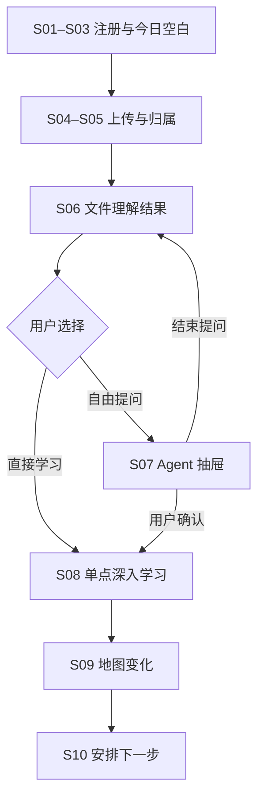

# loci 产品需求文档（PRD）

> 版本：v0.2
> 日期：2026-08-03
> 当前交付目标：独立 App 的移动端高保真前端原型与首次使用闭环  
> 文档状态：当前产品开发基线

---

## 1. 文档目的

本文档将当前已经确认的产品定位、信息架构、首次用户旅程和交互边界转化为可执行的产品需求，并作为队友代码仓库后续重构与新增开发的统一基线。

本文档重点解决三个问题：

1. 明确当前产品已经不再沿用哪些旧假设；
2. 定义独立 App 首版需要实现的页面、能力、状态与数据关系；
3. 为前端原型、后续真实能力接入和比赛演示提供一致的验收标准。

本 PRD 不重复规定全部视觉参数。材质、组件尺寸、动效、响应式与无障碍细节以《视觉设计规范.md》和《UI与交互规范.md》为准。

---

## 2. 版本基线与文档优先级

### 2.1 当前有效产品基线

当前产品定位为：

> 一个以个人知识库和学习者模型为基础，持续帮助用户摄入、理解、学习、复习和连接知识的个人知识 Agent。

独立 App 是完整产品。用户不依赖小艺或其他系统智能体，也能完成资料导入、理解、提问、深入学习、查看知识地图和安排下一步的完整闭环。

### 2.2 文档优先级

本 PRD 是产品定位、范围、功能和验收的真源，但不覆盖专项设计和技术实现文档。当前决策记录见《ADR-001：文档真源与烟晶材质基线》，并按以下关注点执行：

| 关注点 | 当前真源 |
|---|---|
| 产品定位、范围、功能与验收 | 本《PRD.md》 |
| 产品身份与高层设计原则 | `PRODUCT.md`、`DESIGN.md` |
| 视觉语言与烟晶材质边界 | 《视觉设计规范.md》 |
| 组件行为、手势、响应式与无障碍 | 《UI与交互规范.md》 |
| 用户旅程与页面关系 | 《用户旅程.md》《信息架构与页面结构.md》 |
| 客户端架构与迁移边界 | `docs/architecture/` 下已确认的 ADR 与迁移方案 |
| 当前具体视觉与交互参考 | 可运行的 `admin/` 及其基准截图 |

同一关注点冲突时，按“用户最新确认并记录的 ADR → 当前专项规范 → 当前实现基准 → 历史记录”处理。全局结构统一为：

> **今日｜学习｜知识库 + 独立 Agent 入口**

### 2.3 已废弃或降级的旧假设

| 旧假设 | 当前决策 | 仓库处理要求 |
|---|---|---|
| 小艺是主要交互入口 | 独立 App 是完整产品，小艺仅是可选连接器 | 不以小艺页面、协议状态或登录能力作为主流程前置条件 |
| 端 A2A 是产品主架构 | 端 A2A 仅属于可选系统连接层 | 已有代码可隔离保留，但不得决定一级导航和核心数据结构 |
| 卡片流是默认学习形态 | 深入学习采用有目标、有验证、有结束的单知识点任务流；具体可混合解释、回忆、应用与验证 | 不再以卡片列表、翻面和左右滑动作为主页面骨架 |
| 每次卡片交互直接写回掌握度 | 学习状态必须由多种可解释证据形成，单次行为不能等同于掌握结论 | 删除“完成卡片即掌握”等硬编码状态更新 |
| 知识不出端是绝对卖点 | 需要明确区分本地保存、云端处理和同步，并在处理前取得授权 | 禁止使用无法兑现的绝对隐私文案 |
| Agent 是底部一级页面 | Agent 是任意页面可唤起的独立圆形入口和上拉抽屉 | 移除 Agent 一级 Tab，保留跨页面上下文连续性 |
| 地图属于知识库的一种视图 | 学习地图归属“学习”，知识库负责资料列表与正文 | 将图谱页面从知识库 Tab 中解耦 |
| 文件、卡片或课件是地图主节点 | 地图主要展示知识节点和关系，文件只是来源 | 不以文件树或卡片树代替知识地图 |

---

## 3. 产品背景与机会

学习资料通常分散在课件、教材、笔记、网页和对话中。现有工具大多停留在三种能力：保存文件、生成摘要、围绕单份文档问答。它们很难持续回答：

- 这份新资料与我已有知识有什么关系；
- 我现在应该先理解什么；
- 一次问答是否应该转为正式学习；
- 学过的内容如何形成可追溯的个人知识结构；
- 下一次行动为何值得安排。

本产品的机会不在于再做一个文档问答工具，而在于将“资料摄入—结构理解—自由探索—单点学习—证据沉淀—下一步行动”连接为长期闭环。

---

## 4. 产品目标与非目标

### 4.1 首版产品目标

1. 用户能低成本导入一份学习资料，并看懂真实处理状态；
2. Agent 能将资料转化为带出处的知识结构与学习建议；
3. 用户能明确区分跨全库自由 Agent 与单知识点深入学习；
4. 一次深入学习能够形成可解释证据，并附着到对应知识节点；
5. 用户能在学习地图中看到资料与学习带来的变化；
6. “今日”能提出一个有依据、可调整、可拒绝的下一步建议；
7. 独立 App 内可以完成全部核心任务，小艺等连接器不成为阻塞依赖。

### 4.2 当前非目标

- 不做完整笔记编辑器或 Obsidian 替代品；
- 不做无限层级文件夹和复杂文档协作；
- 不做以连续打卡、积分、勋章为核心的游戏化系统；
- 不在首版支持多人知识库、班级或团队协作；
- 不让 Agent 在没有证据时输出精确掌握度；
- 不以大量自动生成卡片作为核心差异点；
- 不在首版实现完整的端 A2A、小艺长时任务、chips 和全部异常协议；
- 不要求首个前端原型接入真实模型、向量数据库或图谱算法。

---

## 5. 目标用户与核心场景

### 5.1 核心用户

主要原型用户：需要持续处理课程、考试或项目学习资料的大学生。

兼容用户：

- 需要长期复习的备考者；
- 需要学习行业知识或新技能的职场学习者；
- 需要跨资料组织研究主题的自主学习者。

### 5.2 首次演示场景

用户刚获得一份《机器学习》第三章课件，希望快速知道：

- 这份资料讲了什么；
- 应该先从哪个知识点开始；
- 是否存在欠缺的前置知识；
- 它与个人已有知识如何关联；
- 学完一个知识点后，下一步做什么。

### 5.3 核心待办

> 当我获得一份新的学习资料时，我希望 Agent 帮我理解其结构、找到合适的学习起点，并将这次学习沉淀进我的长期知识网络，这样我不必在文件、问答工具和复习计划之间反复切换。

---

## 6. 核心价值与产品原则

### 6.1 核心价值

- **摄入**：让资料进入统一、可持续的个人知识范围；
- **理解**：从资料中提取主题、知识点、关系、前置和出处；
- **探索**：通过自由 Agent 跨资料比较、解释和联想；
- **学习**：围绕一个明确知识点完成短闭环；
- **连接**：在学习地图中看见知识如何形成与变化；
- **行动**：根据用户目标和可解释证据安排下一步。

### 6.2 产品原则

1. Agent 可以主动建议，但用户拥有最终控制权；
2. 所有重要 AI 判断都应可见依据、可追溯来源、可修正；
3. 地图表达知识结构，不冒充对用户真实能力的绝对判断；
4. 自由问答与正式学习分离，避免普通对话污染学习状态；
5. 首次体验是一项连续任务，不是一次功能导览；
6. 用户可以自由探索，但关键操作最终回到清晰秩序；
7. 新用户先看到价值，再逐步理解知识空间、节点和学习者模型。

---

## 7. 产品结构

### 7.1 一级导航

| 入口 | 用户问题 | 核心职责 | 不承担的职责 |
|---|---|---|---|
| 今日 | 我现在最值得做什么？ | 一个主要行动、待处理状态、继续学习、近期变化 | 文件管理、完整图谱、开放式对话历史 |
| 学习 | 我的知识如何形成、连接并变化？ | 学习地图、节点抽屉、学习状态图层、深入学习记录 | 原始文件管理、跨全库自由问答 |
| 知识库 | 我保存了哪些资料？ | 知识空间、文件列表、搜索筛选、理解结果、原文阅读 | 今日任务编排、地图主画布 |
| Agent | 我现在想问什么？ | 跨知识点、跨资料、跨空间问答；上下文管理；转入深入学习 | 自动替代学习闭环、未经证据更新学习状态 |

### 7.2 Agent 入口形态

- Agent 不占底部导航 Tab；
- 以与底部导航并列但视觉独立的圆形入口存在；
- 默认打开约 75% 高度的上拉抽屉；
- 可继续上拉至全屏，也可下拉关闭；
- 关闭后返回原页面、原滚动位置和原地图视口；
- 当前页面只作为可移除的弱上下文，不能暗中永久加入会话。

### 7.3 页面容器

| 容器 | 用途 | 示例 |
|---|---|---|
| 一级页面 | 长期目的地并保留页面状态 | 今日、学习、知识库 |
| 任务页 | 完成单一、有结束状态的任务 | 上传、归属确认、深入学习、文件正文 |
| 上拉抽屉 | 保留后方上下文的短至中等交互 | Agent、知识节点详情、筛选、来源详情 |
| 系统浮层 | 短决策和即时反馈 | 菜单、确认、Toast、权限说明 |

---

## 8. 首版范围与交付阶段

### 8.1 P0：视觉与交互基准原型

先使用模拟数据完成以下四张可运行基准页面：

1. 今日；
2. 学习地图；
3. 知识库；
4. Agent 75% 抽屉。

目标是验证浅灰紫连续知识场、深色编辑式层级、稳定实体内容、克制烟晶悬浮控制、桃色 Agent、抽屉阻力、地图惯性与自动吸附，不接后端。

### 8.2 P1：首次使用闭环原型

使用统一模拟数据实现 S01—S10 的连续可操作旅程：

> 注册 → 个性化 → 今日空白 → 上传与解析 → 归属确认 → 文件理解结果 → 可选自由 Agent → 单知识点深入学习 → 查看地图变化 → 安排下一次行动

P1 必须可以脱离小艺独立演示。S07 自由 Agent 是可选路径，S06 必须能直接进入 S08。

### 8.3 P2：真实能力接入

在 P1 结构稳定后，再逐步接入：

- 文件上传、解析和原文定位；
- 知识点与关系抽取；
- RAG 与引用；
- 学习证据与学习者模型；
- 任务安排和通知；
- 小艺、系统分享和桌面组件等可选连接器。

P2 的技术接入不得反向改变 P1 已确认的产品结构。

---

## 9. 首次主旅程

首次价值时刻不是“上传成功”，而是：

> 用户看到自己的资料已经转化为可追溯的知识结构，围绕一个知识点完成短学习，在地图中看到变化，并自主安排下一次行动。

---

## 10. 功能需求

### FR-01 全局导航与状态保持

**需求**

- 底部导航固定为“今日｜学习｜知识库”；
- Agent 圆形入口独立存在；
- 一级页面切换时保留滚动、筛选、地图视口和展开状态；
- 任务页返回进入来源；
- 抽屉关闭后恢复后方页面上下文；
- 系统返回、页面返回和下拉关闭遵循统一优先级。

**验收标准**

- 不出现 Agent 第四个 Tab；
- 从地图打开 Agent 并关闭后，地图视口不重置；
- 从知识库文件进入学习并退出后，能返回原文件位置；
- 点击当前已选导航项可回到该页面默认焦点，但不误清除用户数据。

### FR-02 S01 欢迎与注册

**需求**

- 首屏只展示一句核心价值、注册方式、必要协议和已有账号入口；
- 不在注册前展示冗长功能轮播；
- 明确本地保存、云端处理和同步的基本边界；
- 注册完成后进入 S02。

**P1 原型要求**

- 可使用模拟注册，不要求真实账号系统；
- 必须具备协议展开、注册失败和重新尝试状态。

### FR-03 S02 轻量个性化

**需求**

- 收集 3—4 个会立即影响体验的问题；
- 至少包括身份、最近学习主题、主要目标和 Agent 偏向；
- 所有问题可跳过和返回修改；
- 明确说明每项信息的用途；
- 不在此阶段要求用户声明复杂认知风格或精细学习时段。

**验收标准**

- 跳过不会阻断流程；
- 用户自述与后续系统推断在数据语义上可区分。

### FR-04 S03 今日空白状态

**需求**

- 新用户无任务时显示明确的新手行动；
- 主 CTA 为“上传第一份资料”；
- 次入口为“体验示例知识空间”；
- 示例必须明确标识，不写入个人知识库或学习状态；
- 不显示伪造的统计、任务和学习进度。

### FR-05 S04 上传与解析

**统一流程**

> 选择资料 → 上传 → 解析 → 建议归属 → 用户确认 → 生成理解结果

**需求**

- 展示文件名、格式、大小和移除入口；
- 展示真实阶段，不使用无期限旋转动画；
- 解析时间较长时允许用户离开并后台继续；
- 失败时保留文件和已完成阶段，说明原因并允许重试；
- 部分成功时先展示可用结果，并明确缺失内容；
- 云端处理前说明发送内容和用途，并保留授权记录。

**P1 模拟状态**

- 待上传；
- 上传中；
- 解析中；
- 部分完成；
- 失败并重试；
- 后台继续；
- 完成。

### FR-06 S05 资料归属确认

**需求**

- Agent 根据文件内容、标题、已有空间和用户目标提出归属建议；
- 展示建议空间和一句判断依据；
- 用户可确认、更换或创建新空间；
- 首次创建只要求名称，不要求封面、复杂标签和详细描述；
- Agent 建议不能未经确认直接成为正式归属；
- 用户修正仅作为一次反馈，不直接推断为永久规则。

### FR-07 S06 文件理解结果

**首屏内容**

- 一句话概述；
- 3—5 个主题或章节；
- 核心知识点；
- 前置知识；
- 一个有依据的推荐学习点；
- 关键内容对应的原文出处。

**操作层级**

- 主操作：开始深入学习；
- 次操作：向 Agent 提问；
- 次操作：在学习地图中查看；
- 辅助操作：查看原文、修正理解、文件管理。

**边界**

- “向 Agent 提问”把当前文件作为可移除弱上下文；
- “在地图中查看”聚焦该文件新增的知识斑块；
- 文件本身不成为地图主节点；
- 理解结果与原文是同一文件的两种阅读层，而非两份复制内容。

### FR-08 S07 自由 Agent（可选）

**能力**

- 跨知识点、跨资料和跨空间提问；
- 比较、解释、总结、规划和知识探索；
- 显示当前弱上下文、用户主动添加上下文和可检索范围；
- 回答提供实际引用来源；
- 支持停止生成、继续、重新生成、复制和纠错反馈；
- 对话收敛到单一知识点时，可轻量建议进入深入学习。

**边界**

- 普通问答不会自动更新学习状态；
- 不自动把所有回答保存为知识节点或学习记录；
- 不在自由对话中强制插入验证题；
- 不因当前文件存在而限制跨全库能力；
- 转入深入学习必须由用户确认；
- 用户拒绝转换后不反复催促。

**验收标准**

- 抽屉默认高度约为可用视口的 72%—78%；
- 用户能够看懂“优先参考当前文件”和“允许检索全部知识”的区别；
- 关闭抽屉返回原页面；
- 转入 S08 时携带知识点、关键解释和引用，原对话仍被保留。

### FR-09 S08 单知识点深入学习

**目标**

一次任务只围绕一个知识点或一个短时间内可完成的明确目标。

**首版阶段结构**

1. 明确目标；
2. 连接已有认识；
3. 核心解释；
4. 回忆或应用；
5. 简短验证；
6. 结果反馈；
7. 完成摘要与下一出口。

**需求**

- 展示知识点、目标、预计时长、参考资料和退出入口；
- 相关概念只作为解释材料，不无限扩张任务范围；
- 自评、回答和验证结果仅作为证据之一；
- 错误时解释差异，允许重试、查看来源或标记不确定；
- 用户可查看“为什么系统这样判断”；
- 中断后自动保存，返回时恢复原阶段；
- 用户可以主动结束，不把中断标记为失败；
- 跨知识点问题可转到自由 Agent，但轻微发散不强制跳转。

**完成结果**

- 学习了什么；
- 使用了哪些来源；
- 用户完成了哪些回忆、应用或验证；
- 系统形成了什么学习证据；
- 是否建议复习；
- 查看地图、安排下一次或返回来源。

### FR-10 S09 学习地图

**地图职责**

- 展示知识 outline、主题簇、知识节点和关系；
- 展示资料或学习带来的局部变化；
- 作为进入节点抽屉和深入学习的空间入口；
- 允许按知识范围搜索、筛选、聚焦和查看图层。

**地图不负责**

- 阅读完整资料；
- 展示全部节点详情；
- 把文件作为主要节点；
- 仅凭文件存在判断用户已学习；
- 用同一颜色同时表达类别和掌握状态。

**视觉语义**

| 元素 | 语义 |
|---|---|
| 节点颜色 | 知识类别 |
| 节点位置 | 结构关系和聚集 |
| 节点大小 | 结构重要性或当前焦点 |
| 连线 | 前置、包含、相似、对比、应用等关系 |
| 短期光晕 | 最近新增或刚发生变化 |
| 学习状态图层 | 无学习记录、已学习、待复习 |

“无学习记录”不得写成“未学习”或“不会”。

**交互要求**

- 支持拖拽平移和围绕手势中心缩放；
- 松手后保留短暂惯性并快速衰减；
- 仅在概览、主题和节点等少量语义级别吸附；
- 点击节点后，将其移动至适合抽屉展开的焦点位置；
- 关闭抽屉恢复此前视口；
- 选择邻近节点时地图焦点和抽屉内容同步过渡；
- S09 默认聚焦本次新增知识斑块，不自动漫游整张地图。

### FR-11 知识节点抽屉

**内容**

- 知识点概要；
- 所属主题路径；
- 一阶邻近节点；
- 关系类型；
- 深入学习入口；
- 相关资料与原文跳转；
- 学习证据与状态说明；
- 分类、关系和状态修正入口。

**验收标准**

- 默认以约 30% 高度的节点信息面板呈现，可关闭但不承担全屏阅读；
- 后方保留大部分地图以维持空间连续性；
- 进入相关资料时跳转知识库，并自动带入节点筛选；
- 完整资料正文不在节点抽屉中阅读。

### FR-12 知识库

**需求**

- 默认是编辑式、列表型资料管理页面；
- 支持知识空间范围、搜索、类型、时间和处理状态筛选；
- 文件行至少展示文件名、所属空间、类型、更新时间和处理状态；
- 点击文件进入理解结果，用户可切换原文；
- 从引用进入原文时定位相关页码或段落；
- 支持移动、重命名、重新解析和删除；
- 不建立无限层级文件夹；
- 不将完整知识地图重新塞回知识库页面。

### FR-13 S10 今日成果与下一步

**首次完成状态**

- 展示本次完成的知识点；
- 展示资料和地图变化摘要；
- 只突出一个有依据的下一步建议；
- 主按钮固定为“安排到明天”；
- 次按钮为“今天继续”；
- 辅助入口包括“为什么推荐”“调整时间”“换一个建议”“今天不安排”。

**安排后**

- 显示具体日期和任务摘要；
- 提供短时间撤销或修改；
- 页面进入安静完成状态；
- 不立即补充新的主任务催促用户继续。

### FR-14 回访用户的日常闭环

回访用户进入“今日”后：

- 默认只呈现一个主要行动；
- 可以继续中断的深入学习；
- 可以处理待确认或失败资料；
- 可以查看近期知识变化；
- 可以拒绝、调整或更换建议；
- 完成后允许明确结束，不设计无限任务流。

### FR-15 可选系统连接器

小艺、系统分享、通知和桌面组件只用于缩短路径，例如：

- 把系统中的文件交给同一个 Agent；
- 查询个人知识；
- 接收处理完成或复习提醒；
- 跳转到 App 内指定文件、对话、学习任务或节点。

连接器失败时，用户仍能在 App 内完成相同核心任务。端 A2A 相关代码应封装为连接层，不直接写入页面业务状态。

---

## 11. 核心数据对象

| 对象 | 定义 | 关键关系 |
|---|---|---|
| 用户 | 账号、目标、偏好与学习者模型主体 | 拥有知识空间、任务、会话和记录 |
| 知识空间 | 围绕课程、考试、项目或主题组织的知识范围 | 包含文件和知识节点 |
| 文件 | 原始资料及其解析结果 | 属于一个主空间，关联多个节点 |
| 文件理解结果 | 概述、主题、前置、建议和出处 | 从文件生成，可被用户修正 |
| 知识节点 | 从资料、学习和用户确认中形成的概念单元 | 关联来源、关系和学习证据 |
| 知识关系 | 节点之间的前置、包含、相似、对比或应用 | 具有来源、置信和确认状态 |
| Agent 会话 | 自由问答的连续记录 | 保存可见上下文和实际引用 |
| 深入学习会话 | 有目标、阶段和完成状态的单点学习任务 | 关联节点、来源和学习证据 |
| 学习证据 | 自评、回忆、应用、验证、修正和完成记录 | 支持状态解释，不等于绝对掌握度 |
| 今日任务 | 当前值得执行的行动建议 | 指向学习、资料处理或探索动作 |
| 用户修正 | 用户对分类、关系、理解或状态的修改 | 保留原建议与最终结果 |

### 11.1 核心状态约束

- 文件上传成功不等于文件解析成功；
- 解析成功不等于归属已确认；
- 节点存在不等于用户已学习；
- 自由 Agent 问答不等于正式学习；
- 学习会话完成不等于用户绝对掌握；
- 今日建议由系统提出，但只有用户确认后才成为计划；
- 删除文件前需说明对理解结果、节点来源和学习记录的影响。

---

## 12. AI 行为与信任要求

### 12.1 可解释

以下判断必须提供简短依据：

- 资料归属；
- 主题与知识点抽取；
- 前置知识；
- 知识关系；
- 推荐学习点；
- 今日下一步；
- 学习状态变化。

### 12.2 可追溯

- 文件理解结果可定位原文页码或段落；
- Agent 回答显示实际使用的来源；
- 知识节点显示来源文件；
- 学习证据显示来自何次会话、何种行为和何时产生。

### 12.3 可修正

用户应能修正：

- 文件归属；
- 文件理解结果；
- 知识点分类；
- 节点关系；
- 学习状态；
- 推荐任务；
- Agent 回答错误类型。

用户修正后应保留修正结果，不在下一次刷新时被旧建议覆盖。

### 12.4 不确定性

- Agent 无法可靠判断时应显示“不确定”或请求确认；
- 不伪造精确掌握度；
- 一次答错不能直接判定“不会”；
- 一次完成不能直接判定“已掌握”；
- 首版学习状态只使用“无学习记录、已学习、待复习”等可解释语义。

---

## 13. 状态与异常要求

### 13.1 通用状态

所有核心模块至少覆盖：

- 初始；
- 空白；
- 加载；
- 部分完成；
- 成功；
- 错误；
- 离线；
- 权限不足；
- 可恢复中断。

### 13.2 错误文案规则

错误信息至少回答：

1. 发生了什么；
2. 哪些内容已经保留；
3. 用户现在可以做什么。

不得只使用 Toast 承载需要用户处理的重要错误。

### 13.3 长任务

- 预计 2—10 秒时显示当前阶段；
- 超过 10 秒时允许离开并后台继续；
- 任务完成后在今日、知识库或通知中提供明确回入口；
- 用户返回时恢复任务上下文，不要求重新选择文件。

---

## 14. 视觉与交互硬约束

本节只记录会影响产品实现的硬约束，具体参数参考专项规范。

- 移动端优先，当前高保真标准视口为 390 × 844px，支持 320 至 480px 宽度；
- 一级页面共享浅灰紫连续环境、深色内容和统一材质层级，不为不同功能切换主题；
- 页面主体采用开放编辑式排版与稳定实体内容，不做 SaaS 卡片矩阵；
- 烟晶材质只用于页眉用户区、底部导航、短时筛选、Agent 入口、Agent 抽屉和必要覆盖层，不进入正文、普通列表和阅读小节；
- 材质不得依赖 Web 专属滤镜才能成立，各端必须提供关闭实时模糊后仍保持层级、对比度和可操作性的降级态；
- 重要内容区域不套满屏卡片，普通列表优先使用分隔线；
- 底部导航使用烟晶悬浮表面与近白实体选中面；Agent 使用独立桃色入口和桃花标识；
- 桃色只用于品牌、Agent、当前行动、选中和近期变化，不使用蓝紫霓虹和持续发光；
- 地图和抽屉承担明显惯性、阻力和吸附；
- 普通内容动画快速、克制；
- 学习完成不使用烟花、金币、奖章和夸张庆祝；
- 支持减少动态效果；
- 触控目标不小于 44 × 44px；
- 重要状态不能只依赖颜色表达。

---

## 15. 非功能需求

### 15.1 性能

- 一级页面切换和抽屉打开应保持连续，不因加载大模型而冻结界面；
- 地图首版应在目标移动设备上保持可交互帧率；
- 烟晶效果不得阻塞启动、页面切换、滚动或抽屉操作；低性能、减少动态或平台能力不足时使用已验收的实体降级材质；
- 长列表使用按需渲染；
- 后台任务与 UI 状态解耦。

### 15.2 可访问性

- 支持键盘焦点和清晰聚焦态；
- 抽屉打开后焦点进入抽屉，关闭后回到触发入口；
- 地图提供可见缩放控制和跳过地图的访问方式；
- 文本和关键控件满足可读对比度；
- 支持系统字体缩放与减少动态效果；
- 图标按钮具有可访问名称。

### 15.3 隐私与数据控制

- 明确区分本地数据、云端处理数据和同步数据；
- 云端处理遵循最小必要原则；
- 用户可查看和撤销授权；
- 用户可删除原文件、对话、学习记录和账号数据；
- 删除前说明关联影响；
- 禁止使用“知识绝不出端”等未经技术保证的绝对表述。

### 15.4 可恢复性

- 深入学习自动保存阶段和输入草稿；
- Agent 生成中断保留已生成内容；
- 上传和解析失败保留可复用进度；
- 页面刷新或 App 重启后恢复关键任务状态。

---

## 16. 原型模拟数据要求

P0/P1 使用同一套《机器学习第三章》模拟数据，避免页面之间口径不一致。

至少包含：

- 知识空间：机器学习基础；
- 文件：机器学习第三章.pdf；
- 4 个主题；
- 12 个知识节点；
- 至少 4 种关系类型；
- 推荐节点：监督学习与无监督学习；
- 2—3 条可定位引用；
- 一次自由 Agent 会话；
- 一次约 8 分钟的深入学习任务；
- 学习前后的地图变化；
- 一个“安排到明天”的今日任务。

模拟结果应固定且可重复，不使用随机文案导致演示状态漂移。

---

## 17. 数据埋点与成功指标

### 17.1 首次闭环

- 注册完成率；
- 个性化完成/跳过率；
- 首份资料上传成功率；
- 从上传到看到理解结果的耗时；
- S06 进入 S08 的比例；
- S06 先进入 S07 再转 S08 的比例；
- 深入学习开始率和完成率；
- S09 地图查看率；
- 节点抽屉打开率；
- “安排到明天”“今天继续”“暂不安排”的选择比例。

### 17.2 价值与信任

- 用户能否说出产品与网盘、摘要工具和普通文档问答的区别；
- 归属建议接受和修正比例；
- 引用与推荐依据查看率；
- 知识关系和学习状态修正率；
- 用户能否区分“无学习记录”和“未学习”；
- 用户是否误以为自由问答会自动更新学习状态；
- 首次使用后 7 日内再次进入深入学习或 Agent 的比例。

### 17.3 原型体验验证

- 用户能否理解今日、学习、知识库和 Agent 的职责；
- 用户能否理解地图、节点抽屉和知识库正文的层级；
- 75% 抽屉、全屏吸附与返回是否自然；
- 地图拖拽、缩放、阻力和吸附是否既自由又可控；
- 首次旅程是否像一项连续任务，而不是被带着参观多个页面；
- S10 是否形成明确、不催促的结束感。

---

## 18. 仓库纠偏与实施要求

### 18.1 立即停止继续扩张的旧实现

在完成代码审查前，不再继续扩张：

- 小艺主入口页面；
- A2A 协议驱动的主导航；
- 卡片流、翻面和滑动学习作为主链路；
- 卡片交互直接更新掌握度；
- 文件节点式思维导图；
- Agent 独立 Tab；
- 以大面积卡片矩阵呈现首页和功能入口。

### 18.2 可保留但需隔离的能力

- 文件选择、上传和解析状态组件；
- 文档内容抽取与 LaTeX 渲染；
- 端 A2A 接入代码；
- 对话流式输出；
- 本地存储和索引；
- 知识抽取与关系生成；
- 学习行为记录。

这些能力应从旧页面假设中解耦，作为可复用服务、适配器或基础组件存在。

### 18.3 前端重构顺序

1. 建立设计 token、全局壳层和“今日｜学习｜知识库 + Agent”导航；
2. 用模拟数据完成今日、学习地图、知识库和 Agent 抽屉；
3. 建立统一路由、抽屉与页面状态恢复机制；
4. 实现 S06 文件理解结果、S08 深入学习、S09 地图变化、S10 今日收尾；
5. 补齐 S01—S05 进入链路；
6. 统一空白、加载、错误、部分完成和中断恢复状态；
7. 再接入真实解析、Agent、学习证据和连接器。

### 18.4 代码审查输出

实际代码仓库接入后，应额外产出一份重构清单，逐项标记：

- 保留；
- 重命名或迁移；
- 重构；
- 废弃；
- 暂缓。

每项需说明对应的新页面、数据对象和 PRD 编号。未看到实际代码前，本 PRD 不臆测具体文件路径和组件名称。

---

## 19. P1 发布验收清单

### 19.1 架构

- [ ] 一级导航统一为“今日｜学习｜知识库”；
- [ ] Agent 通过独立圆形入口打开；
- [ ] 地图位于学习页面；
- [ ] 知识库为列表型资料空间；
- [ ] 核心流程不依赖小艺和端 A2A。

### 19.2 首次旅程

- [ ] S01—S10 可以连续完成；
- [ ] S07 为可选路径；
- [ ] S06 可直接进入 S08；
- [ ] S08 聚焦单一知识点并有明确结束状态；
- [ ] S09 展示地图变化，而不是学习后才首次生成地图；
- [ ] S10 默认主操作为“安排到明天”；
- [ ] 安排后页面安静结束，不自动追加任务。

### 19.3 AI 信任

- [ ] 归属、理解、关系和推荐均能查看依据；
- [ ] 回答和知识点能查看来源；
- [ ] 用户可修正重要 AI 判断；
- [ ] 自由问答不会自动更新学习状态；
- [ ] 不把“无学习记录”写成“未学习”；
- [ ] 不输出无法解释的精确掌握度。

### 19.4 交互与视觉

- [ ] 页面主体不是大面积卡片矩阵；
- [ ] 正文、普通列表和阅读小节没有无意义玻璃容器，烟晶只出现在已定义的悬浮控制与覆盖层；
- [ ] 页面共享浅灰紫连续环境、深色排版、稳定实体内容和烟晶控制层，桃色行动与冷紫复习语义没有被滥用；
- [ ] 关闭实时模糊或使用实体降级材质后，信息层级、文字对比和交互状态仍完整；
- [ ] Agent 支持 75%、全屏和关闭吸附点；节点详情以约 30% 的稳定信息面板呈现；
- [ ] 地图具备惯性、阻力和少量语义吸附；
- [ ] 返回后页面状态和地图视口正确恢复；
- [ ] 重要操作可用键盘、触控和减少动态模式完成。

### 19.5 状态

- [ ] 上传与解析覆盖等待、部分完成、失败、重试和后台继续；
- [ ] Agent 生成支持停止和恢复；
- [ ] 深入学习支持中断和继续；
- [ ] 错误说明已保留内容和下一步；
- [ ] 模拟数据跨页面保持一致。

---

## 20. 开放决策

以下问题尚未定稿，不应由开发在代码中写死：

1. 注册是否必须发生在上传前；
2. 首批支持的文件格式、单文件大小和扫描能力；
3. 文件解析过程中可提前返回哪些渐进式结果；
4. 深入学习最终采用单页阶段流、对话推进还是混合形态；
5. 学习者模型首版采用哪些证据和权重；
6. 学习状态如何由证据推导以及如何允许手动补录；
7. 今日建议在学习、复习、资料处理和探索之间的排序规则；
8. Agent 转入深入学习的触发阈值与提示频率；
9. 地图一级类别、自动分类和用户编辑方式；
10. 官方知识框架的来源、审核和与个人数据的区分；
11. 云端模型、端侧存储和同步的最终技术边界；
12. P2 是否将鸿蒙作为首个原生平台，或先以 Web 高保真原型验证。

在开放决策确认前，前端应使用可替换配置、模拟数据或清晰接口边界，不把临时方案塑造成不可修改的产品规则。

---

## 21. 后续文档动作

1. 将《信息架构与页面结构.md》同步为当前“今日｜学习｜知识库 + 独立 Agent”结构；
2. 实际代码仓库接入后，补充《仓库差距与重构清单.md》；
3. 完成四张代码基准页后，根据真机效果修订 UI 参数；
4. 确认开放决策 4、5、6 后，再补写学习者模型与深入学习专项需求；
5. P1 通过验收后，再制定 P2 的接口、数据和隐私技术方案。

