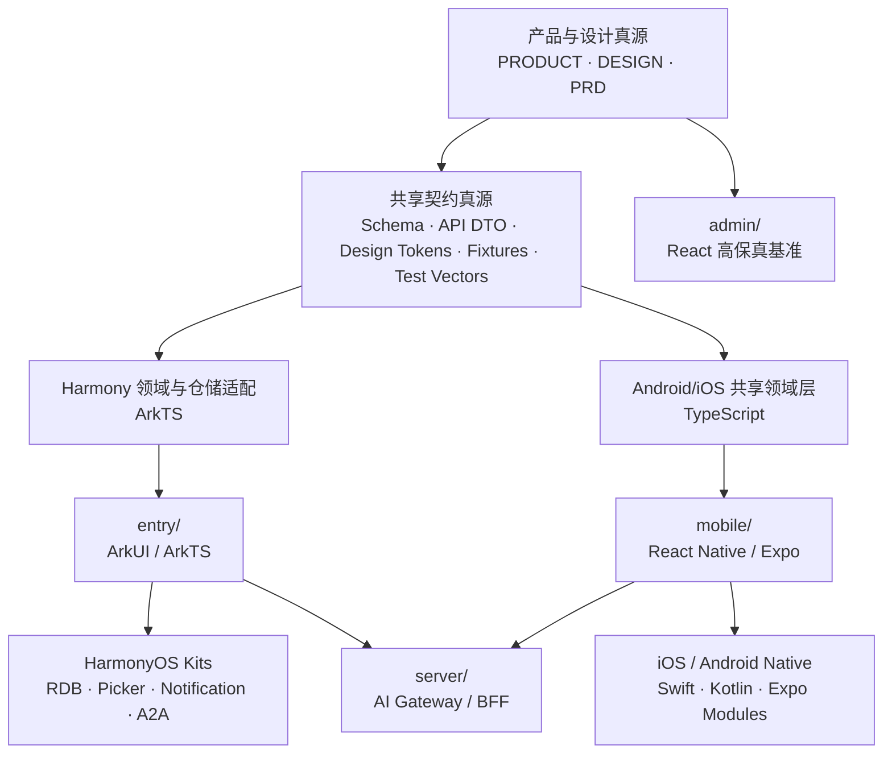

# loci 跨平台客户端迁移与 React 重构方案

> 状态：提案，待首个 ArkUI 垂直切片验证
> 日期：2026-07-31
> 适用范围：HarmonyOS、Android、iOS 客户端及其共享工程边界
> 产品与设计基线：`PRODUCT.md`、`DESIGN.md`、`docs/PRD.md`

## 1. 决策摘要

本项目采用“原生体验层 + 共享契约层”的跨平台架构：

- HarmonyOS 使用现有 `entry/` 工程，以 ArkUI、ArkTS 和系统 Kit 原生实现；
- Android 与 iOS 后续新增 React Native 客户端，默认采用 Expo Development Build；
- 当前 `admin/` React/Vite 工程完成不透明视觉重构后冻结为高保真视觉与交互基准，不再作为移动端生产代码演进；
- `server/` 保留为开发期 AI Gateway / BFF 骨架，接口需要重新契约化后才能成为三端共同依赖；
- 三端共享产品语义、数据契约、设计 Token、测试数据和算法验收向量，不强求共享 UI 实现；
- Android 与 iOS 可直接共享 React Native 组件和 TypeScript 业务代码；
- HarmonyOS 不直接依赖 React Native 包。适合共享的内容通过 JSON、Schema、代码生成或经过明确适配的纯 ArkTS 模块进入 `entry/`。

本方案不选择以下路线：

- 不把现有 Web 页面包装进 ArkWeb/WebView 作为正式客户端；
- 不继续扩展 Web 全局 CSS，也不从 Web 工程直接搬运页面实现；
- 不建设一套同时抽象 ArkUI、React Native 和 DOM 的“万能 UI 组件层”；
- 不以小艺、端 A2A、通知或云端模型作为核心 App 首次闭环的前置条件。

## 2. 为什么采用这条路线

### 2.1 当前 Web 原型适合作为设计基准，不适合作为移动端代码基座

`admin/` 已经完整表达当前页面结构和风格，但行为实现仍依赖：

- React DOM 与浏览器 History；
- 全局 CSS 级联与祖先选择器；
- Pointer Events、ResizeObserver、requestAnimationFrame；
- 浏览器安全区、固定定位和 View Transition。

2026-07-31 已将正式样式从约 247 KB、10,023 行的玻璃叠加实现收敛为约 40 KB、2,160 行的不透明视觉基线；旧实现集中归档到 `admin/archive/glass/`，不进入生产包。该重构降低了设计迁移风险，但 CSS 本身仍不具备 ArkUI 或 React Native 的直接复用价值。

### 2.2 当前 HarmonyOS 工程已经具备可继续建设的骨架

现有 `entry/` 已包含：

- HarmonyOS 6.1.1 / API 24 Stage 工程配置；
- `EntryAbility`；
- `AgentExtensionAbility` 与 A2A 协议骨架；
- RelationalStore 十张表的初始 DDL；
- LLM Gateway 占位接口；
- ArkUI 占位首页。

因此 HarmonyOS 迁移应在 `entry/` 内继续，不重新创建第二套鸿蒙工程。

### 2.3 React Native 适合承载后续 Android 与 iOS

React Native 使用 React 组织原生组件，但样式采用 JavaScript 对象而不是浏览器 CSS。它支持以 `.ios.tsx`、`.android.tsx` 和 `.native.tsx` 隔离平台差异；需要更深系统能力时，可以增加 Swift、Kotlin 原生模块。

这意味着团队可以复用 React 的组件思维、TypeScript 领域逻辑和 Android/iOS 的大部分页面，但不能直接复用当前 DOM 组件与 CSS。

## 3. 目标架构



架构原则：

1. 产品语义只有一个真源，平台实现可以不同。
2. 共享层不引用 React、ArkUI、Android SDK 或 iOS SDK。
3. 平台特有能力通过 Adapter / Repository / Gateway 隔离。
4. 页面以业务垂直切片交付，不先建设大而全的组件库。
5. 视觉一致通过 Token、截图基准和验收规则实现，不通过跨平台 UI 抽象实现。

## 4. 目标目录

保留现有目录，渐进增加共享层和移动端，不做一次性大搬家：

```text
HUAWEI-knowledge-management/
├── admin/                         # 冻结的 React 高保真基准
├── entry/                         # HarmonyOS ArkUI 正式客户端
├── mobile/                        # 后续新增 React Native / Expo 客户端
├── packages/
│   ├── contracts/                 # OpenAPI / JSON Schema / DTO 定义
│   ├── design-tokens/             # 平台中立设计 Token
│   ├── fixtures/                  # 跨端一致的模拟数据
│   ├── test-vectors/              # 学习规则、调度、地图算法验收向量
│   └── domain-ts/                 # Android/iOS 可直接共享的纯 TypeScript 领域逻辑
├── tools/
│   └── codegen/                   # Token、DTO、资源文件生成器
├── server/                        # AI Gateway / BFF
└── docs/
    └── architecture/              # 架构方案与 ADR
```

`entry/` 初步调整为：

```text
entry/src/main/ets/
├── entryability/
├── pages/
│   ├── AppRoot.ets
│   ├── TodayPage.ets
│   ├── LearningMapPage.ets
│   ├── KnowledgeLibraryPage.ets
│   └── learning/
├── components/
│   ├── shell/
│   ├── navigation/
│   ├── surfaces/
│   └── feedback/
├── models/
├── stores/
├── repositories/
├── services/
├── agent/
└── theme/
```

`mobile/` 初步采用：

```text
mobile/
├── src/
│   ├── app/                        # 应用入口与导航装配
│   ├── features/
│   ├── components/
│   ├── navigation/
│   ├── repositories/
│   ├── services/
│   └── theme/
├── modules/                        # 本项目 Swift/Kotlin 原生模块
└── assets/
```

## 5. 共享边界

| 能力 | Android/iOS | HarmonyOS | 共享方式 |
|---|---|---|---|
| 产品对象和枚举 | 直接共享 TypeScript | 生成或适配为 ArkTS | Schema 为真源 |
| API DTO | 直接共享 TypeScript | 生成 ArkTS 类型 | OpenAPI / JSON Schema |
| 设计 Token | 生成 TS 常量 | 生成 color/float/ArkTS 常量 | JSON Token 为真源 |
| 演示数据 | 读取 JSON | 读取 JSON/资源文件 | `fixtures/` |
| 学习与调度规则 | TypeScript 实现 | ArkTS 对等实现 | 共享测试向量 |
| 地图布局数学 | TypeScript 实现 | ArkTS 对等实现 | 输入输出测试向量 |
| 页面组件 | React Native | ArkUI | 不共享实现 |
| 导航 | Expo Router / React Navigation | Navigation / NavPathStack | 共享路由语义 |
| 本地数据库 | SQLite 适配 | RelationalStore | Repository 接口一致 |
| 文件选择 | Expo/原生模块 | DocumentViewPicker | 用例与错误模型一致 |
| 通知和后台任务 | iOS/Android 原生能力 | HarmonyOS Kit | 平台 Adapter |
| Agent / 系统入口 | 平台模块 | A2A Extension | 共享 Agent 契约 |

### 5.1 可以直接从当前 React 中提取

- `types/prototype.ts` 中的平台中立类型；
- `data/learningMap.ts` 中的节点、关系和部分地图数学参数；
- `data/` 中跨页面一致的模拟内容；
- 学习阶段、验证结果、Agent 消息等领域枚举；
- `server/` 中与模型厂商无关的请求和响应结构。

### 5.2 只能作为行为参考，不能直接共享

- `App.tsx` 中的 hash/history 路由；
- React Hooks 生命周期和组件状态；
- `useMapGesture.ts` 的 DOM 事件绑定；
- `useDrawerGesture.ts` 的 Pointer Capture；
- 所有 TSX 页面结构；
- `index.css`；
- `admin/archive/glass/` 中的历史材质实验。

地图边界、惯性衰减、吸附阈值等纯数学部分可以从 Hook 中提取为测试向量；事件处理必须由各平台重写。

## 6. 平台实现约束

### 6.1 HarmonyOS

- 新页面默认使用状态管理 V2：`@ComponentV2`、`@Local`、`@Param`、`@Event`、`@ObservedV2`、`@Trace`；
- 页面导航使用 `Navigation` / `NavPathStack`，不继续扩展旧 `router` 注释和单页条件渲染；
- 一级“今日｜学习｜知识库”保留自定义底部导航，Agent 是独立入口；
- 纯色矿物灰画布延伸到系统安全区，交互内容使用安全区 Padding；
- 普通列表使用 `List` / `LazyForEach` 或适合 API 24 的复用方案；
- Agent 优先验证 `bindSheet`；若无法满足 75% / 全屏 / 关闭的吸附与返回语义，再使用自定义 Overlay；
- 学习地图使用 Canvas/Path 绘制关系，ArkUI 节点组件负责文字、状态和点击；
- 正式组件使用不透明 `Column` / `Row` / `Stack` 表面、单像素边界与语义 Token；
- 不为迁移引入 `backgroundEffect`、`backgroundBlurStyle`、RenderNode 折射或环境光。

### 6.2 Android / iOS

- 使用 React Native 和 Expo Development Build，不以 Expo Go 的能力边界约束产品；
- 页面和 Feature 使用 TypeScript 严格模式；
- 样式由 Token、组件内 StyleSheet 和明确 Variant 组成，不建立新的全局级联；
- 标准页面尽量共享，复杂视觉或系统能力使用 `.ios.tsx`、`.android.tsx` 或原生模块；
- 地图、手势和动画优先选择支持新架构且有明确维护状态的依赖；
- 系统分享、通知、文件 Picker、后台任务和安全存储保留平台适配层；
- 原生模块通过 Swift、Kotlin 或 Expo Modules API 实现。

### 6.3 服务端

- 移动端不直接保存模型密钥；
- `server/` 对外只暴露版本化契约；
- 页面不直接依赖模型厂商响应结构；
- 请求包含超时、取消、错误码、重试语义和幂等标识；
- 流式 Agent 响应统一定义事件协议；
- 真实文件解析、检索与学习证据接入前，先确认隐私、数据删除和授权撤回边界。

## 7. 迁移阶段

### M0：工程与契约基线

目标：让迁移有稳定边界，不急于搬页面。

交付物：

- 本文档进入评审状态；
- 建立 `packages/design-tokens`、`packages/fixtures` 和 `packages/test-vectors`；
- 将 `DESIGN.md` 中已确认的 Token 转为平台中立 JSON；
- 为现有七个业务页面和 Agent 抽屉保存标准视口截图；
- 建立路由语义表，不再使用 URL hash 作为产品流程定义；
- 验证 DevEco Studio、API 24 SDK、签名与 HAP 构建链路；
- 将 `admin/` 标记为视觉基准，只接受阻塞性修复。

退出条件：

- ArkUI 空壳可以构建、安装和启动；
- 设计 Token 能生成 ArkUI 资源；
- 模拟数据在 Web 与 ArkUI 中能被同一组 ID 引用。

### M1：ArkUI 原生壳与“今日”垂直切片

目标：验证 ArkUI 技术路线与当前真实风格。

范围：

- `AppRoot`；
- 固定矿物灰画布和沉浸式安全区；
- 顶部身份栏；
- “今日｜学习｜知识库”底部导航；
- 66px 桃色 Agent 入口；
- 今日标题、焦点学习面板、行动列表；
- 页面切换、按压态与减少动态。

暂不包含：

- 真实 Agent；
- 文件导入；
- 学习地图；
- 后端调用。

退出条件：

- 不使用 WebView、DOM 或浏览器运行时；
- 390 × 844px 基准截图的构图、色彩层级和主要尺寸与当前原型一致；
- 安全区、滚动、返回与应用生命周期行为正确；
- 在目标真机或官方模拟器完成基本性能记录。

### M2：ArkUI 核心产品闭环

按业务依赖顺序迁移：

1. 知识库；
2. 文件理解结果；
3. 深入学习解释；
4. 学习验证；
5. 学习完成；
6. 今日成果；
7. Agent 抽屉的模拟态。

同时建立：

- `Navigation` 路由栈；
- 页面与 Repository 的接口；
- 全局错误、空白、加载、离线和恢复状态；
- RDB schema version 与升级机制；
- 跨页面一致的模拟数据。

退出条件：

- S03—S10 可以完全在 ArkUI 中使用模拟数据演示；
- 系统返回不会丢失来源和阶段；
- 页面不直接访问数据库或系统 Kit；
- UI 状态与领域状态分离。

### M3：ArkUI 高风险组件

目标：单独处理不适合夹在普通页面迁移中的复杂能力。

工作包：

- 学习地图 Canvas、节点、连线、平移、双指缩放、惯性和聚焦；
- Agent 75% / 全屏 / 关闭吸附；
- 键盘避让和输入焦点；
- 文件 Picker、URI 授权和沙箱复制；
- 通知、分享与 A2A 作为独立连接器。

退出条件：

- 地图在目标真机连续操作时没有明显掉帧或误触；
- Agent 抽屉与系统返回、键盘、导航栈不冲突；
- 减少动态下仍保持可理解；
- 所有覆盖面板均不依赖背景模糊或自定义材质。

### M4：共享契约固化

ArkUI 核心流程稳定后，再将已经验证的对象固化为跨端契约：

- OpenAPI / JSON Schema；
- Design Token JSON；
- 模拟数据 Fixture；
- 学习调度 Test Vector；
- 地图算法 Test Vector；
- Agent 流式事件协议；
- Repository 用例与错误模型。

退出条件：

- 平台实现不需要读取另一平台的 UI 文件；
- 相同 Fixture 在 ArkUI 和 TypeScript 中产生相同对象 ID 和流程结果；
- 算法差异能通过测试向量定位。

### M5：React Native Android/iOS 首个切片

目标：用 M1 的同一验收标准建立 Android/iOS 客户端。

交付物：

- `mobile/` Expo Development Build 工程；
- 设计 Token 生成结果；
- 共享 TypeScript 领域包；
- App Shell、底部导航和 Agent 入口；
- 今日页面；
- Android/iOS 平台截图和差异记录；
- 开发、预览、生产三套构建配置。

退出条件：

- Android 与 iOS 均可独立构建和安装；
- 无 DOM/CSS 兼容层；
- Today 切片通过与 ArkUI 相同的产品验收；
- 平台差异通过明确 Variant 或平台文件实现。

### M6：React Native 功能对齐

迁移顺序与 ArkUI 已验证的依赖顺序一致：

1. 知识库和文件；
2. 学习闭环；
3. Agent；
4. 学习地图；
5. 通知、分享、后台任务；
6. 平台特有视觉与系统集成。

退出条件：

- 三端核心旅程使用同一组契约和 Fixture；
- Android/iOS 共享页面不存在大面积平台条件分支；
- 平台能力通过 Adapter 或原生模块隔离；
- 三端行为差异有文档、有理由、有验收。

### M7：真实能力与发布工程

- 接入版本化 Gateway；
- 真实上传、解析、检索、引用与 Agent；
- 数据迁移、备份、删除和授权撤回；
- 单元、集成、视觉回归和端到端测试；
- 崩溃、性能、网络与业务事件观测；
- HarmonyOS、Android、iOS 签名、渠道与发布流程；
- 隐私声明、权限说明和应用市场材料。

## 8. 首个 ArkUI 切片的任务拆分

### 8.1 Theme

- `LociColors`；
- `LociTypography`；
- `LociSpacing`；
- `LociRadius`；
- `LociMotion`；
- 实体表面、边界与层级 Token。

### 8.2 Shell

- `LociPageBackground`；
- `AppIdentityBar`；
- `BottomNavigation`；
- `AgentLauncher`；
- `AppRoot`；
- 一级目的地状态。

### 8.3 Today

- `TodayHeader`；
- `TodayLearningPanel`；
- `TodayActionList`；
- 模拟数据绑定；
- Scroll 和底部安全区；
- CTA 与按压状态。

### 8.4 验收资产

- Web 基准截图；
- ArkUI 模拟器截图；
- 真机截图；
- 关键尺寸对照表；
- 交互录屏；
- 已知差异清单。

## 9. 质量策略

### 9.1 测试层级

| 层级 | 重点 |
|---|---|
| Schema 校验 | DTO、Fixture、Token 格式 |
| 领域单元测试 | 学习阶段、调度、证据、错误恢复 |
| Repository 契约测试 | RDB、网络、文件、内存实现行为一致 |
| 组件测试 | 状态、事件、无障碍名称、禁用态 |
| 视觉回归 | 标准视口、关键状态、平台差异 |
| 端到端 | S03—S10、返回、恢复、离线、权限拒绝 |
| 真机性能 | 启动、滚动、地图手势、抽屉和键盘 |

### 9.2 每个页面的完成定义

- 使用当前 PRD 和 DESIGN Token；
- 包含正常、加载、空白、错误、权限拒绝和恢复状态；
- 支持系统返回和来源恢复；
- 关键触控目标不小于 44vp/pt/dp 等价尺寸；
- 支持减少动态；
- 不直接调用数据库、网络或系统 API；
- 有截图基准和至少一条核心流程测试；
- 无隐藏的全局样式或祖先选择器依赖。

## 10. 主要风险与控制

| 风险 | 影响 | 控制措施 |
|---|---|---|
| 把 TypeScript 共享误解为 ArkTS 直接复用 | 编译失败、动态类型泄漏 | Schema/代码生成优先；ArkTS 保持严格类型 |
| 过早抽象三端 UI | 组件复杂、平台体验变差 | 只共享 Token 和语义，不共享 UI 实现 |
| 旧玻璃实验重新进入正式实现 | 跨端分裂、性能不稳 | 玻璃文件保持归档；构建检查禁止滤镜和背景模糊 |
| 学习地图手势冲突 | 掉帧、误触、返回冲突 | 独立工作包、真机性能和手势验收 |
| 当前 RDB DDL 被当作最终模型 | 后续迁移困难 | 建立 schema version、Repository 和 ADR |
| A2A 代码驱动 App 主流程 | 产品被可选连接器绑架 | A2A 仅通过领域用例接入 |
| React Native 平台条件扩散 | Android/iOS 行为分裂 | 平台文件和 Adapter，禁止页面内大量判断 |
| 后端契约过早定型 | 三端重复改造 | 模拟闭环稳定后固化 OpenAPI |
| Web 原型继续叠加覆盖 | 视觉基准继续漂移 | M0 后冻结，仅接受阻塞性修复 |

## 11. 决策门

### G0：是否开始 ArkUI 页面迁移

必须满足：

- DevEco 构建链可用；
- API 24 工程可安装；
- Token 与 Fixture 路径确定。

### G1：是否扩大 ArkUI 页面范围

必须满足：

- Today 垂直切片通过视觉、交互和性能验收；
- 状态管理 V2、Navigation、Theme 和安全区方案稳定。

### G2：是否开始 React Native

必须满足：

- ArkUI 核心页面结构不再大幅变化；
- 共享契约已从真实实现中验证；
- Android/iOS 最低版本、账号、证书和发布范围已确认。

### G3：是否研发复杂交互和系统能力

必须满足：

- P1 核心闭环已可用；
- 性能预算与目标真机明确；
- 地图、抽屉与系统能力的性能预算已通过评审。

## 12. 尚待确认的开放决策

这些问题不阻塞 M0/M1，但必须在对应决策门前确认：

- HarmonyOS、Android、iOS 的最低系统版本；
- 是否同时支持平板、折叠屏和横屏；
- React Native 使用 Expo Router 还是直接管理 React Navigation；
- Expo EAS 云构建与本地原生构建的组织策略；
- 登录、同步和多设备数据模型；
- 文件原文保留、上传和删除策略；
- AI Gateway 的认证、限流和环境划分；
- Agent、通知、分享、桌面卡片进入哪个发布阶段；
- 三端正式发布顺序。

## 13. 官方技术参考

- React Native Style：<https://reactnative.dev/docs/style>
- React Native Platform-Specific Code：<https://reactnative.dev/docs/platform-specific-code>
- Expo 自定义原生代码：<https://docs.expo.dev/workflow/customizing/>
- ArkTS 语法适配背景：<https://developer.huawei.com/consumer/cn/doc/doccenter-getting-started/arkts-migration-background>
- ArkUI 状态管理 V1 到 V2：<https://developer.huawei.com/consumer/cn/doc/harmonyos-guides/arkts-v1-v2-migration-inner-class>
- ArkUI Canvas / RenderNode：<https://developer.huawei.com/consumer/cn/doc/harmonyos-guides-V5/canvas-get-result-draw-arkts-V5>
- ArkUI 沉浸式与安全区：<https://developer.huawei.com/consumer/cn/doc/doccenter-capabilities/arkts-develop-apply-immersive-effects>
