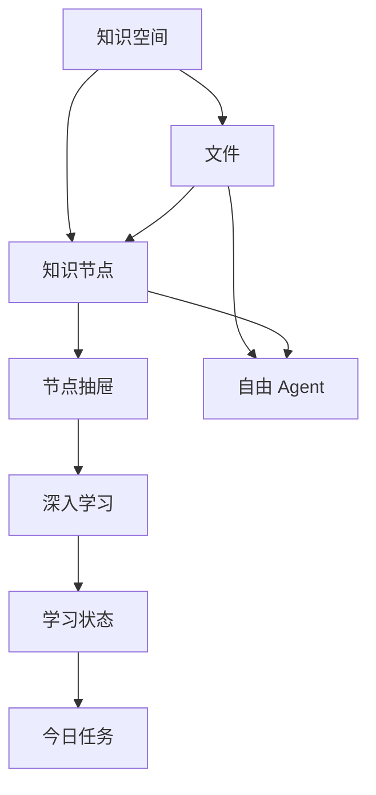
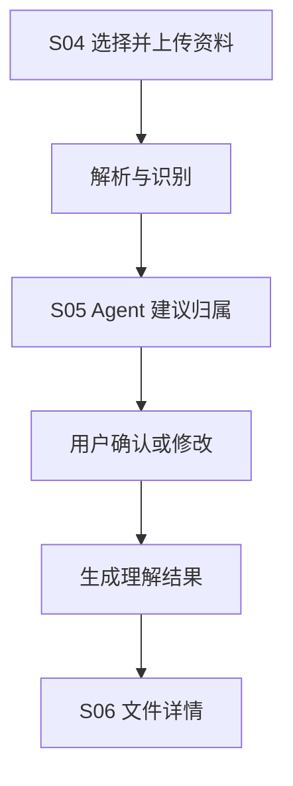
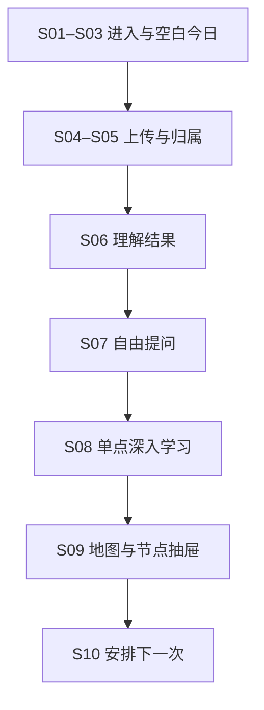

# 信息架构与页面结构

## 1. 文档目的

本文档用于明确知识管理 Agent 独立 App 的信息架构、页面层级、模块职责与跨页面上下文规则，并作为低保真原型、交互设计、UI 规范和后续 PRD 的共同依据。

本文档承接《用户旅程.md》，重点回答：

1. 产品由哪些一级目的地和全局能力构成；
2. “今日”“学习”“知识库”和自由 Agent 分别解决什么问题；
3. 知识地图、节点抽屉、深入学习和资料阅读如何分工；
4. 用户如何在不同页面之间移动，并保持当前知识上下文；
5. 首次使用主旅程需要哪些页面和状态；
6. 哪些内容进入首轮低保真原型，哪些暂时不展开。

---

## 2. 已确认的架构决策

### 2.1 一级导航采用“目的地胶囊 + 全局对话入口”

底部导航分为两部分：

> 左侧胶囊：今日｜学习｜知识库  
> 右侧独立圆形入口：对话

- “今日”“学习”“知识库”是三个固定目的地；
- “对话”是覆盖整个产品的自由 Agent，不是第四个普通页面；
- 个人中心通过页面右上角头像进入，不占一级导航；
- 上传是全局任务流，不单独占据底部导航。

### 2.2 今日以单一行动焦点为核心

“今日”负责回答“我现在最值得做什么”，不做综合资讯流或无限任务看板。页面优先突出一个主要行动，其余任务和近期变化作为次级内容。

首次完成学习闭环后，今日默认帮助用户安排下一次行动，而不是继续催促学习：

- 主按钮：安排到明天；
- 次按钮：今天继续；
- 安排完成后进入明确的结束状态，不立即补充新任务。

### 2.3 学习以知识地图作为总入口

“学习”承载个人知识世界的结构化探索与单知识点学习入口。知识地图是该空间的默认 outline：

- 展示知识主题、节点分布和节点间联系；
- 支持搜索、移动视角、聚焦节点和进入主题簇；
- 不承担大段知识内容、原文阅读或文件管理；
- 完整知识网络持续存在，但当前视口不必容纳所有节点；节点可以随视角移动越过屏幕边缘并消失。

### 2.4 地图、节点抽屉与列表知识库严格分工

| 载体 | 核心职责 | 不承担 |
|---|---|---|
| 知识地图 | 展示全局 outline、主题分布与节点联系；负责定位和选择 | 不展示大段解释、完整资料或文件管理操作 |
| 节点抽屉 | 展示知识点概要、主题路径、邻近节点、学习入口和资料跳转 | 不承载完整课件、文章正文或笔记全文 |
| 列表型知识库 | 搜索、筛选、管理和阅读知识空间与具体资料 | 不负责表现全局知识关系 |

用户点击地图节点后，节点进入焦点区，一阶关系高亮，节点抽屉从底部上拉并默认覆盖约 75% 页面。后方保留少量地图以维持空间连续性；抽屉可继续上拉至全屏。

### 2.5 地图默认表达类别，学习状态作为可选图层

地图基础语义是“我拥有哪些知识领域，它们如何连接”，不默认把产品内学习记录当作用户真实知识水平。

- 节点颜色默认表达知识类别；
- 节点位置表达关系与聚集；
- 节点大小表达结构重要性或当前焦点；
- 临时光晕表达本次新增或最近活动；
- 学习状态仅作为用户主动开启的覆盖图层；
- 状态使用“无学习记录、已学习、待复习”，不自动把“无记录”解释为“未学习”。

用户可手动补录软件外的学习状态，也可批量标记主题簇。分享知识地图时默认隐藏学习状态、文件名称和私密内容，只展示知识类别、规模与连接。

### 2.6 自由 Agent 是跨全库的全局能力

自由 Agent 可以跨知识点、跨主题和跨知识空间询问，适合查询、比较、解释、联想、寻找资料与知识探索。

点击底部独立圆形入口后：

- 保留当前页面和页面状态；
- 对话抽屉从底部上拉，默认覆盖约 75%；
- 用户可继续上拉至全屏，也可下拉关闭；
- 后方页面轻微暗化但仍可辨认；
- 当前页面可以作为可移除的弱上下文，但不会把自由 Agent 锁死在该范围内。

### 2.7 深入学习只针对单一知识点

深入学习与自由 Agent 不是同一种会话：

- 自由 Agent：跨知识点、用户主导、开放式问答；
- 深入学习：锁定一个知识点、有目标、有阶段、有结束状态；
- 自由问答默认不改变学习状态；
- 深入学习可以形成学习过程、验证结果和个人状态证据；
- 两者可以携带已有上下文相互转换，但不强制跳转。

### 2.8 知识空间统一底层结构

底层统一使用“知识空间”组织资料与知识，但创建时允许选择课程、考试、项目、兴趣主题和自定义等模板。模板只影响默认字段、推荐任务和展示方式，不形成彼此割裂的数据结构。

---

## 3. 总体架构原则

### 3.1 按用户目标划分，而非按技术能力划分

- 今日组织下一步行动；
- 学习组织知识关系、节点探索与单知识点深入学习；
- 知识库组织资料、知识空间和原文阅读；
- 自由 Agent 组织跨全库的自然语言探索与协作。

摘要生成、知识抽取、向量检索、推荐和学习者模型属于底层能力，不直接成为一级功能名称。

### 3.2 同一对象只有一个真实来源

- 文件只在知识库中保存，其他页面展示引用或跳转入口；
- 知识节点统一属于个人知识图谱，地图与抽屉只是不同呈现层；
- 对话统一保存在自由 Agent 会话系统中，其他页面只带入上下文；
- 深入学习记录独立保存，不与自由问答历史混为一谈；
- 今日任务引用节点、文件、空间或会话，不复制其内容。

### 3.3 地图完整不等于所有节点同时可读

系统保留并绘制完整的知识网络，但当前视口只承担局部阅读。用户通过移动视角、搜索和聚焦进入不同区域；节点可以越过屏幕边缘，不需要被强制压缩在一个画面中。

### 3.4 入口可以不同，任务流保持统一

上传、提问和开始学习可以从多个页面发起，但调用统一任务流，并根据入口预填上下文。任务结束后优先返回发起位置，并恢复其滚动、地图和筛选状态。

### 3.5 上下文必须可见、可改、可追溯

只要 Agent 正在优先参考特定空间、文件、节点或今日任务，界面就应明确显示。用户能够增加、移除或扩大参考范围，并能查看回答实际引用了哪些来源。

### 3.6 默认轻量，复杂结构逐步揭示

首次使用不要求用户理解完整图谱、复杂标签或多层文件夹。地图先承担 outline；用户选择节点后，再通过抽屉中的主题路径和邻近节点逐层展开细节。

---

## 4. 核心信息对象

| 对象 | 定义 | 主要归属 | 关键关系 |
|---|---|---|---|
| 用户 | 账号、目标、偏好与学习者模型的主体 | 个人中心 | 拥有知识空间、任务、会话与学习记录 |
| 知识空间 | 围绕课程、考试、项目或主题组织的知识范围 | 知识库 | 包含文件与节点，关联会话和任务 |
| 文件 | 用户导入的原始资料及其解析结果 | 知识库 | 属于一个主知识空间，可关联多个知识节点 |
| 知识节点 | 从资料、对话或学习中形成的概念单元 | 学习地图 | 关联类别、来源、关系与个人学习状态 |
| 知识关系 | 节点间的前置、包含、相似、对比、应用等关系 | 学习地图 | 具有来源、置信度与确认状态 |
| 自由 Agent 会话 | 跨全库的连续问答与协作记录 | 全局对话层 | 保存会话上下文、引用来源与生成结果 |
| 深入学习会话 | 围绕单一知识点形成的有目标学习过程 | 学习任务页 | 关联节点、材料、验证结果和个人状态 |
| 今日任务 | 当前最值得执行或安排的行动建议 | 今日 | 指向深入学习、资料处理或自由 Agent 任务 |
| 学习状态 | 用户在产品内外形成的个人记录 | 节点个人图层 | 无学习记录、已学习、待复习 |
| 参考框架 | 官方或第三方提供的知识结构模板 | 学习地图 | 可与个人地图对照，但不等同于用户已掌握知识 |

### 4.1 核心关系



---

## 5. 全局导航与公共入口

### 5.1 底部导航结构

| 入口 | 形态 | 核心问题 | 主要内容 |
|---|---|---|---|
| 今日 | 左侧胶囊项 | 我现在最值得做什么？ | 单一主建议、其他可做、最近变化 |
| 学习 | 左侧胶囊项 | 我的知识如何连接，我要理解哪个知识点？ | 全局知识地图、节点抽屉、深入学习入口 |
| 知识库 | 左侧胶囊项 | 我保存了哪些资料，如何阅读和管理？ | 知识空间、文件列表、搜索、筛选、阅读与上传 |
| 对话 | 右侧独立圆形按钮 | 我想让 Agent 帮我探索什么？ | 自由 Agent 抽屉、全库问答、上下文与引用 |

圆形“对话”按钮可略高、略大，但不做成压过三个核心页面的强悬浮主按钮。打开抽屉后，按钮临时变为收起状态。

### 5.2 全局公共入口

核心页面共享：

- 顶部头像：个人中心与设置；
- 通知入口：处理完成、复习提醒与异常信息；
- 全局搜索入口：搜索知识空间、文件、节点、会话和学习记录；
- 深链能力：允许通知、系统分享、小艺和桌面组件直接进入指定任务；
- 对话入口：在当前上下文上方唤起自由 Agent。

上传可从今日、知识库、当前知识空间、自由 Agent 附件入口或系统分享触发。

---

## 6. 页面结构总览

```text
App
├── 账号与首次引导
│   ├── S01 欢迎与注册
│   └── S02 轻量个性化
│
├── 今日
│   ├── S03 首次空白状态
│   ├── 日常主建议
│   ├── 任务进行中
│   ├── 今日已完成
│   └── S10 首次闭环与下一次安排
│
├── 学习
│   ├── S09 全局知识地图
│   ├── 节点抽屉（默认约 75%）
│   ├── 节点抽屉全屏状态
│   ├── 主题簇逐层导航
│   ├── 学习状态图层
│   └── S08 单知识点深入学习
│
├── 知识库
│   ├── 知识空间与资料列表
│   ├── 文件详情 / 理解结果
│   ├── 阅读与来源定位
│   ├── 待整理资料
│   └── 上传任务流
│       ├── S04 上传与解析
│       ├── S05 知识空间归属确认
│       └── S06 文件理解结果
│
├── 全局自由 Agent
│   ├── S07 首次互动抽屉
│   ├── 默认约 75% 状态
│   ├── 全屏对话状态
│   ├── 上下文选择器
│   ├── 引用与出处
│   └── 对话历史
│
└── 全局辅助页面
    ├── 搜索结果
    ├── 通知中心
    ├── 个人中心与设置
    ├── 数据与隐私控制
    └── 错误、离线与处理中状态
```

---

## 7. 今日

### 7.1 页面职责

今日不是信息聚合首页，而是由 Agent 生成、允许用户调整的单一行动焦点。它根据资料状态、用户目标、近期行为和复习需求，回答“现在最值得做什么”。

### 7.2 信息优先级

1. **唯一主建议**：页面最突出的当前行动；
2. **其他可做**：最多 2—3 条紧凑任务行；
3. **最近变化**：知识地图、资料和学习记录发生的轻量变化。

主建议不局限于软件内学习，可以是：

- 深入学习；
- 继续上次；
- 复习回顾；
- 资料整理；
- 查看新建立的知识联系；
- 向自由 Agent 提问。

主建议必须用一句话解释推荐依据，并允许用户查看完整依据或调整建议。系统只能说“缺少学习记录”，不能据此断言用户没有学过。

### 7.3 S03 首次空白状态

新用户进入今日时，只展示一项新手任务：

- 标题：让 Agent 认识你的第一份知识；
- 说明：上传课件、笔记或教材，将资料转化为可探索、可学习的知识结构；
- 主 CTA：上传第一份资料；
- 次入口：体验示例知识空间。

### 7.4 S10 首次闭环与下一次安排

用户完成首次学习并查看地图变化后，今日先确认成果，再给出下一步建议：

1. 顶部短暂显示“第一份知识已经建立”，概括新增节点、联系和学习记录；
2. 主卡展示下一步建议及推荐原因；
3. 主按钮为“安排到明天”；
4. 次按钮为“今天继续”；
5. 点击“安排到明天”后，主卡转为“已安排到明天”；
6. 页面不再自动补充新任务，让首次旅程安静结束。

### 7.5 日常状态

| 状态 | 页面表现 |
|---|---|
| 首次空白 | 单一上传任务 |
| 首次闭环 | 成果反馈 + 安排下一次行动 |
| 日常待办 | 直接展示一个当前主建议 |
| 任务进行中 | 主卡变为“继续”，保留上下文与剩余时间 |
| 今日已完成 | 明确显示已完成，继续学习仅作为可选入口 |

### 7.6 调整与结束

用户可对主建议执行：换一个建议、缩短时长、安排到其他时间、今天不学习、不再推荐该知识点或调整当前目标。一次拒绝只影响本次推荐，不被解释为永久失去兴趣。

---

## 8. 学习

### 8.1 页面职责

学习页以知识地图作为默认入口，用于看见个人知识世界的 outline、发现联系、选择知识点，并进入单知识点深入学习。具体资料阅读和管理仍由知识库承担。

### 8.2 S09 全局知识地图

地图是一张连续、可移动的知识网络：

- 所有已生成节点都属于同一完整网络；
- 当前视口只展示其中一部分，节点可自然越过边缘；
- 同一知识点长期保持大致位置，避免每次进入重新打乱；
- 远看时形成主题区域，聚焦后才显示节点名称和主要关系；
- 文件只作为节点来源和筛选条件，不成为主要地图节点。

从不同入口进入同一张地图时，仅改变初始镜头：

| 入口 | 默认聚焦 |
|---|---|
| 从底部“学习”进入 | 最近发生个人学习行为的节点；无记录时聚焦最近上传的核心区域 |
| 从上传结果进入 | 本次上传形成的新增知识斑块 |
| 从文件详情进入 | 该文件生成的节点及其与旧知识的连接 |
| 从搜索结果进入 | 搜索命中的节点 |

### 8.3 地图视觉语义

| 视觉元素 | 表达内容 |
|---|---|
| 节点颜色 | 知识类别 |
| 节点位置 | 知识之间的关联与聚集 |
| 节点大小 | 结构重要性或当前焦点 |
| 连线 | 前置、包含、相似、对比、应用等关系 |
| 临时光晕 | 本次新增或最近活动 |
| 学习状态图层 | 无学习记录、已学习、待复习 |

知识类别由系统自动识别，用户可以修改、合并、改名和换色。全局一级类别数量应受到控制，细分主题留到主题簇展开后呈现。

### 8.4 节点抽屉

用户点击节点后的默认流程：

1. 节点移动至焦点区，一阶关系高亮；
2. 抽屉上拉并吸附在约 75% 高度；
3. 后方地图保留约 20%—25% 可见区域；
4. 抽屉展示知识点概要、所属主题路径、邻近节点、深入学习入口和相关资料跳转；
5. 点击邻近节点时，抽屉不关闭，内容切换，后方地图同步移动焦点；
6. 用户继续上拉可进入全屏状态，下拉可回到地图。

抽屉只保留三个吸附位置：关闭、约 75%、全屏。从 75% 向全屏拖动时加入阻力，超过距离或速度阈值才吸附到全屏。

内容滚动与抽屉拖拽规则：

- 拖拽把手始终控制抽屉；
- 抽屉内容区域正常滚动；
- 内容滚动到顶部后继续下拉，才开始收起抽屉；
- 点击后方露出的地图区域，可关闭抽屉并回到当前地图位置。

### 8.5 主题簇逐层展开

主题簇逐层展开保留，但它不改变全局地图的完整性，也不让地图承担正文内容。它发生在节点选择后的抽屉中：

- 默认层展示当前知识点概要与一阶邻近节点；
- 选择上级主题、子主题或关联节点后，抽屉内容逐层切换；
- 后方地图同步聚焦相应节点或区域；
- 全屏状态可以展示更完整的主题路径和关系说明；
- 具体课件、文章和笔记仍跳转到知识库阅读。

### 8.6 学习状态图层与分享

地图默认使用“知识版图”模式。用户主动切换到“学习状态”图层后，才显示无学习记录、已学习和待复习。

- 通过深入学习完成的节点可以自动形成状态证据；
- 用户可以手动标记软件外的学习经历；
- 支持批量标记主题簇和清除状态；
- 默认分享模板只展示知识版图；
- “近期学习轨迹”作为用户主动选择的另一种分享模板。

---

## 9. 知识库

### 9.1 页面职责

知识库是列表型资料中心，负责知识空间、文件、原文和解析结果的长期管理与阅读。它不再通过“列表｜地图”切换承载知识地图；地图统一进入“学习”。

### 9.2 范围层级

| 当前范围 | 主要内容 |
|---|---|
| 全部知识 | 按空间分组的文件、最近使用、待整理、搜索与筛选 |
| 某个知识空间 | 该空间的资料、轻量摘要、相关节点数量和下一步建议 |
| 某个文件 | 原文、理解结果、引用定位、相关节点和操作入口 |

知识空间是主要组织范围，标签、文件类型、更新时间与处理状态作为辅助筛选，不建立无限层级文件夹。

### 9.3 知识空间列表

建议包含：

- 搜索；
- 知识空间筛选与创建；
- 最近使用；
- 待整理；
- 全部资料；
- 上传入口；
- 文件类型、所属空间、更新时间与处理状态。

选中知识空间后，顶部可显示空间名称、类型、资料数量、知识节点数量、最近活动和“在学习地图中查看”入口。

### 9.4 S06 文件详情 / 理解结果

文件详情承担原始资料与 Agent 理解结果的统一展示：

1. 文件基本信息与处理状态；
2. 原文或分页预览；
3. 内容摘要；
4. 核心主题与知识点；
5. 建议学习顺序与可能缺失的前置知识；
6. 引用定位；
7. “向自由 Agent 提问”；
8. “开始深入学习”；
9. “在学习地图中查看”；
10. 修正标题、归属、知识抽取和删除等控制操作。

首次上传完成后，用户直接进入文件详情的“理解结果”状态，不先回到列表。

### 9.5 与学习地图的跳转

| 用户操作 | 结果 |
|---|---|
| 文件详情点击“在学习地图中查看” | 进入全局地图，聚焦该文件生成的新增知识斑块 |
| 节点抽屉点击“查看相关资料” | 进入知识库，并自动带入当前节点筛选条件 |
| 节点抽屉点击某个来源 | 打开对应文件及原文位置 |
| 从知识库返回地图 | 恢复进入前的地图位置、焦点和抽屉状态 |

### 9.6 示例与参考框架

示例与参考框架作为学习地图的辅助内容，不混入用户资料列表：

- 空白期可体验独立示例，不写入个人状态；
- 成长期可将参考框架添加到某个知识空间；
- 参考节点必须与用户资料生成的节点视觉区分；
- 参考节点不自动计为已学习。

---

## 10. 全局自由 Agent

### 10.1 能力边界

自由 Agent 适合：

- 跨知识点和跨主题提问；
- 在全库中寻找相关资料；
- 比较不同概念或多份资料；
- 解释、总结、联想与规划；
- 发现新联系并发起后续行动。

它不负责：

- 自动判定用户已经掌握某个知识点；
- 代替单知识点深入学习的阶段化过程；
- 长期保存和管理文件正文；
- 把开放式问答强制转成学习任务。

### 10.2 S07 首次互动抽屉

自由 Agent 没有独立的一级首页。点击底部圆形入口后，在当前页面上方打开抽屉：

- 默认高度约 75%；
- 顶部显示 Agent 名称、新建对话和历史入口；
- 中部显示 2—3 个结合当前页面生成的建议问题；
- 底部固定输入框；
- 输入框聚焦、键盘弹出时，可自动扩展至接近全屏；
- 键盘收起后恢复用户此前的抽屉高度。

### 10.3 当前页面作为弱上下文

自由 Agent 始终具备全库能力，但可以优先参考唤起位置：

| 唤起位置 | 默认弱上下文 |
|---|---|
| 学习地图 | 当前聚焦节点或主题区域 |
| 节点抽屉 | 当前知识点及其来源 |
| 文件详情 | 当前文件 |
| 今日 | 当前主建议或任务 |
| 普通页面 | 全部知识或无指定范围 |

上下文以可移除标签显示。用户可以添加或移除资料、扩大到整个知识空间、切换为全知识库或不引用知识库，并查看实际引用来源。

### 10.4 会话归档

每段自由对话保存：

1. 会话内容；
2. 会话发生时的弱上下文和用户选定范围；
3. Agent 实际引用的来源；
4. 由对话生成的节点、资料入口或学习建议；
5. 用户对回答的纠正与反馈。

历史会话从抽屉顶部进入，并支持按知识空间、时间和任务类型筛选，不建立第二套会话系统。

### 10.5 与深入学习的转换

当自由对话持续集中于同一个知识点时，Agent 可以轻量建议“进入深入学习”。用户确认后，已有问题、关键解释和参考资料作为学习起点，不重新开始。

深入学习中出现跨知识点问题时，可以先做简短回应，再提供“转到自由 Agent 继续探索”，但不因轻微发散强制跳转。

---

## 11. S08 单知识点深入学习

### 11.1 页面职责

深入学习用于完成一个明确、可结束、可反馈的单知识点学习目标。一次会话只锁定一个核心知识点；相关概念可以作为解释材料，但不把任务扩张为跨全库自由问答。

### 11.2 页面结构

- 当前知识点与本次目标；
- 预计时长与当前阶段；
- 解释、例子、材料或题目；
- 必要时的自由提问入口；
- 自评与客观验证；
- 完成总结；
- 学习状态证据；
- 下一步建议。

### 11.3 进入来源

- 今日主建议；
- 地图节点抽屉；
- 文件理解结果；
- 自由 Agent 对话；
- 复习提醒或桌面组件。

### 11.4 完成后的去向

完成页优先展示学习结果与节点状态变化，再根据来源返回：

- 从今日进入：返回今日并刷新任务；
- 从节点抽屉进入：返回原地图位置并聚焦当前节点；
- 从文件进入：返回文件详情；
- 从自由 Agent 进入：返回原对话，并插入学习完成摘要。

深入学习形成的状态是产品内学习证据，不应被表述为对用户全部真实掌握程度的绝对判断。

---

## 12. 上传任务流

上传是全局能力，不是一级页面。所有入口使用统一流程：



### 12.1 不同入口的默认行为

| 上传入口 | 默认归属与处理 |
|---|---|
| 今日空白状态 | 走完整新手流程，由 Agent 建议创建或选择空间 |
| 知识库首页 | 由 Agent 判断知识空间，用户确认 |
| 当前知识空间 | 默认归入当前空间，仍允许修改 |
| 自由 Agent 输入框 | 先作为会话附件，并询问是否保存到知识库 |
| 系统分享 / 小艺 | 进入轻量接收状态，处理完成后通知用户确认归属 |

### 12.2 关键处理状态

- 待上传；
- 上传中；
- 解析中；
- 等待归属确认；
- 正在生成理解结果；
- 已完成；
- 部分完成；
- 失败，可重试。

用户离开处理页后，任务继续运行；通知和今日页面承接完成或失败状态。

---

## 13. 搜索与发现

### 13.1 全局搜索对象

全局搜索可返回：

- 知识空间；
- 文件及原文片段；
- 知识节点；
- 自由 Agent 会话；
- 深入学习记录。

### 13.2 结果跳转

| 结果类型 | 默认去向 |
|---|---|
| 知识空间 | 知识库中的对应空间 |
| 文件 / 原文片段 | 文件详情及原文位置 |
| 知识节点 | 学习地图聚焦该节点并打开抽屉 |
| 自由 Agent 会话 | 在全屏对话抽屉中打开历史会话 |
| 深入学习记录 | 打开已完成学习摘要 |

首版原型只需体现搜索入口、结果分类和文件/节点两类跳转，不展开复杂语义筛选。

---

## 14. 首次使用主旅程的页面映射

### 14.1 S01—S10 页面序列

| 编号 | 页面 | 核心目标 | 主要去向 |
|---|---|---|---|
| S01 | 欢迎与注册 | 快速进入产品并确认数据可持续保存 | S02 |
| S02 | 轻量个性化 | 获取少量目标与偏好，不进行长问卷 | S03 |
| S03 | 今日：首次空白状态 | 用单一 CTA 引导上传第一份资料 | S04 |
| S04 | 上传与解析 | 导入资料并透明呈现处理阶段 | S05 |
| S05 | 知识空间归属确认 | 由 Agent 建议归属，用户确认或修改 | S06 |
| S06 | 文件理解结果 | 展示摘要、核心节点、前置知识和建议动作 | S07 / S08 |
| S07 | 自由 Agent：首次互动抽屉 | 带着当前文件完成第一次提问 | S08 或返回 S06 |
| S08 | 单知识点深入学习 | 围绕一个知识点形成短学习闭环 | S09 |
| S09 | 学习：全局知识地图与节点抽屉 | 看见首份资料如何进入个人知识网络 | S10 |
| S10 | 今日：首次闭环与下一次安排 | 确认成果并默认安排到明天 | 结束或继续学习 |



### 14.2 页面状态变化

| 阶段 | 页面 | 关键状态变化 |
|---|---|---|
| 初始 | 今日 | 从无内容变为“上传第一份资料”新手任务 |
| 导入 | 上传流程 | 文件从上传中变为等待归属确认 |
| 理解 | 文件详情 | 展示摘要、核心节点、前置知识与建议动作 |
| 互动 | 自由 Agent 抽屉 | 自动带入当前文件作为弱上下文 |
| 学习 | 深入学习 | 记录单知识点目标、验证结果与状态证据 |
| 结构化 | 学习地图 | 聚焦首份资料形成的新增知识斑块 |
| 闭环 | 今日 | 确认成果并安排下一次行动 |

首次旅程虽然跨越多个页面，但用户感受到的始终是一项连续任务，而不是功能导览。

---

## 15. 回访用户的主要路径

### 15.1 今日驱动

> 打开 App → 查看一个主建议 → 完成或安排 → 查看状态变化 → 明确结束

### 15.2 学习驱动

> 学习地图 → 选择节点 → 上拉节点抽屉 → 逐层浏览主题簇 → 开始单知识点深入学习

### 15.3 资料驱动

> 知识库 → 选择空间或文件 → 阅读理解结果 → 向自由 Agent 提问或在地图中查看

### 15.4 问题驱动

> 任意页面唤起自由 Agent → 调整参考范围 → 跨全库提问 → 查看引用 → 跳转资料或进入深入学习

### 15.5 外部触发

> 通知 / 桌面组件 / 小艺 → 打开指定任务或资料 → 完成处理 → 返回对应上下文

---

## 16. 页面与抽屉状态规范

### 16.1 通用页面状态

| 状态 | 设计要求 |
|---|---|
| 首次空白 | 解释价值并给出单一清晰 CTA，不只显示“暂无内容” |
| 有内容 | 明确主要行动与信息层级 |
| 加载 / 生成中 | 显示真实阶段，允许离开后继续处理 |
| 部分完成 | 保留已完成结果，说明缺失部分及影响 |
| 错误 | 说明原因、保留进度、提供重试或替代方案 |
| 离线 | 区分可本地查看与必须联网的能力 |
| 权限不足 | 说明所需权限及用途，不强迫一次性授权 |
| Agent 不确定 | 显示不确定性与依据，允许确认或修正 |
| 用户修正后 | 明确已更新对象，并允许撤销 |

### 16.2 抽屉统一规范

节点抽屉与自由 Agent 抽屉共享基础手势模型：

- 关闭、约 75%、全屏三个吸附位置；
- 75% 向全屏拖动时具有阻力；
- 拖拽把手与内容滚动区域分离；
- 内容滚动到顶部后继续下拉才收起；
- 关闭抽屉后恢复后方页面原有位置和状态。

两类抽屉的内容职责不同：节点抽屉用于理解和导航一个知识点；自由 Agent 抽屉用于跨全库问答。

---

## 17. 原型页面范围

### 17.1 首轮低保真必须覆盖

1. S01 欢迎与注册；
2. S02 轻量个性化；
3. S03 今日首次空白状态；
4. S04 上传与解析；
5. S05 知识空间归属确认；
6. S06 文件理解结果；
7. S07 自由 Agent 首次互动抽屉；
8. S08 单知识点深入学习；
9. S09 全局知识地图与节点抽屉；
10. S10 今日首次闭环与下一次安排。

### 17.2 为验证整体架构补充

11. 知识库列表与知识空间范围；
12. 地图节点抽屉全屏状态；
13. 自由 Agent 全屏与历史会话；
14. 学习状态图层；
15. 回访用户的今日页面。

### 17.3 首轮可以暂缓

- 完整个人设置；
- 复杂通知中心；
- 多人协作；
- 知识空间共享；
- 大规模地图性能优化的全部异常分支；
- 完整模板市场；
- 高级筛选与批量文件管理；
- 小艺和系统级入口的所有异常分支。

---

## 18. 低保真原型验证重点

低保真阶段优先验证：

1. 用户是否理解今日、学习、知识库三个目的地的职责差异；
2. 独立圆形“对话”入口是否被理解为全局能力，而非第四个普通页面；
3. 用户能否理解地图是 outline、抽屉是节点概要、知识库是资料正文；
4. 节点抽屉在 75% 与全屏之间的拖拽是否自然，是否与内容滚动冲突；
5. 主题簇逐层展开是否能支持导航，而不让地图和抽屉膨胀成第二套知识库；
6. 自由 Agent 与单知识点深入学习的区别是否清晰；
7. 当前页面作为弱上下文时，用户是否始终知道 Agent 正在优先参考什么；
8. 地图按类别表达、学习状态作为可选图层是否符合用户预期；
9. 首次地图是否让用户相信它来自自己的真实资料；
10. S10 的“安排到明天”能否形成明确、不过度催促的结束感。

---

## 19. 后续工作顺序

1. 基于本信息架构绘制 S01—S10 首次主旅程低保真原型；
2. 优先验证底部“胶囊 + 圆形对话入口”的层级是否清晰；
3. 为 S07 与 S09 建立统一但职责不同的抽屉手势规范；
4. 验证 S08 深入学习与自由 Agent 的双向转换；
5. 验证 S10 安排下一次行动后的结束状态；
6. 选取 2—3 个视觉方向进行风格探索；
7. 确定视觉方向后撰写基础 UI 规范并制作高保真原型。

当前最直接的下一步是：

> 按 S01—S10 逐页补齐低保真页面的内容层级、组件、交互状态与页面间返回规则。
