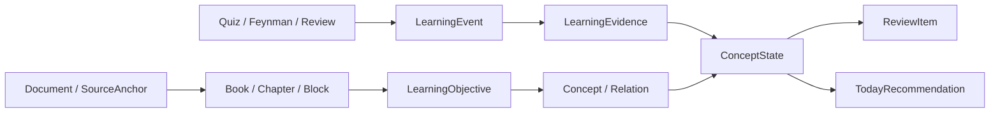

# 领域模型与学习证据

> 状态：指导性合同
>
> 更新日期：2026-08-24

## 1. 设计原则

后端先保存事实，再形成投影。模型输出、推荐、概念状态和用户画像都不是原始事实，必须能回到来源或学习事件。

## 2. 学习项目聚合

`LearningProject` 是面向客户端的聚合边界，至少包含：

- `projectId`；
- 所有者；
- 标题；
- 学习目标、当前水平和学习深度；
- 一个主要来源 `documentId`；
- 一本当前学习书 `bookId`；
- 用户生命周期状态；
- 创建、最近学习和归档时间；
- 当前可执行动作摘要；
- 未处理项目通知摘要。

首版可以在读取时由 `Document`、`Book` 和学习状态组合生成，不强制立即迁移为单表。客户端必须只消费稳定的项目 DTO，不自行猜测多个资源的关联。

## 3. 来源与引用

### 3.1 `DocumentUnit`

统一表示 PDF 页、Markdown 章节、DOCX 段落或虚拟页。至少包含：

- 稳定 `unitId`；
- 文档内顺序；
- 标题或页码；
- 原始文本；
- 结构路径；
- 内容哈希。

### 3.2 `SourceAnchor`

至少包含：

- `documentId`；
- `unitId`；
- 页码或结构路径；
- 文本起止位置或引用片段；
- 来源版本或内容哈希；
- 定位精度：`exact / unit / page / unavailable`。

生成内容、Chat 回答、概念关系和证据解释都应引用 `SourceAnchor`，不得只保存无法跳转的字符串出处。

## 4. 学习书模型

### 4.1 状态拆分

`Book` 的用户状态与生成任务状态分开。章节各自保存生成状态，不能由一本书的单一 `error` 覆盖全部可用内容。

`ChapterGenerationTask` 至少记录：

- 章节和方案版本；
- `pending / running / ready / failed / paused / cancelled`；
- 尝试次数；
- 幂等键；
- 开始、结束时间；
- 可展示错误码；
- 可安全重试的阶段。

### 4.2 内容合同

正式生成合同只暴露 `explanation / example / formula_or_conclusion / citation / quiz / feynman`。展示层可以拥有附件、标注和样式变体，但不得反向扩大模型提示词和正式 API DTO。

每个生成块必须包含稳定 ID、类型、正文、顺序、关联目标和可用来源。不能通过数组下标作为长期引用。

## 5. 学习事件

`LearningEvent` 是不可变原始记录。至少包含：

- 全局唯一 `eventId` 和幂等键；
- 用户、项目、书、章节；
- 事件类型；
- 目标概念或学习目标；
- 原始输入与必要上下文；
- 客户端发生时间和服务端接收时间；
- 客户端/设备和合同版本；
- 关联块、题目或复习项；
- 隐私与删除范围。

首版允许产生候选学习证据的事件：

- `quiz_submitted`；
- `feynman_submitted`；
- `review_submitted`；
- 后续章节中的正式迁移应用验证。

阅读、滚动、书签、笔记、Chat、查看来源和图探索可以形成分析事件，但不得进入掌握投影。

## 6. 学习证据

`LearningEvidence` 是对一个或多个事件的结构化评价。至少包含：

- `evidenceId`；
- 来源事件 ID；
- 目标概念和学习目标；
- 证据类型；
- 结果：支持掌握、显示薄弱、矛盾、不确定；
- 评价要点和遗漏点；
- 评价器类型与版本；
- 引用或评分规则；
- 置信度，仅供内部投影；
- 生成时间；
- 是否被用户纠正、撤销或后续证据取代。

模型评价不能直接覆盖旧证据。重新评价应产生新版本并保留链路。

## 7. 概念状态投影

### 7.1 用户状态

| 状态 | 投影条件示例 |
| --- | --- |
| 未验证 | 没有正式证据 |
| 学习中 | 有证据，但数量不足、结果不稳定或仍有关键遗漏 |
| 已掌握 | 多条近期、相互一致的正式证据支持理解和应用 |
| 待复习 | 最近证据出现矛盾，或既有证据达到可解释的复查条件 |

状态变更必须生成可解释原因，并列出参与投影的证据 ID。删除或撤销证据后可以重建投影。

### 7.2 禁止规则

- 答对一道题后立即标记永久掌握；
- 因阅读时长、点击或 Chat 频率提高掌握度；
- 仅因时间经过就宣称用户已经遗忘；
- 向用户显示没有校准意义的精确百分比；
- 客户端直接写入最终 `ConceptState`。

## 8. 概念与关系

### 8.1 概念

`Concept` 保存规范名称、别名、简短定义、覆盖章节和来源。概念合并需要保留别名和历史 ID 映射。

### 8.2 关系

首版采用受控类型，例如：

- `depends_on`：理解 A 需要先理解 B；
- `part_of`：A 是 B 的组成；
- `causes`：A 会导致 B；
- `contrasts_with`：A 与 B 在关键维度对比；
- `applies_to`：A 可应用于 B；
- `extends`：A 在 B 基础上扩展。

每条关系至少包含方向、理由、来源、生成器版本、置信状态和用户纠正状态。`related` 不能作为默认兜底；无法说明语义时不创建关系。

### 8.3 纠正

用户修正产生 `ConceptRelationCorrection`，记录原关系、建议关系、说明、时间和操作者。读取投影优先使用已确认纠正，保留原始生成记录以供审计。

## 9. Chat 契约

`Conversation` 至少保存：

- 会话 ID、项目 ID；
- 作用域类型和对象 ID；
- 创建时的作用域快照；
- 标题和最后活动时间；
- 是否仍使用有效来源版本。

消息返回内容、引用、补充知识标记、工具建议和待确认动作。所有写操作使用两阶段语义：Agent 先提出 `ProposedAction`，用户确认后服务端执行并返回结果。

切换页面不自动改写既有会话作用域。客户端可以发起新会话或显式请求扩大范围。

## 10. 今日推荐与项目通知

### 10.1 `TodayRecommendation`

至少包含：

- 推荐动作类型和目标位置；
- 项目、章节或概念；
- 一句用户可读原因；
- 参与排序的状态或证据引用；
- 预计时间；
- 有效期；
- 主推荐或备选排序；
- 用户拒绝、稍后或完成状态。

服务端返回一条主推荐和最多两条备选。排序规则必须确定、可测试；模型可以生成解释文案，但不能任意改变业务优先级。

### 10.2 `ProjectNotice`

单独保存项目任务状态、严重程度、目标动作、创建和已读时间。它不引用或修改掌握状态，也不参与学习推荐的证据计算。

## 11. 复习调度

`ReviewItem` 关联概念、触发证据、可复查时间和任务状态。首版使用简单、可解释的确定性规则：

- 薄弱或矛盾证据优先；
- 已到可复查时间的项目其次；
- 同一次复习限制 3—5 个概念；
- 前置概念优先于依赖它的概念；
- 用户稍后处理只调整调度，不改变掌握状态。

## 12. 一致性与安全

- 服务端负责 ID、权限、幂等、事件签发和最终投影。
- 客户端提交事件草稿，不签发正式学习证据。
- 所有投影器支持从事件和有效证据重建。
- 用户删除项目时，服务端给出影响清单并执行统一级联策略。
- 日志不得记录完整资料、用户长回答、密钥和不必要的个人数据。
- 测试夹具必须与生产合同同形，但不能出现在真实产品表面。

## 13. 最低合同测试

- 来源锚点能跨格式准确恢复；
- 章节生成重试不会产生重复章节；
- 同一学习事件重复提交只生成一份有效证据；
- 普通 Chat 无法调用掌握状态写接口；
- 删除、撤销证据后可以确定性重建概念状态；
- 用户纠正关系后，再生成不覆盖纠正；
- 今日推荐与项目通知分别排序和读取；
- `entry/` 能按正式合同还原服务端返回的项目、任务和学习状态。
