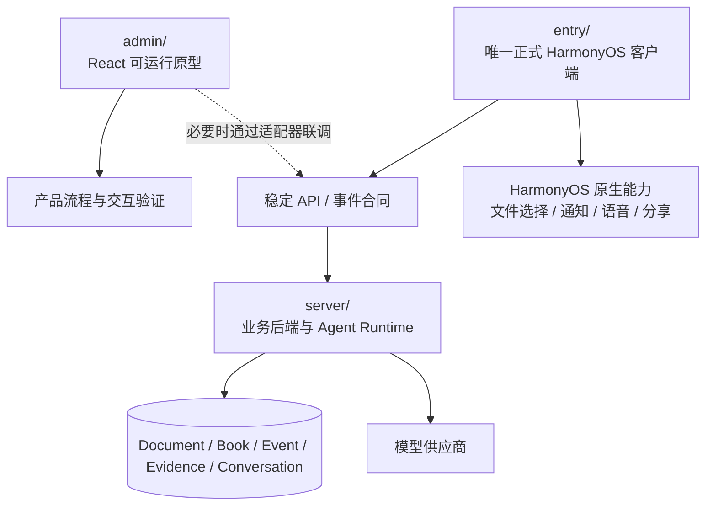

# 原型、客户端与服务端边界

> 状态：已确认方向
>
> 更新日期：2026-08-24

## 1. 结论

`entry/` 是唯一正式产品客户端，`server/` 是唯一业务后端和事实来源。`admin/` 只是用 Web 技术实现的可运行产品原型，用于确认流程、页面和交互，不是 Web 产品端，也不是正式 API 的长期兼容对象。

原型验证产品方案；正式客户端承载产品；服务端保存业务事实。三者可以复用术语、场景和测试数据，但不承担对等职责。

## 2. 模块职责

### 2.1 `server/`

负责：

- 来源上传、解析、版本和定位；
- 学习项目聚合；
- 方案与章节生成任务；
- Agent Runtime、工具权限、会话与引用；
- 学习事件接收、证据签发和状态投影；
- 概念与关系、纠正和图投影；
- 复习调度、今日推荐和项目通知；
- 权限、幂等、审计、错误码和业务一致性。

当前实现仍是实验性本地服务，不代表生产存储、账户和部署已经完成。

### 2.2 `admin/`

负责：

- 快速表达和确认产品流程、页面结构和交互细节；
- 覆盖成功、空、加载、部分成功、失败和恢复状态；
- 为评审和自动化页面测试提供可运行原型；
- 必要时通过适配器连接 `server/`，验证合同草案和流式体验。

`admin/` 可以使用受控 fixture 演示尚未实现的产品状态，但必须明确标注模拟数据。原型跑通只证明产品方案可演示，不证明正式 API、真实模型或 HarmonyOS 链路已经完成。

不得：

- 把原型 DTO、路由或浏览器行为直接宣布为正式合同；
- 要求正式 API 长期兼容原型的临时实现；
- 在原型内形成另一套业务事实或最终状态规则；
- 把 Web DOM、CSS、Hook、材质或手势当作 HarmonyOS 实现要求；
- 用原型测试替代 `entry + server` 的真实验收。

### 2.3 `entry/`

`entry/` 是唯一正式客户端，也是正式 API 的客户端验收端。负责：

- HarmonyOS 原生导航、生命周期、安全区和返回语义；
- 调用服务端合同并投影用户状态；
- 文件选择、通知、语音、分享和其他系统能力；
- 设备缓存、未提交草稿和断网恢复；
- ArkUI 原生组件、无障碍和性能降级。

不得：

- 在本地重新计算最终掌握状态；
- 使用 fixture 作为正式页面的默认数据源；
- 将 Web DOM、CSS 或 Hook 逐行移植到 ArkUI；
- 因本地缓存与服务端冲突而静默覆盖服务端事实。

## 3. 复用和验证边界

| 内容 | 正式归属 | `admin/` 的用法 |
| --- | --- | --- |
| 产品术语、页面职责和状态语义 | `docs/product/` | 按现行文档表达和验证 |
| API DTO、枚举和版本化事件 | `entry + server` 合同 | 可通过适配器或同形 fixture 提前验证 |
| 状态机和推荐规则 | `server/` | 只展示结果，不复制最终规则 |
| 视觉 Token 与组件行为 | `entry/` 按 HarmonyOS 能力实现 | 提供视觉与交互参考，不共享实现 |
| React 与 ArkUI 组件 | 各自实现 | 不互相移植代码 |
| Fixture | 原型和自动化测试 | 不进入正式产品表面 |
| 真机能力与发布门禁 | `entry/` | 不承担验收责任 |

## 4. API 固定时点

API 不因 `admin/` 原型跑通而冻结，也不一次性冻结全部未来接口。

### 4.1 M0：固定核心领域合同

正式客户端开发前先固定：

- 资源 ID、对象名称和状态枚举；
- 学习项目聚合边界；
- 来源锚点、后台任务和 Chat 作用域；
- 学习事件、证据和概念状态语义；
- 错误结构、幂等规则和版本策略；
- `TodayRecommendation` 与 `ProjectNotice` 的边界。

这一阶段固定业务语义，不要求锁死所有 URL、字段和未来接口。

### 4.2 每个纵向切片：固定对应 API

`entry/` 开始实现某个纵向切片前，冻结该切片的请求、响应、错误、幂等和事件合同。后续破坏性修改必须显式升级版本或提供迁移。

### 4.3 真实验收后：标记稳定

只有 `entry + server` 使用真实文件、真实模型和目标设备完成该切片，相关 API 才能标记为稳定。完整生产级 `v1` 在 M7 真实 HarmonyOS 端到端通过后确认。

## 5. API 设计要求

- `entry/` 围绕学习项目读取聚合视图，不拼接多个内部资源猜测状态。
- 长任务返回任务 ID、阶段、进度语义、可取消性和可重试性。
- 流式 Agent 和章节生成使用版本化事件，不让客户端解析自然语言判断状态。
- 错误返回稳定错误码、用户可读摘要、是否可重试和已保留内容。
- 所有写入支持幂等键；移动端重试不能产生重复事件。
- 分页、时间和 ID 语义保持稳定。
- 合同升级遵循向后兼容或显式版本迁移，不以原型发布时间代替 API 版本。

## 6. 正式客户端本地状态边界

`entry/` 可以只在本地保存：

- 未发送的 Chat 草稿；
- 未提交的测验或费曼草稿；
- 当前滚动位置和展开状态；
- 短期响应缓存；
- 系统通知调度句柄；
- 原生权限和设备能力状态。

`server/` 必须保存：

- 项目、来源和学习书；
- 方案与章节生成状态；
- 正式 Chat 会话和已发送消息；
- 学习事件、证据和概念状态；
- 概念关系和用户纠正；
- 今日推荐与项目通知的业务状态。

## 7. 缓存与离线

- `entry/` 缓存必须记录服务端版本和更新时间。
- 离线时可以阅读已缓存章节和编辑草稿，但正式提交进入待同步队列。
- 待同步学习事件携带幂等键；同步成功后以服务端回执为准。
- 冲突时展示可解释恢复，不静默覆盖用户长文本。
- 来源未缓存时，引用仍显示元数据并说明需要联网打开。

首版不把完整离线学习列为 `Verified` 前置条件，但合同不得阻断后续实现。

## 8. Agent 与模型边界

- `entry/` 只选择作用域和提交用户意图，不自行拼装完整系统提示词。
- `server/` 解析作用域、检索来源、执行工具权限和过滤写操作。
- 模型提供草稿、解释和评价候选；确定性代码负责权限、合同验证、幂等和状态投影。
- 模型调用失败不损坏既有项目；流式中断保留已接收内容并允许重试。
- 供应商密钥只存在服务端。

## 9. HarmonyOS 专属能力

HarmonyOS 可以增强核心流程，但不能形成另一套产品：

- 文件选择器进入统一新建项目流程；
- 系统分享创建来源选择草稿；
- 通知深链进入具体项目、章节或复习任务；
- 语音识别只生成可编辑草稿，用户确认后提交；
- 文本朗读不产生掌握证据；
- A2A 或小艺属于可选连接层，不阻塞独立 App 闭环。

## 10. 验证路径

每个纵向切片按以下顺序验证：

1. 在 `admin/` 中确认流程、页面和异常状态；
2. 根据产品语义固定该切片的正式 API；
3. 在 `entry/` 中接入真实 `server/`；
4. 使用真实文件、真实模型和目标 HarmonyOS 设备完成端到端测试；
5. 记录已验证范围、失败恢复和未验证内容。

`admin/` 原型验证不是正式验收门槛。只有第 4 步通过，能力才能标记为 `Verified`。
