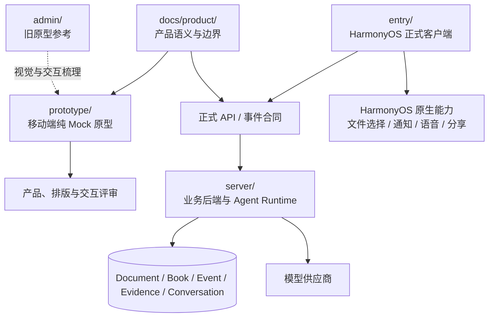

# 原型、客户端与服务端边界

> 状态：已确认方向
>
> 更新日期：2026-08-24

## 1. 结论

`prototype/` 是当前移动端产品原型，使用 React、TypeScript 和 Vite 实现。它只读取本地 Mock 数据，不连接 `server/`，也不是 Web 产品端。

`admin/` 是旧原型代码，只用于追溯原有视觉语言和交互处理，不再承接新功能。`entry/` 是唯一正式产品客户端，`server/` 是唯一业务后端和事实来源。

原型验证方案，正式客户端承载产品，服务端保存业务事实。三者可以复用术语和场景，但不共享运行依赖，也不承担对等职责。

## 2. 模块职责

### 2.1 `prototype/`

负责：

- 快速表达和确认移动端信息架构、页面结构、文案和交互；
- 用本地 Mock 数据覆盖成功、空、加载、部分成功、失败和恢复状态；
- 为产品评审、视觉评审和原型自动化测试提供可运行界面；
- 维护可复用组件、统一 Token 和简洁的页面编排。

必须保持：

- 独立启动，不要求 `server/`、账户、密钥或外部服务；
- 所有业务数据来自原型内的 fixture、Mock 模块或纯前端状态；
- 视觉与组件规范写入 `prototype/DESIGN.md`；
- 原型特有目标与演示边界写入 `prototype/PRODUCT.md`。

不得：

- 调用 `server/` 接口、复用服务端密钥或建立临时联调适配器；
- 把 Mock DTO、路由和浏览器行为宣布为正式合同；
- 在原型内形成另一套最终业务事实或状态规则；
- 把 DOM、CSS、Hook 和浏览器手势当作 ArkUI 实现要求；
- 用原型测试替代 `entry + server` 的真实验收。

### 2.2 `admin/`

`admin/` 只保留为旧代码参考。可以从中分析已有配色、排版、页面关系和交互经验，但新页面、新组件、新 Mock 和原型文档全部进入 `prototype/`。不得为保持旧目录可运行而反向约束新原型结构。

### 2.3 `server/`

负责：

- 来源上传、解析、版本和定位；
- 学习项目聚合；
- 方案与章节生成任务；
- Agent Runtime、工具权限、会话与引用；
- 学习事件接收、证据签发和状态投影；
- 概念与关系、纠正和图投影；
- 复习调度、今日推荐和项目通知；
- 权限、幂等、审计、错误码和业务一致性。

当前实现仍是实验性本地服务，不代表生产存储、账户和部署已经完成。

### 2.4 `entry/`

`entry/` 是唯一正式客户端，也是正式 API 的客户端验收端。负责：

- HarmonyOS 原生导航、生命周期、安全区和返回语义；
- 调用服务端合同并投影用户状态；
- 文件选择、通知、语音、分享和其他系统能力；
- 设备缓存、未提交草稿和断网恢复；
- ArkUI 原生组件、无障碍和性能降级。

`entry/` 不得在本地重新计算最终掌握状态，不得使用原型 fixture 作为正式页面的默认数据源，也不得逐行移植 React 和 CSS 实现。

## 3. 复用和验证边界

| 内容 | 正式归属 | `prototype/` 的用法 |
| --- | --- | --- |
| 产品术语、页面职责和状态语义 | `docs/product/` | 按现行文档表达和验证 |
| 原型视觉与组件规则 | `prototype/DESIGN.md` | 直接实施和维护 |
| API DTO、枚举和版本化事件 | `entry + server` 合同 | 不依赖；只用面向界面的本地 Mock |
| 状态机和推荐规则 | `server/` | 展示代表性结果，不复制最终规则 |
| React 与 ArkUI 组件 | 各自实现 | 不互相移植代码 |
| Fixture | 原型和自动化测试 | 只服务演示与测试，不进入正式产品表面 |
| 真机能力与发布门禁 | `entry/` | 不承担验收责任 |

## 4. API 固定时点

API 不因 `prototype/` 跑通而冻结，也不一次性冻结全部未来接口。

### 4.1 M0：固定核心领域合同

正式客户端开发前先固定资源 ID、对象名称、状态枚举、学习项目聚合边界、来源锚点、后台任务、Chat 作用域、学习事件、证据、错误、幂等和版本策略。

### 4.2 每个纵向切片：固定对应 API

`entry/` 开始实现某个纵向切片前，冻结该切片的请求、响应、错误、幂等和事件合同。后续破坏性修改必须显式升级版本或提供迁移。

### 4.3 真实验收后：标记稳定

只有 `entry + server` 使用真实文件、真实模型和目标设备完成该切片，相关 API 才能标记为稳定。

## 5. 正式端状态边界

`entry/` 可以在本地保存未发送草稿、当前滚动位置、展开状态、短期响应缓存和设备能力状态。

`server/` 必须保存项目、来源、学习书、生成状态、正式会话、学习事件、证据、概念关系、用户纠正、今日推荐和项目通知的业务状态。

所有写入必须支持幂等重试；服务端返回稳定错误码和可恢复信息；模型密钥只存在服务端。原型不模拟这套持久化和网络链路。

## 6. 验证路径

每个纵向切片按以下顺序推进：

1. 在 `prototype/` 中用本地 Mock 确认流程、文案、页面和异常状态；
2. 根据 `docs/product/` 固定该切片的正式合同；
3. 在 `entry/` 中接入真实 `server/`；
4. 使用真实文件、真实模型和目标 HarmonyOS 设备完成端到端测试；
5. 记录已验证范围、失败恢复和未验证内容。

原型确认是设计输入，不是正式验收门槛。只有第 4 步通过，能力才能标记为 `Verified`。
