# Agent 架构：单 Agent 多能力

> 状态：现行（与 `server/src/agent/` 代码一致）
>
> 创建日期：2026-09-03
>
> 产品依据：docs/product/01 §4、02 §5、04 §9

loci 的学习 Agent 是**单 Agent 多能力**架构：一个 `AgentRuntime` 承载所有交互，通过**能力（Capability）**决定这一轮能用什么工具，通过**工具（Tool）**把学习读写收敛到受控入口。不拆分 Planner/Tutor/Evaluator 等多 Agent；新功能一律以新能力或新工具接入。

```mermaid
flowchart TB
    client[entry/ 客户端] -->|POST /api/agent/turns SSE| runtime[AgentRuntime]
    runtime --> ctx[LearningContextBuilder\n作用域解析 + 权限校验]
    ctx --> cap[CapabilityRegistry\nfree_chat / guided_learning]
    cap --> tools[ToolRegistry\n按 allowlist 挂载工具]
    tools --> read[读: read_source / read_learning_state]
    tools --> write[写: grade_quiz / evaluate_feynman\nappend_evidence / schedule_review / ask_user]
    write --> evidence[LearningEvidenceService\nHMAC 签发 + 投影 outbox]
    runtime --> store[TurnStore\nturn + 事件持久化]
    runtime --> runner[BookAgentRunner\nOpenAI 兼容流式上游]
```

## 1. 运行时模型

一次交互是一个 **turn**。turn 状态机（`agentRuntimeTypes.ts`）：

`queued → running → completed / failed / cancelled`，中间可进 `waiting_user`（等用户回答）与 `retrying`。

`AgentRuntime`（`agentRuntime.ts`）的关键机制：

- **事件溯源**：turn 内发生的一切都落成版本化事件（见 §4），每个事件带幂等键；写库用 `expectedStatuses` 乐观并发，重复提交不产生重复事实。
- **取消**：每个 turn 一个 `AbortController`；`cancel` 先落 `cancelled` 状态再 abort 上游流，断开连接时上游请求随之中止。
- **恢复**：`resume` 用 per-turn 串行队列防止并发恢复；重复答案通过 `duplicate` 检测短路；`checkpoint` 记录恢复点（当前能力、refs、已完成步骤、选择阶段）。
- **失败收口**：`execute` 的 catch 统一落 `turn_failed`（`agent_failed`），用户可见文案固定为「学习助手生成失败，请稍后重试。」，不泄内部错误。

## 2. 能力层

`CapabilityRegistry`（`capabilityRegistry.ts`）注册能力 → 工具集合的映射：

| 能力 | 工具 | 用途 |
| --- | --- | --- |
| `free_chat` | `read_source`、`read_learning_state` | 有作用域的问答，**只读** |
| `guided_learning` | 上两项 + `grade_quiz`、`evaluate_feynman`、`append_evidence`、`schedule_review`、`ask_user` | 引导式学习，含受控写 |

能力决定工具上限；`LearningContextBuilder` 再按作用域生成 `toolAllowlist`，`ToolRegistry.getForContext` 取两者交集挂载——**上下文不允许的工具，能力声明了也挂不上**。

新增能力的接入方式：定义 `CapabilityId` → 在 `CapabilityRegistry` 与 `CAPABILITY_TOOLS` 登记工具集 → 在 `LearningContextBuilder` 补作用域规则。不需要动运行时主干。

## 3. 工具层

`ToolRegistry`（`toolRegistry.ts`）中每个工具有 `access: read | write` 声明：

| 工具 | access | 行为 |
| --- | --- | --- |
| `read_source` | read | 按 `sourceId` 取来源片段；不在 `readScope.sourceIds` 内抛 `source_not_allowed` |
| `read_learning_state` | read | 返回学习状态摘要（答题数/证据数/到期复习数/掌握投影） |
| `ask_user` | write | 向用户提问（prompt + options + allowFreeText），产生 `user_question` 事件并进 `waiting_user` |
| `grade_quiz` | write | 判分并记录测验证据（块必须在 readScope 内） |
| `evaluate_feynman` | write | 调评估器 → 返回 HMAC 签名回执（**不落库**） |
| `append_evidence` | write | 凭回执落证据（与 evaluate_feynman 构成两段式，防伪造） |
| `schedule_review` | write | 记录复习结果并推进调度 |

**权限原则（对应 docs/product/04 §7.2）**：`free_chat` 没有任何写工具，普通 Chat 在结构上无法写 `ConceptState`；写工具的块/来源输入必须在当前 readScope 内，越界即 `invalid_tool_input`。

## 4. 交互合同

### 4.1 请求

`StartTurnRequestV1`（`agentRuntimeTypes.ts`，`normalizeStartTurnRequest` 校验）：

- `version: '1'`；`message` 必填、≤ 2000 字；
- `surface`：`today | learning | library | agent`；
- `refs` 层级校验：`chapterId` 须带 `bookId`，`blockId` 须带 `chapterId`，`conceptId` 须带 `bookId`；
- `capabilityHint`：可选能力提示；
- `action` 白名单：`grade_quiz{answerId}` / `evaluate_feynman{confirmedText}` / `schedule_review{result}` —— 写操作只能以白名单 action 发起，不接受自由指令。

校验失败抛 `AgentRuntimeValidationError`，路由层映射为稳定错误码与安全文案（`SAFE_ERROR_MESSAGES`，不泄内部细节）。

### 4.2 事件（SSE）

`AgentEventEnvelopeV1`：`{version, turnId, eventId(=序号), timestamp, idempotencyKey, type, payload}`。

| 事件 | 含义 |
| --- | --- |
| `turn_started` | turn 创建（携带 capability 与 surface） |
| `activity` | 阶段提示（核对上下文/继续学习） |
| `content_delta` | 流式正文增量 |
| `citation` | 回答引用的来源（sourceId/文件名/页码区间） |
| `user_question` | Agent 提问，turn 进 `waiting_user` |
| `evidence_recorded` | 证据已落库（携带 evidenceId 与投影状态） |
| `turn_completed` / `turn_failed` | 终态 |

### 4.3 HTTP 端点（`routes/agentTurns.ts`）

| 端点 | 行为 |
| --- | --- |
| `POST /api/agent/turns` | 开 turn，SSE 从事件 0 开始流 |
| `GET /api/agent/turns/:id/events` | 续传：`Last-Event-ID` 头或 `?afterEventId=`，断线重连不丢帧 |
| `POST /api/agent/turns/:id/answers` | 提交提问答案，从当前游标继续流 |
| `POST /api/agent/turns/:id/cancel` | 取消，返回 JSON 终态 |

SSE 带心跳与最大订阅时长。另有旧端点 `POST /api/agent/book-chat`（`routes/bookAgent.ts`）服务 admin 参考端，新客户端一律走 turns 合同。

### 4.4 两阶段写操作

对应 docs/product/02 §5.2 与 04 §9：Agent 的写意图先以 `user_question` / 确认卡片呈现，用户确认后客户端以白名单 `action` 重新发起 turn 才真正执行；取消无副作用。费曼评估内部也是两段式（评估 → 回执 → `append_evidence` 落库）。

## 5. 证据与安全

- **HMAC 签发**（`learning/evidenceSecurityKeys.ts`）：费曼证据须持服务端签名回执才能落库；密钥落 `server/data/` 并做权限加固（win32 用 `EVIDENCE_RECEIPT_SECRET` 环境变量绕过目录加固），密钥不出服务端。
- **投影可重建**：证据先落 `ProjectionOutboxEntry` 再投影（`LearningEvidenceService`），`ProjectionRecoveryWorker` 启动与运行期 drain 未投影条目；删除/撤销后可从事件与有效证据确定性重建（`masteryProjector.ts`）。
- **版本兼容**：`LegacyLearningEvidence` 读取时迁移为 `LearningEvidenceV1`（`migrateLegacyLearningEvidence`），旧数据不失效。
- **日志纪律**：审计只记时间/模型/token；不记资料全文、用户长回答与密钥。

## 6. 作用域模型

`LearningContextBuilder.build`（`learningContext.ts`）把请求 refs 解析为权威上下文：

- **归属校验**：book 必须属于当前 actor（单用户下为 `local-user`）；chapter/block/concept/document 必须属于该 book，否则 `invalid_ref_ownership` 系列错误；
- **读范围**：`readScope` = 当前书/章/块推导出的 chapterIds、blockIds、sourceIds，工具与提示词都只能看到这个范围；
- **状态摘要**：`learningStateSummary` 含答题数、证据数、到期复习数和范围内的掌握投影，供 `read_learning_state` 与提示词使用。

对应 docs/product/02 §5.1 的六个默认作用域：surface 决定入口语义，refs 决定对象范围；切换页面不改写既有 turn。

## 7. 演进边界（决策记录）

- **不引入多 Agent 编排**。新功能 = 新能力或新工具：例如自适应出题（已有 HTTP 端点，`Planned` 接入 guided_learning 工具）、今日推荐解释文案、概念图纠正确认卡片。
- **DeepTutor（HKUDS）参考定位为功能对标**（题库、仪表盘、自适应出题、多源合书等），不是架构分层依据。此为 2026-09-03 与用户确认的假设；如后续要对标其多 Agent 编排，须先重新评审本节。
- **生产化（数据库、账户、多租户、部署）属 `Deferred`**，见 docs/product/06 §5；当前文件存储与单用户模型不变。
